# Active Selection from Pairwise Image Preferences

### Abstract

This study examines how to select a limited number of image-pair preference labels for training the Bradley--Terry reward model, in order to improve the downstream reconstruction type classifier. We implement a ResNet-18 reward model, compare uncertainty and diversity-aware acquisition rules, and evaluate against a test set of ideal images with absolute labels. One thing to note is that an SHA-256 audit found byte-identical images crossing prior partitions (1-3 ideal images in each seed were included as unlabelled images in "trajectory" folder), so those results cannot be treated as leakage-free final estimates. The revised implementation uses content identity rather than path names to construct and audit splits, removes every outer-test identity from pairwise/unlabelled trajectory images and negative anchors, and records epoch-wise validation metrics for validation-only early stopping.

## 1. Introduction

Pairwise labels ask a simple question: *given two images, which one is preferred for a specified reconstruction type?* They are often easier for experts to provide than absolute scores. However, expert time is limited, so an active-learning system must choose which hidden comparisons to reveal.

We study the following computational question: among **candidate pairs**, which pairs should be labelled and added to a preference-trained image model? 

Figure 1 shows the intended evaluation firewall. Validation can select training settings and a stopping epoch; the outer test is used only after these choices are frozen.

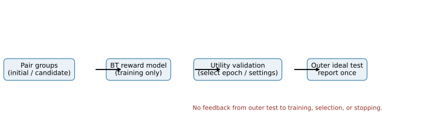

*Figure 1. Computational pipeline and evaluation firewall.*

## 2. Method

### 2.1 Preference reward model

See https://github.com/ymeng3/Quantum/tree/main/Classifier2.

Each image $x$ is passed through a ResNet-18 encoder and a reward head that returns one score per reconstruction class, $r_\theta(x,t)$. For a labelled pair $(x_i,x_j)$ of type $t$, the Bradley--Terry model assigns the probability that the first image is preferred as

$$
P_\theta(x_i \succ x_j \mid t) = \sigma\!\left(r_\theta(x_i,t)-r_\theta(x_j,t)\right),
\qquad \sigma(z)=\frac{1}{1+e^{-z}}.
$$

In plain language, the model is confident that the first image should win when its learned score is much larger than the second image's score. For a first-image win, the loss is

$$
\mathcal L_{BT} = -\frac{1}{|D|}\sum_{(i,j,t)\in D} w_{ij}\log P_\theta(x_i \succ x_j\mid t),
$$

where $w_{ij}$ is an optional annotator-confidence weight. The implementation also handles reversed wins, ties, and not-applicable labels using the corresponding loss terms in `pairwise_active_learning_pipeline.py`.

The model is initialized with an image encoder and fine-tuned with AdamW. Ideal reference images serve as training anchors only; they are neither validation nor outer-test images.

### 2.2 Active selection

Candidate comparisons retain their images but hide their human winner labels. Active selection decides which $b$ comparisons should be labelled next so that the retrained preference model makes more accurate predictions on future, previously unseen comparisons. Let $L$ be the currently labelled pair groups, let $C$ be the label-hidden candidate groups, let $S_b\subseteq C$ be the $b$ groups selected by an acquisition strategy, and let $Y(S_b)$ be the labels revealed only after selection. The quantity that selection is trying to increase is

$$
\Delta A_{\mathrm{val}}(S_b\mid L)=
A_{\mathrm{val}}\!\left(\operatorname{Train}(L\cup Y(S_b))\right)
-A_{\mathrm{val}}\!\left(\operatorname{Train}(L)\right).
$$

Here $A_{\mathrm{val}}$ is validation reconstruction accuracy, $\operatorname{Train}(\cdot)$ denotes the fixed training procedure, and $\Delta A_{\mathrm{val}}$ is the improvement attributable to the newly labelled batch. An acquisition rule cannot calculate this quantity directly because $Y(S_b)$ is hidden; instead, it uses the available images, embeddings, and model predictions as a proxy. Section 2.3 defines those proxies. Validation data choose a training schedule and compare design choices; the locked outer test is evaluated only after those choices are fixed.

The current study is a single-round, batch active-learning experiment: train on $L$, score all of $C$, select one batch $S_b$, reveal its labels, retrain on $L\cup Y(S_b)$, and evaluate. This makes a strategy's contribution easy to compare at a fixed annotation budget.

Implementation entry point: [Experiment.select](https://github.com/Purpleline-z/rl_quantum_2026summer/blob/main/code/active_learning_program/pairwise_active_learning_pipeline.py#L536).

~~~text
Algorithm 3: Single-round active-selection loop
Input: labelled groups L, label-hidden candidate groups C, budget b,
       acquisition rule A, validation set V, locked outer-test set T
1. Train a reward model f on L using a validation-selected schedule.
2. Compute permitted label-free quantities for every c in C.
3. Select S_b = A(C, f, L, b); do not read winner labels in this step.
4. Reveal Y(S_b), then retrain f' on L union Y(S_b).
5. Measure A_val(f') on V for protocol decisions and save the full run record.
6. Once all strategies and settings are frozen, evaluate the chosen protocol on T.
Output: selected groups S_b, validation result, and one locked-test result.
~~~

### 2.3 Acquisition strategies and their roles

All methods select complete pair groups, never individual images. The candidate view contains image paths and permitted model outputs, but not the human winner label.

| Strategy | Selection rule | Why it may help | Main tuning or failure mode |
|---|---|---|---|
| Random | Uniform sample of candidate groups | Essential unbiased baseline | High variance at small budgets |
| Uncertainty | Largest mean predictive entropy | Requests comparisons near the model decision boundary | Can repeatedly select visually similar pairs |
| Core-set | Farthest-first coverage in embedding space | Covers underrepresented image regions | Depends on encoder geometry and distance metric |
| Cluster-quota uncertainty | Spread selections over clusters, then rank by uncertainty | Avoids spending all labels in one region | Cluster count and quota can be mismatched to the data |
| Uncertainty + diversity | Largest $a(c)$ | Balances difficult and nonredundant pairs | Requires validation choice of $\lambda$ |
| Cluster-Margin | Low margin, then round-robin from small clusters | Keeps ambiguous pairs while protecting rare clusters | Historical evidence is a separate extension, not pooled with the five-strategy curve |
| MC-dropout variance / mutual information | Rank disagreement across dropout predictions | Models epistemic uncertainty | Requires dropout probability and Monte-Carlo sample-count calibration |

The common strategy dispatcher is [`Experiment.select`](https://github.com/Purpleline-z/rl_quantum_2026summer/blob/main/code/active_learning_program/pairwise_active_learning_pipeline.py#L536). Each pseudocode block gives the exact implemented score or sampling distribution, defines its symbols, and links to the implementing function. $C$ is the candidate-pair pool, $L$ is the labelled-pair pool, and $b$ is the requested number of selected pair groups throughout.

#### Algorithm 3a: Random baseline

Implementation: [`random_sampling`](https://github.com/Purpleline-z/rl_quantum_2026summer/blob/main/code/active_learning_program/pair_acquisition_methods.py#L110).

```text
Input: candidate pair groups C, budget b, random seed s
initialize a deterministic random-number generator with s
return b distinct groups sampled uniformly from C
```

$$
\Pr(S)=\binom{|C|}{b}^{-1}\quad\text{for every }S\subseteq C\text{ with }|S|=b.
$$

Thus every possible batch $S$ of $b$ groups has the same probability; $|C|$ is the number of available candidates. Random has no model-derived score and provides the reference for whether a more elaborate rule earns its complexity.

#### Algorithm 3b: Predictive uncertainty

Implementation: [`uncertainty_sampling`](https://github.com/Purpleline-z/rl_quantum_2026summer/blob/main/code/active_learning_program/pair_acquisition_methods.py#L116), which calls [`score_uncertainty`](https://github.com/Purpleline-z/rl_quantum_2026summer/blob/main/code/active_learning_program/pair_acquisition_methods.py#L75).

```text
Input: candidates C, trained reward model f, budget b
for each pair (xi, xj) in C:
    p_h = sigmoid(r_h(xi) - r_h(xj)) for every reward head h
    uncertainty = mean BernoulliEntropy(p_h) across reward heads
return the b pairs with largest uncertainty
```

$$
p_h(c)=\sigma\!\left(r_\theta(x_i,h)-r_\theta(x_j,h)\right),\qquad
u(c)=\frac{1}{H}\sum_{h=1}^{H}\left[-p_h(c)\log p_h(c)-(1-p_h(c))\log(1-p_h(c))\right].
$$

For candidate $c=(x_i,x_j)$, $p_h(c)$ is the predicted probability that $x_i$ wins under reward head $h$, $H$ is the number of heads, and $u(c)$ is their mean Bernoulli entropy. Large entropy means that the current model assigns a probability near one half, so this rule requests labels for comparisons it presently finds hard.

#### Algorithm 3c: Core-set coverage

Implementation: [`core_set_select`](https://github.com/Purpleline-z/rl_quantum_2026summer/blob/main/code/active_learning_program/pair_acquisition_shared_calculations.py#L52); pair embeddings are created through [`pair_vector`](https://github.com/Purpleline-z/rl_quantum_2026summer/blob/main/code/active_learning_program/pair_acquisition_shared_calculations.py#L20).

```text
Input: candidate pair embeddings C, labelled-pair embeddings L, budget b
selected = empty
repeat b times:
    choose c in C that has the greatest distance to L union selected
    add c to selected
return selected
```

$$
v(c)=\frac{e(x_i)+e(x_j)}{2},\qquad
c^*=\underset{c\in C\setminus S}{\arg\max}\ \min_{z\in\{v(\ell):\ell\in L\}\cup\{v(s):s\in S\}}\|v(c)-z\|_2.
$$

Here $e(x)$ is the encoder embedding of image $x$, $v(c)$ is the average embedding of the two images in pair $c$, $S$ is the batch selected so far, and $\|\cdot\|_2$ is Euclidean distance. The rule repeatedly adds the candidate furthest from already covered labelled or selected pairs. When $L$ is empty, the implementation initializes distances from the candidate-pool mean.

#### Algorithm 3d: Cluster-quota uncertainty

Implementation: [`cluster_quota_uncertainty_sampling`](https://github.com/Purpleline-z/rl_quantum_2026summer/blob/main/code/active_learning_program/pair_acquisition_methods.py#L122).

```text
Input: candidates C with cluster IDs, reward model f, budget b
compute uncertainty for every candidate
allocate a proportional integer quota, with a minimum of one before budget is exhausted
within each cluster quota, choose the most uncertain remaining candidate
fill any unused budget with globally most uncertain remaining candidates
return selected groups
```

$$
n_g=|\{c\in C:g(c)=g\}|,\qquad
q_g=\max\!\left(1,\operatorname{round}\!\left(b\frac{n_g}{|C|}\right)\right).
$$

$g(c)$ is the cluster assigned to pair $c$, $n_g$ is that cluster's candidate count, and $q_g$ is its proportional provisional quota. Within each cluster the implementation takes the $q_g$ largest uncertainty scores $u(c)$, then fills any remaining budget with the largest $u(c)$ globally. The minimum-one rule gives small clusters a chance to contribute before the budget is exhausted.

#### Algorithm 3e: Uncertainty plus diversity

Implementation: [`uncertainty_diversity_select`](https://github.com/Purpleline-z/rl_quantum_2026summer/blob/main/code/active_learning_program/pair_acquisition_shared_calculations.py#L29).

```text
Input: uncertainty-scored candidates C, labelled embeddings L, budget b, lambda
for each candidate c:
    u = normalized predictive uncertainty of c
    d = normalized distance from c to L and already selected pairs
    score(c) = u + lambda*d
repeat until b groups are selected:
    add remaining candidate with largest score and update diversity distances
return selected groups
```

$$
d(c;L,S)=\min_{z\in\{v(\ell):\ell\in L\}\cup\{v(s):s\in S\}}\|v(c)-z\|_2,
\qquad a(c)=R(u(c))+\lambda R(d(c;L,S)).
$$

Here $u(c)$ is the uncertainty from Algorithm 3b, $d(c;L,S)$ is distance from covered pair embeddings, $S$ is updated after every selection, and $\lambda$ weights diversity. $R(\cdot)$ is the implementation's robust normalization: values are clipped at their 5th and 95th percentiles and rescaled to $[0,1]$. The rule greedily chooses the remaining candidate with the largest $a(c)$ and then recomputes diversity distances.

#### Algorithm 3f: Cluster-Margin

Implementation: [`cluster_margin_pairwise_sampling`](https://github.com/Purpleline-z/rl_quantum_2026summer/blob/main/code/active_learning_program/pair_acquisition_methods.py#L145).

```text
Input: candidates C with clusters, reward model f, budget b
compute each pair's distance from probability 0.5 (its margin)
prefilter min(10*b, number of candidates) pairs with the smallest margins
round-robin across prefiltered clusters, visiting smaller prefiltered clusters first
return b selected groups
```

$$
m(c)=\frac{1}{H}\sum_{h=1}^{H}\left|p_h(c)-\tfrac{1}{2}\right|,
\qquad P=\operatorname{Bottom}_{\min(10b,|C|)}\{m(c):c\in C\}.
$$

$p_h(c)$ and $H$ have the meanings defined for predictive uncertainty. $m(c)$ is small when the heads place the comparison close to a 50--50 decision, and $P$ is the low-margin prefilter. The implementation then groups $P$ by $g(c)$, orders the groups from smallest to largest, and takes their smallest-margin remaining member in round-robin order until $b$ pairs are selected. This is deliberately not “choose $k$ clusters”: it starts from the smallest available prefiltered cluster and cycles through all eligible clusters to avoid losing rare regions.

#### Algorithm 3g: MC-dropout probability variance

Implementation: [`score_mc_dropout`](https://github.com/Purpleline-z/rl_quantum_2026summer/blob/main/code/active_learning_program/monte_carlo_dropout_uncertainty.py#L33) and [`select_mc_dropout`](https://github.com/Purpleline-z/rl_quantum_2026summer/blob/main/code/active_learning_program/monte_carlo_dropout_uncertainty.py#L77).

```text
Input: candidates C, reward model f with dropout active, b, M stochastic passes
for m = 1,...,M:
    score every candidate with a different dropout mask
for each candidate:
    compute variance of its predicted preference probability across M passes
return b candidates with largest probability variance
```

$$
v_{\mathrm{MC}}(c)=\frac{1}{H}\sum_{h=1}^{H}\operatorname{Var}_{m=1}^{M}\!\left[p_{mh}(c)\right].
$$

$p_{mh}(c)$ is the preference probability for candidate $c$ from dropout pass $m$ and reward head $h$, $M$ is the number of stochastic dropout passes, and $H$ is the number of heads. A large $v_{\mathrm{MC}}(c)$ means predictions change substantially when dropout perturbs the model, so the candidate is selected as epistemically uncertain.

#### Algorithm 3h: MC-dropout mutual information

Implementation: the same [`score_mc_dropout`](https://github.com/Purpleline-z/rl_quantum_2026summer/blob/main/code/active_learning_program/monte_carlo_dropout_uncertainty.py#L33) and [`select_mc_dropout`](https://github.com/Purpleline-z/rl_quantum_2026summer/blob/main/code/active_learning_program/monte_carlo_dropout_uncertainty.py#L77) functions, dispatched with metric `mc_dropout_mutual_information`.

```text
Input: candidates C, reward model f with dropout active, b, M stochastic passes
obtain M stochastic preference distributions per candidate
for each candidate:
    predictive_entropy = entropy(mean probability)
    expected_entropy = mean entropy(stochastic probabilities)
    mutual_information = predictive_entropy - expected_entropy
return b candidates with largest mutual_information
```

$$
I_{\mathrm{MC}}(c)=\frac{1}{H}\sum_{h=1}^{H}\left[
h\!\left(\frac{1}{M}\sum_{m=1}^{M}p_{mh}(c)\right)
-\frac{1}{M}\sum_{m=1}^{M}h\!\left(p_{mh}(c)\right)\right],
\qquad h(p)=-p\log p-(1-p)\log(1-p).
$$

The symbols $p_{mh}(c)$, $M$, and $H$ are as above. $h(p)$ is Bernoulli entropy. The first term measures uncertainty after averaging dropout predictions; the second measures their average individual uncertainty. Their difference is large when model samples disagree, which directs labels toward uncertainty caused by model parameters rather than one consistently ambiguous pair.

### 2.4 Leakage-safe training algorithms

```text
Algorithm 1: Build leakage-safe partitions
Input: ideal images, pairwise rows, seed
1. Compute SHA-256 identity for every image file.
2. Assign each unique ideal identity to exactly one of {reference, validation, outer test}.
3. Collect identities assigned to outer test.
4. Remove every pairwise/unlabelled-trajectory row and negative anchor whose image identity is in outer test.
5. Form pair-disjoint initial and candidate pair groups; image reuse across those pair groups is allowed.
6. Audit and save every path/hash overlap count; fail a run if any test-identity overlap remains.
Output: pair-disjoint training/candidate groups and identity-disjoint ideal partitions.
```

```text
Algorithm 2: Train with validation-only early stopping
Input: labelled pairs, reference images, utility-validation set, maximum epochs E, patience p
best_metric = -infinity; stale = 0
for epoch = 1,...,E:
    optimize Bradley--Terry and permitted reference-anchor losses for one epoch
    record mean training loss
    metric = reconstruction_accuracy(utility-validation)
    record metric; never evaluate outer test here
    if metric improves best_metric: save model; best_metric = metric; stale = 0
    else: stale += 1
    if stale >= p: stop
return saved model with highest validation metric
```


## 3. Data Protocol and Leakage Prevention

The unit of acquisition is an unordered pair group; initial and candidate groups are pair-disjoint. The same image may occur in different non-test pair groups because image-disjoint pair partitions are unnecessarily restrictive for this application. In contrast, no outer-test identity may appear in training pairs, candidate images, reference anchors, utility validation, or Bad-image anchors.

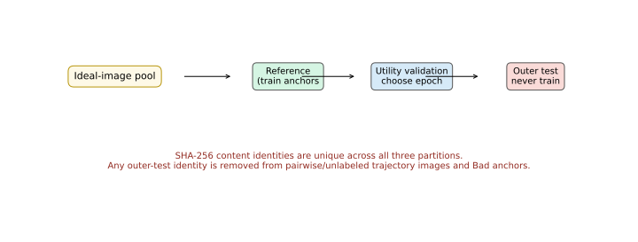

*Figure 2. Required split protocol. Identity means SHA-256 file content, not filename.*

The implementation enforces this rule in `active_learning_program/pairwise_active_learning_pipeline.py`. It retains audit counts for path and content-identity overlaps. This avoids the failure mode in which duplicated image bytes appear under different paths and silently leak from a train-time pool into the test set.

## 4. Implementation and Reproducibility

The reusable program is in `active_learning_program/`. `pairwise_active_learning_pipeline.py` loads preference CSVs, creates ideal partitions, trains the reward model, and executes selectors. `resumable_model_training.py` now stores per-epoch training loss and utility-validation accuracy and restores the best validation checkpoint. The budget-aware runner uses `utility_validation` for training decisions and records `outer_test_not_evaluated: true` during calibration.

Each run should save: configuration; data hashes; pair manifests; split audit; per-epoch metrics; selected pair IDs; seed; and all aggregate CSVs used in figures. Every paper number must trace to one of these saved artifacts.

## 5. Results and Evidence Status

### 5.1 Historical selector curves: diagnostic only

The repository contains five-seed, fixed-schedule curves across acquisition budgets. Figure 3 is generated directly from `results/selected_summaries/budget_curve_5seed/tables/strategy_performance_by_acquisition_budget.csv`.

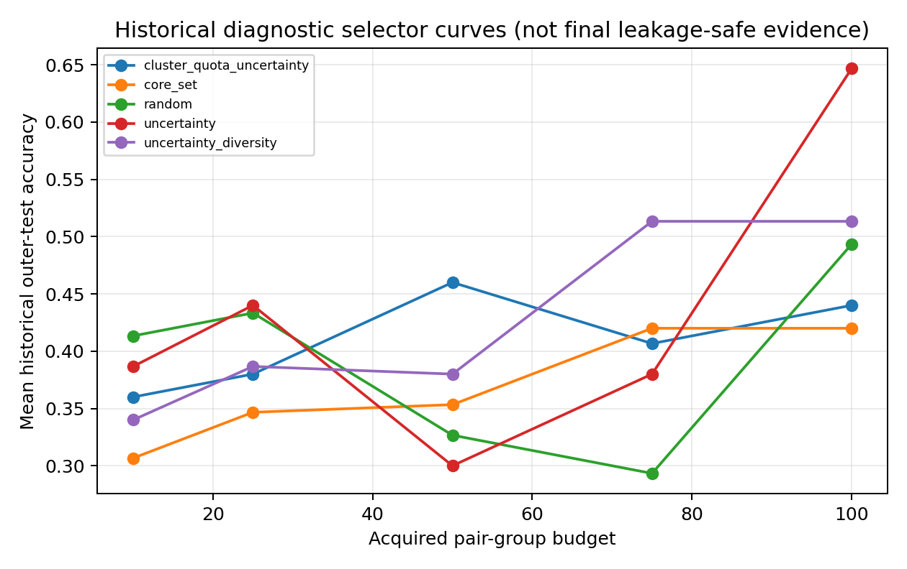

*Figure 3. Five-strategy accuracy across acquisition budgets from the fixed-schedule study; the winner changes with budget.*

**Question.** Does the same acquisition rule select useful labels at every annotation budget? The five-seed curve answers no. At 10 acquired groups, random is highest (0.413); uncertainty takes a narrow lead at 25 (0.440); cluster-quota uncertainty leads at 50 (0.460); uncertainty--diversity leads at 75 (0.513); and uncertainty leads at 100 (0.647). The full means and standard deviations are in the [strategy-by-budget table](active_learning_studies/pair_disjoint_not_image_disjoint/results/selection_benchmark/stage1_selector_curves_none/aggregate/strategy_budget_summary.csv).

This progression is informative because the budget changes the type of mistake a selector can make. With only 10 labels, a complicated score can spend most of its budget on a few idiosyncratic comparisons, while random sampling supplies a more stable cross-section of the pool. At 50 labels, cluster quotas can prevent the batch from collapsing into one embedding region. By 75--100 labels, the model can afford to sample several ambiguous regions, so uncertainty and uncertainty--diversity become more useful. This is a design hypothesis, not a statement about image physics: the next experiment tests it by comparing paired seed-level gains over random after validation selects the training schedule and a fixed-total-update control removes the confounding effect of different numbers of optimizer updates.

### 5.2 Symmetry preprocessing is an experimental factor

The repository evaluates three input modes: `none`, `left_half_mirror`, and `symmetric_average`. The latter two encode a symmetry assumption by reconstructing an image from its left half or averaging it with its horizontal reflection. They are not treated as harmless augmentations: they can remove discriminative asymmetry as well as reduce nuisance variation.

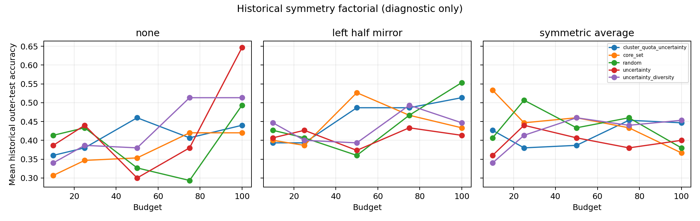

*Figure 4. Strategy--budget--symmetry interaction from the Stage 2 aggregate CSV; no one preprocessing mode wins across conditions.*

**Question.** Does enforcing horizontal symmetry make candidate comparisons easier to use? The answer depends on both budget and selector. The table below gives the strongest and weakest condition at each budget from the [Stage 2 factorial](active_learning_studies/pair_disjoint_not_image_disjoint/results/selection_benchmark/stage2_symmetry_factorial/aggregate/strategy_budget_summary.csv).

| Budget | Highest mean accuracy condition | Lowest mean accuracy condition | Operational meaning |
|---:|---|---|---|
| 10 | core-set + symmetric average: 0.533 | core-set + none: 0.307 | Averaging can make embedding coverage more stable when labels are scarce. |
| 25 | random + symmetric average: 0.507 | core-set + none: 0.347 | The transform can help even without model-based selection, consistent with removing condition-specific variation. |
| 50 | core-set + left-half mirror: 0.527 | uncertainty + none: 0.300 | Mirroring changes which regions look distinct in embedding space. |
| 75 | uncertainty-diversity + none: 0.513 | random + none: 0.293 | The unmodified image retains useful information for the best selector at this budget. |
| 100 | uncertainty + none: 0.647 | core-set + symmetric average: 0.367 | Strong symmetry processing can remove distinctions that uncertainty exploits. |

`left_half_mirror` and `symmetric_average` therefore change the information given to the encoder; they are not just ways to create extra copies of the data. A gain after averaging is consistent with nuisance asymmetry being suppressed for that condition, whereas a loss is consistent with asymmetric detail contributing to the comparison. The follow-up is a pre-registered strategy × budget × preprocessing factorial under the identity-safe split, with the same validation-selected schedule for all arms at a given budget.

### 5.3 SimCLR versus ImageNet initialization

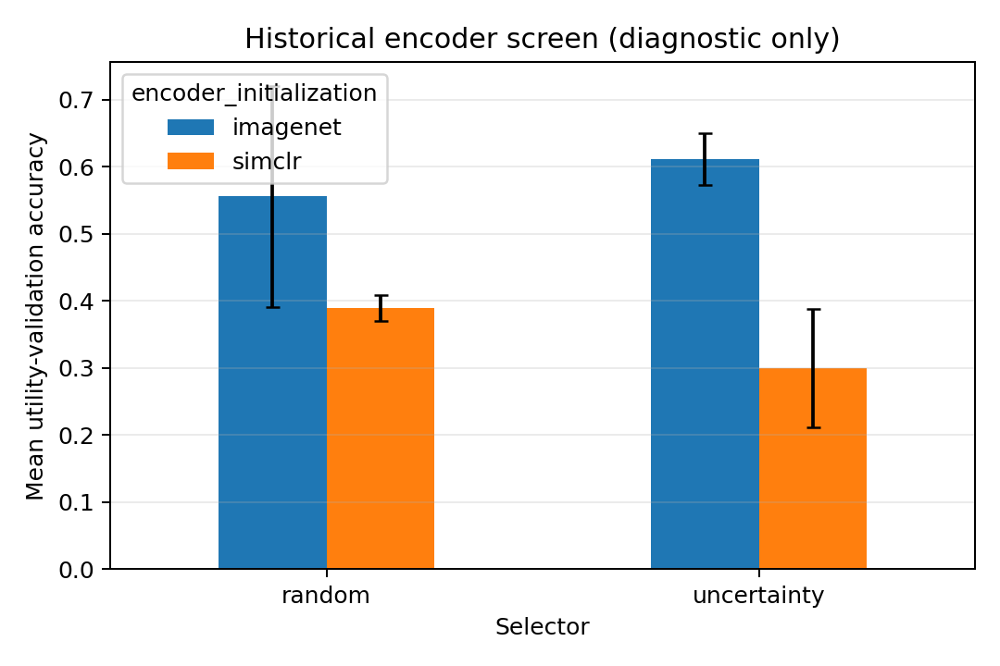

*Figure 5. Utility-validation encoder screen; error bars are standard deviations over three seeds.*

**Question.** Which frozen starting representation gives the selector a more useful coordinate system? In the three-seed validation screen, ImageNet initialization exceeds SimCLR for both random selection (0.556 vs. 0.389) and uncertainty selection (0.611 vs. 0.300), as shown in the [encoder-screen CSV](active_learning_studies/pair_disjoint_not_image_disjoint/results/protocol_diagnostics/encoder_initialization_screen/aggregate/encoder_utility_validation_summary.csv).

This matters beyond a classifier accuracy number. The encoder determines which pairs appear close, which candidate clusters exist, and which comparisons look uncertain. In this screen, the ImageNet starting geometry made the subsequently fine-tuned reward model more useful on the utility-validation images. The next comparison should keep the identity-safe seeds, optimizer, stopping rule, and budget fixed while varying encoder × strategy; reporting the per-seed paired difference will show whether the improvement comes from a broad shift or a few favorable splits.

### 5.4 PCA and t-SNE representation diagnostics

**Question.** Do frozen image features put examples of the same reconstruction type in the same local neighborhood, and do the labelled ideal images cover the trajectory population? An embedding is a numerical location assigned to each image: local label consistency means an image's nearest neighbours usually have the same reconstruction label. PCA displays the two directions with the most variation; the retained-variance fraction tells the reader how much of the full representation is visible in that two-axis sketch. t-SNE emphasizes who is near whom and is useful for local neighborhoods, but its apparent gap widths are not literal distances.

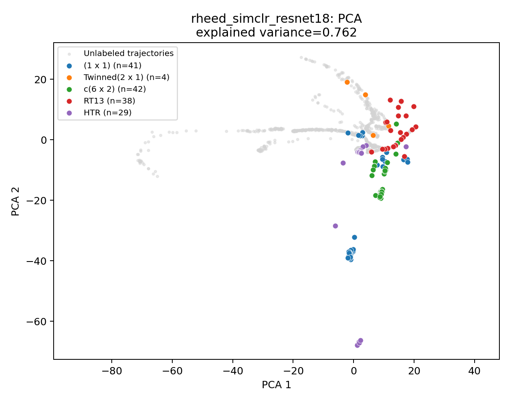

*Figure 6. PCA of frozen RHEED-SimCLR features for the exploratory image manifest.*

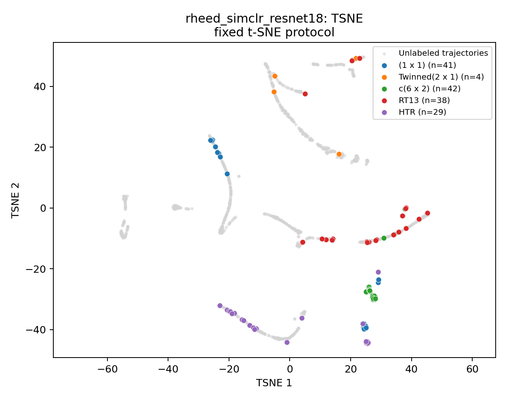

*Figure 7. t-SNE of frozen RHEED-SimCLR features for the same exploratory manifest.*

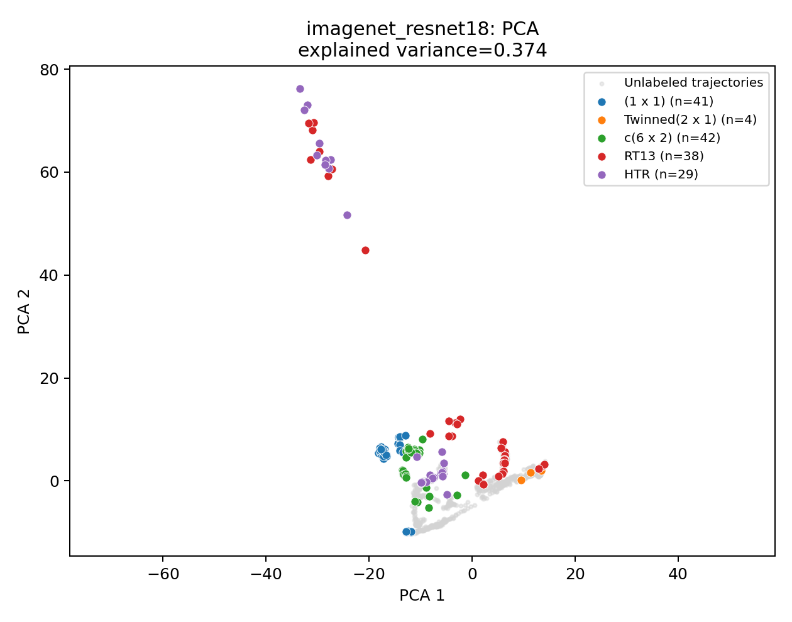

*Figure 8. PCA of frozen ImageNet ResNet-18 features for the exploratory image manifest.*

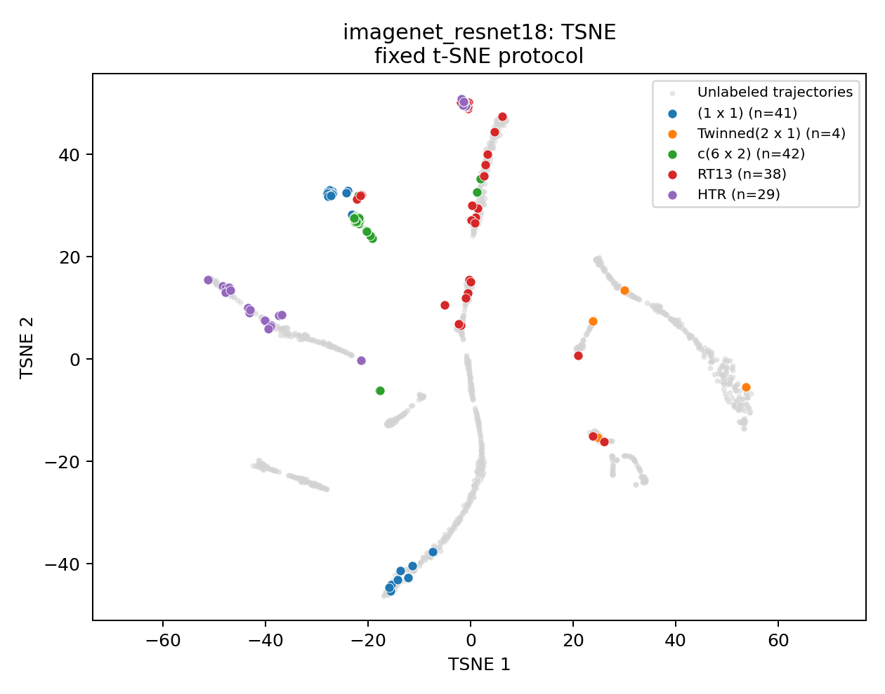

*Figure 9. t-SNE of frozen ImageNet ResNet-18 features for the same exploratory manifest.*

The full frozen-feature check gives 5-NN accuracy 0.884 for SimCLR and 0.896 for ImageNet, versus 0.832 for raw pixels. The more specific coordinate diagnostics now show what that average hides. In PCA coordinates, `(1 x 1)` has the highest 5-NN recall for both SimCLR (0.927) and ImageNet (0.976); `c(6 x 2)` is also locally consistent (0.857 and 0.881). These are the classes whose nearest feature-space neighbours usually share their label, so coverage- or similarity-based acquisition has a meaningful local geometry to work with for them.

The main ambiguous boundary is `HTR` versus `RT13`: SimCLR PCA 5-NN misclassifies 7 HTR images as RT13 and 9 RT13 images as HTR; ImageNet PCA makes the same pair of errors 5 and 7 times. Their nearest-other-class distances are also small relative to within-class spread in the [class-separation table](active_learning_studies/image_representation_analysis/results/representation_exploration/section5_diagnostics/class_separation_metrics.csv). This says that frozen appearance features alone place many HTR and RT13 images in mixed neighborhoods. The most useful follow-up is not a generic encoder rerun: it is a boundary-pair acquisition slice that deliberately measures whether expert preference labels resolve HTR--RT13 comparisons, alongside an image-only versus permitted-additional-feature ablation.

`Twinned(2 x 1)` has only four labelled ideal images and has PCA recall 0.000 for SimCLR and 0.250 for ImageNet. That is primarily a data-support problem: with four examples, there are too few same-class neighbours to define a stable five-neighbour neighborhood. The next data action is to obtain or annotate additional Twinned ideal images before claiming that an encoder separates, or fails to separate, this type.

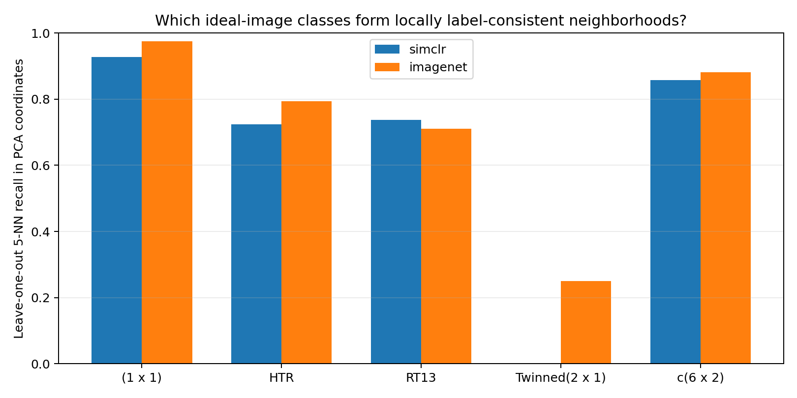

*Figure 10. Which ideal-image types have locally label-consistent PCA neighborhoods? `(1 x 1)` and `c(6 x 2)` are high-recall in both encoders; the small Twinned sample is not. Generated from [per-class 5-NN diagnostics](active_learning_studies/image_representation_analysis/results/representation_exploration/section5_diagnostics/per_class_knn_metrics.csv).*

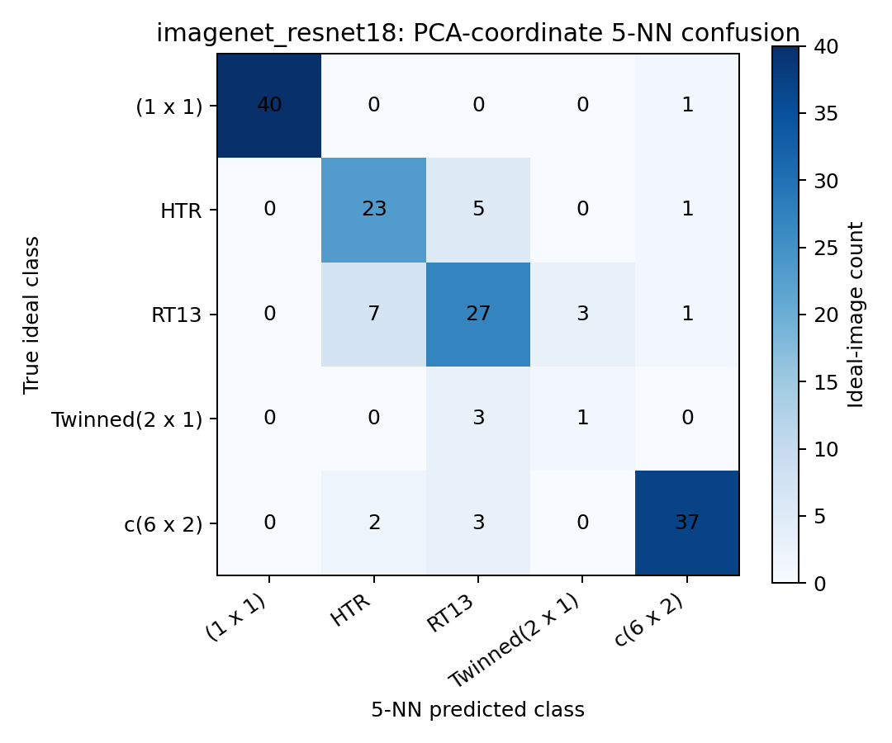

*Figure 11. Which reconstruction types share local ImageNet-feature neighborhoods? The off-diagonal HTR--RT13 counts identify the principal boundary for targeted comparisons. Generated from the [confusion matrix](active_learning_studies/image_representation_analysis/results/representation_exploration/section5_diagnostics/knn_confusion_matrix.csv).*

For trajectory coverage, the near threshold is the 95th percentile of each labelled ideal image's leave-one-out nearest-ideal distance, rather than an arbitrary radius. In the PCA views, 71.7% of trajectory frames lie inside the SimCLR labelled-ideal neighborhood and 81.9% lie inside the ImageNet neighborhood; the remaining 28.3% and 18.1% are feature-space regions sparsely represented by the ideal set. These frames are candidates for a trajectory coverage audit or expert labeling before treating an ideal-image classifier as representative of the whole trajectory stream. The full thresholds and fractions are in [trajectory-neighborhood coverage](active_learning_studies/image_representation_analysis/results/representation_exploration/section5_diagnostics/trajectory_neighborhood_coverage.csv).

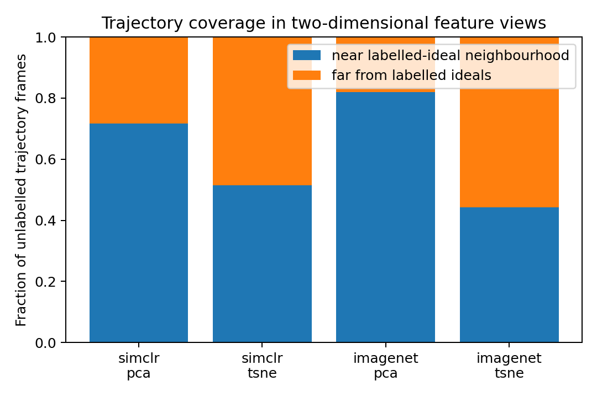

*Figure 12. Fraction of trajectory frames near the labelled ideal-image neighbourhood in each two-dimensional view. The plot identifies coverage gaps to inspect; it does not assign labels to unlabeled trajectory frames.*

PCA retains 76.2% of the SimCLR feature variation but only 37.4% of ImageNet variation, so the ImageNet PCA plot is a more compressed sketch of its full representation. The report therefore uses the two-dimensional plots to locate candidate overlap and coverage questions, then tests those questions with acquisition and validation experiments rather than treating a plotted gap as a performance result. All metrics, coordinate files, and thresholds are recorded in the [diagnostic manifest](active_learning_studies/image_representation_analysis/results/representation_exploration/section5_diagnostics/manifest.json).

### 5.5 Metadata fusion: a separate, currently data-limited study

**Question.** Do process-monitor variables contain prediction information that is absent from the image? This is a different experiment from active pair selection. It requires three matched models—image-only, metadata-only, and image-plus-metadata late fusion—so that a gain can be attributed to the combination rather than to a changed split or image encoder. The available bundle does not yet provide multiple image-resolved sessions with a causal sensor-to-image mapping. The next action is therefore concrete: assemble those mappings, then evaluate the three arms on run-disjoint sessions with accuracy, macro-F1, per-class outcomes, and missing-metadata handling reported together.

### 5.6 Task 3b: budget-aware training protocol

**Question.** Should every acquisition budget use the same learning rate and number of epochs? Task 3a answered this with a validation-only grid rather than choosing a schedule by convention: five seeds × two encoder initializations × five acquisition budgets × four learning rates × three epoch counts, for 600 cells. Each cell begins with ten labelled pair groups, acquires a deterministic random reference batch at its budget, and measures utility-validation accuracy without opening the outer test. Task 3b then selects the highest mean validation setting for each encoder × budget. The complete grid is in the [validation-calibration summary](active_learning_studies/pair_disjoint_not_image_disjoint/results/budget_aware_protocol/validation_calibration_summary.csv), and the machine-readable selection is in the [Task 3b protocol](active_learning_studies/pair_disjoint_not_image_disjoint/results/budget_aware_protocol/budget_aware_protocol_by_encoder_and_budget.json).

| Encoder | Budget 10 | Budget 25 | Budget 50 | Budget 75 | Budget 100 |
|---|---|---|---|---|---|
| ImageNet | 30 epochs, $10^{-4}$ | 10 epochs, $3\cdot10^{-4}$ | 10 epochs, $3\cdot10^{-4}$ | 30 epochs, $3\cdot10^{-4}$ | 30 epochs, $3\cdot10^{-4}$ |
| SimCLR | 30 epochs, $10^{-4}$ | 30 epochs, $3\cdot10^{-4}$ | 30 epochs, $3\cdot10^{-4}$ | 10 epochs, $3\cdot10^{-4}$ | 30 epochs, $10^{-4}$ |

The selected schedules vary in both epoch count and learning rate. That variation is the useful finding: smaller and larger acquired sets do not present the optimizer with the same amount or composition of pairwise data, and the two encoder initializations respond differently. Task 3b therefore prevents a strategy comparison from accidentally rewarding an arm because it received a better training schedule. In Task 3c, every strategy at the same encoder and budget must use the same Task 3b-selected setting; the strategy comparison can then focus on the value of the acquired labels rather than a hidden optimizer advantage.

The currently saved Task 3b table was built before the SHA-256 image-identity repair. Its role is to define the calibration procedure and show why schedule selection must be budget-aware. The next operational step is to rerun the same Task 3a → Task 3b process after rebuilding the partitions by image identity, then use the resulting table for the final strategy curve.

### 5.7 Evidence categories

| Category | Status | Permitted interpretation |
|---|---|---|
| Historical fixed-schedule budget curves | Strategy/budget and preprocessing hypotheses | Re-run after SHA-256 split exclusion before selecting a final acquisition rule |
| Task 3b budget-aware protocol | Per-encoder, per-budget validation-selected learning rates and epoch counts | Re-run the same Task 3a → Task 3b selection after identity-safe partitioning |
| SHA-256-safe split + epoch logging | Test-image exclusion and validation-based stopping mechanism | Use as the protocol for all new comparison arms |
| Leakage-safe calibration and final selector curve | Final strategy ranking and effect size | Execute after validation freezes all settings |

### 5.8 Claim Audit

| Claim | Measured evidence | Interpretation | Concrete next test |
|---|---|---|---|
| Useful selector changes with acquisition budget | Five-seed winners change from random at 10 to uncertainty at 100 | Small batches benefit from stable pool coverage; larger batches can exploit ambiguity | Identity-safe paired strategy curve using the Task 3b-selected schedule and a fixed-update control |
| Symmetry changes selector behavior | Stage 2 best condition ranges from symmetric-average core-set at 10 to no-symmetry uncertainty at 100 | Mirroring can either suppress nuisance variation or erase discriminative detail | Full strategy × budget × preprocessing factorial |
| ImageNet provides a stronger starting geometry in the current screen | Validation: 0.556 vs. 0.389 for random; 0.611 vs. 0.300 for uncertainty | The starting coordinate system affects uncertainty, clustering, and coverage | Encoder × strategy × budget paired rerun |
| HTR and RT13 are the principal frozen-feature boundary | PCA 5-NN confusion has 7/9 SimCLR and 5/7 ImageNet HTR/RT13 cross-errors | Their local appearance neighborhoods overlap | Target HTR--RT13 boundary-pair acquisition and feature ablation |
| Twinned support is insufficient for stable 5-NN geometry | Only four labelled ideals; recall 0.000/0.250 | Current feature-space estimate is dominated by sample scarcity | Add labelled Twinned ideal images before encoder comparison |
| A nontrivial trajectory region is outside ideal neighborhoods | PCA far fractions: 28.3% SimCLR, 18.1% ImageNet | The ideal set does not densely cover every observed trajectory region | Audit and label representative far trajectory frames |
| Training schedule depends on encoder and budget | Task 3b selects both 10- and 30-epoch settings and both $10^{-4}$ and $3\cdot10^{-4}$ learning rates | Training configuration is a controlled variable, not a fixed default | Re-run Task 3a/3b under SHA-256-safe partitions before Task 3c |

## 6. Reproducible Next Experiments

The required experiment sequence is deliberately ordered so that the outer test cannot influence a decision.

1. **Identity-safe split capacity audit.** Rebuild every seed by SHA-256 identity, confirm zero outer-test overlap with pairwise rows, candidate images, unlabeled trajectories, references, utility validation, and Bad anchors, and record how many rows are excluded.
2. **Identity-safe Task 3a → Task 3b calibration.** For every encoder and budget, use utility validation to screen learning rate $[10^{-5},3\cdot10^{-5},10^{-4},3\cdot10^{-4}]$ and epoch count $[3,10,30]$ at the protocol weight decay $10^{-4}$. Aggregate the five seeds and select one setting per encoder × budget before running any strategy arm.
3. **Leakage-safe strategy comparison.** Freeze the selected schedule and evaluate random, uncertainty, core-set, cluster-quota uncertainty, uncertainty--diversity, Cluster-Margin, and eligible MC-dropout rules at budgets $[10,25,50,75,100]$ across the declared seeds. Sweep uncertainty--diversity $\lambda \in [0,0.25,0.5,0.75,1]$, cluster count, dropout probability, and MC sample count on validation only.
4. **Controls and reporting.** Run both Task 3b-selected epoch training and a fixed-total-optimizer-update control. Only after all choices are frozen, run outer-test evaluation and report mean, standard deviation, per-seed values, and paired differences versus random.
5. **Independent metadata-fusion study.** Obtain multiple image-resolved sessions, audit causal alignment, then run image-only, metadata-only, and fusion baselines under run-disjoint splits.

## 7. Limitations and Next Experiment

The outer ideal-image endpoint is small and may have high seed variation. The historical data-identity leakage means previously reported outer-test numbers must not be presented as final generalization estimates. The next experiment must rebuild the split by identity, train using only permitted data, select hyperparameters and stopping epochs from utility validation, freeze those choices, and then run a single final outer-test comparison across declared strategies and seeds.

## 8. Conclusion

Pairwise active learning can be evaluated rigorously only when the acquisition unit, training data, validation decisions, and final test set are explicitly separated. This repository now provides the necessary computational safeguards: pair-disjoint acquisition groups, content-identity exclusion of outer-test images, validation-only early stopping, and artifact-level auditing. The historical curves are useful motivation; the leakage-safe rerun is the necessary evidence for a final result.

## References

1. R. A. Bradley and M. E. Terry. *Rank Analysis of Incomplete Block Designs: I. The Method of Paired Comparisons*. Biometrika, 1952.
2. B. Settles. *Active Learning Literature Survey*. University of Wisconsin--Madison, 2009.
3. K. He, X. Zhang, S. Ren, and J. Sun. *Deep Residual Learning for Image Recognition*. CVPR, 2016.
4. T. Chen et al. *A Simple Framework for Contrastive Learning of Visual Representations*. ICML, 2020.

## Appendix A. Figure Provenance

- Figure 1: generated by `active_learning_studies/pair_disjoint_not_image_disjoint/generate_academic_report_assets.py`.
- Figure 2: generated by the same script from the implemented split contract.
- Figure 3: generated by the script from the cited historical CSV; it introduces no new numerical results.
- Figure 4: generated by the script from the Stage 2 symmetry-factorial aggregate CSV.
- Figure 5: generated by the script from the encoder-screen validation CSV.
- Figures 6--9: existing PCA/t-SNE artifacts from `active_learning_studies/image_representation_analysis/results/representation_exploration/`; they use the exploratory manifest and are not active-learning outcome figures.
- Figures 10--12: generated by `generate_section5_representation_diagnostics.py` from saved exploratory coordinate CSVs.
