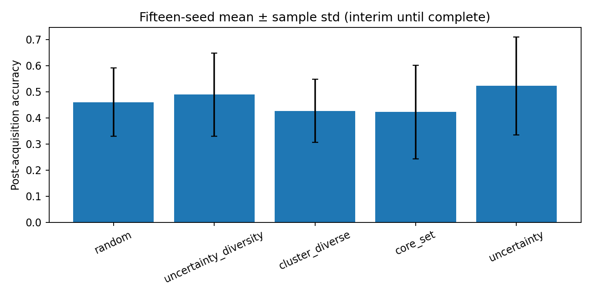
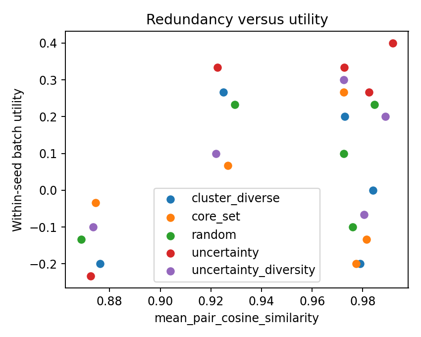
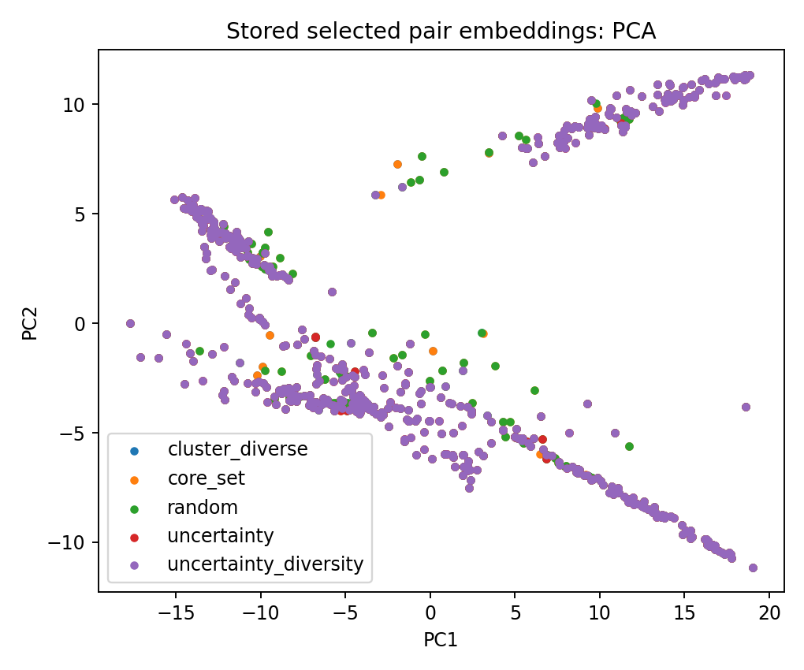

# Active Selection from Pairwise Image Preferences

### Abstract

This study examines how to select a limited number of image-pair preference labels for training the Bradley--Terry reward model, in order to improve the downstream reconstruction type classifier. We implement a ResNet-18 reward model, compare uncertainty and diversity-aware acquisition rules, and evaluate against a test set of ideal images with absolute labels. An SHA-256 audit found byte-identical images crossing prior partitions: 1--3 ideal images per seed also appeared as unlabelled trajectory images. The revised implementation constructs and audits splits by content identity, excludes every outer-test identity from pairwise/unlabelled trajectory images and negative anchors, and records epoch-wise validation metrics for validation-only early stopping.

## 1. Introduction

Pairwise labels ask a simple question: *given two images, which one is preferred for a specified reconstruction type?* They are often easier for experts to provide than absolute scores. However, expert time is limited, so an active-learning system must choose which hidden comparisons to reveal.

We study the following computational question: among **candidate pairs**, which pairs should be labelled and added to a preference-trained image model? 

Figure 1 shows the intended evaluation firewall. Validation can select training settings and a stopping epoch; the outer test is used only after these choices are frozen.


*Figure 1. Computational pipeline and evaluation firewall.*

## 2. Method

### 2.1 Preference reward model

See https://github.com/ymeng3/Quantum/tree/main/Classifier2.

Each image $x$ is passed through a ResNet-18 encoder and a reward head that returns one score per reconstruction class, $r_\theta(x,t)$. For a labelled pair $(x_i,x_j)$ of type $t$, the Bradley--Terry model assigns the probability that the first image is preferred as

$$
P_\theta(x_i \succ x_j \mid t) = \sigma\!\left(r_\theta(x_i,t)-r_\theta(x_j,t)\right),
\qquad \sigma(z)=\frac{1}{1+e^{-z}}.
$$

In plain language, the model is confident that the first image should win when its learned score is much larger than the second image's score. For a first-image win, the loss is

$$
\mathcal L_{BT} = -\frac{1}{|D|}\sum_{(i,j,t)\in D} w_{ij}\log P_\theta(x_i \succ x_j\mid t),
$$

where $w_{ij}$ is an optional annotator-confidence weight. The implementation also handles reversed wins, ties, and not-applicable labels using the corresponding loss terms in `pairwise_active_learning_pipeline.py`.

#### Downstream reconstruction prediction and accuracy

The downstream endpoint is reconstruction-type accuracy on held-out ideal images, not pairwise training accuracy. For a test or utility-validation image $x$, let $R_c$ be the set of ideal reference anchors labelled as class $c$, and let $R_{-c}=\bigcup_{d\ne c}R_d$ be the anchors from every *other* class. The class-$c$ win rate is

$$
W_c(x)=\frac{1}{|R_{-c}|}\sum_{z\in R_{-c}}\sigma\!\left(r_\theta(x,c)-r_\theta(z,c)\right).
$$

$r_\theta(x,c)$ is the $c$-th reward-head score for image $x$. Each term asks whether $x$ is more compatible with class $c$ than an anchor known to belong to another class, on the class-$c$ reward dimension. $W_c(x)$ averages that comparison over all non-$c$ reference anchors. The predicted reconstruction type is

$$
\hat c(x)=\underset{c\in\mathcal C}{\arg\max}\ W_c(x),
$$

where $\mathcal C$ is the available reconstruction-type set. Thus a class wins only when its reward dimension separates the image from reference examples of the competing classes; the model does not compare an image with same-class reference anchors at this step. For an evaluation split $E$ with absolute labels $c(x)$, downstream accuracy is

$$
A(E)=\frac{1}{|E|}\sum_{x\in E}\mathbf{1}\!\left[\hat c(x)=c(x)\right].
$$

In plain language, this is the fraction of held-out ideal images assigned the correct reconstruction type. $A(E)$ is calculated identically for `utility_validation` and `outer_test`; only the former is available while selecting epochs, learning rates, and acquisition settings. The implementation is [Experiment.evaluate](https://github.com/Purpleline-z/rl_quantum_2026summer/blob/main/code/active_learning_program/pairwise_active_learning_pipeline.py#L447-L464), which also saves correct count, total count, and per-class accuracy.

The downstream model is a ResNet-18 encoder followed by a 512-to-256-to-5 reward head, and is fine-tuned with AdamW. Ideal reference images serve as both training anchors and the fixed comparison bank for downstream prediction; they are neither validation nor outer-test images. The historical fixed-schedule curves use full-model fine-tuning, batch size 16, learning rate $10^{-4}$, and three epochs; the budget-aware protocol in Section 5.8 replaces this fixed schedule with validation-selected settings.

The two encoder initializations are different starting representations under this same downstream training procedure. The shipped SimCLR checkpoint is image-only self-supervised pretraining and has not seen pairwise preference labels. ImageNet initialization uses torchvision ResNet-18 weights trained with ImageNet-1K supervision. Pairwise labels enter only during reward-model fine-tuning.

### 2.2 Active selection

Candidate comparisons retain their images but hide their human winner labels. Active selection decides which $b$ comparisons should be labelled next so that the retrained preference model makes more accurate reconstruction-type predictions on held-out ideal images. Let $L$ be the currently labelled pair groups, let $C$ be the label-hidden candidate groups, let $S_b\subseteq C$ be the $b$ groups selected by an acquisition strategy, and let $Y(S_b)$ be the labels revealed only after selection. The quantity that selection is trying to increase is

$$
\Delta A_{\mathrm{val}}(S_b\mid L)=
A_{\mathrm{val}}\!\left(F(L\cup Y(S_b))\right)
-A_{\mathrm{val}}\!\left(F(L)\right).
$$

Here $F(L)$ is the model produced by the fixed training procedure using labelled groups $L$, $A_{\mathrm{val}}$ is validation reconstruction accuracy, and $\Delta A_{\mathrm{val}}$ is the improvement attributable to the newly labelled batch. An acquisition rule cannot calculate this quantity directly because $Y(S_b)$ is hidden; instead, it uses the available images, embeddings, and model predictions as a proxy. Section 2.3 defines those proxies. Validation data choose a training schedule and compare design choices; the locked outer test is evaluated only after those choices are fixed.

The current study is a single-round, batch active-learning experiment: train on $L$, score all of $C$, select one batch $S_b$, reveal its labels, retrain on $L\cup Y(S_b)$, and evaluate. This makes a strategy's contribution easy to compare at a fixed annotation budget.

Implementation entry point: [Experiment.select](https://github.com/Purpleline-z/rl_quantum_2026summer/blob/main/code/active_learning_program/pairwise_active_learning_pipeline.py#L536).

~~~text
Algorithm 3: Single-round active-selection loop
Input: labelled groups L, label-hidden candidate groups C, budget b,
       acquisition rule A, validation set V, locked outer-test set T
1. Train a reward model f on L using a validation-selected schedule.
2. Compute permitted label-free quantities for every c in C.
3. Select S_b = A(C, f, L, b); do not read winner labels in this step.
4. Reveal Y(S_b), then retrain f' on L union Y(S_b).
5. Measure A_val(f') on V for protocol decisions and save the full run record.
6. Once all strategies and settings are frozen, evaluate the chosen protocol on T.
Output: selected groups S_b, validation result, and one locked-test result.
~~~

### 2.3 Acquisition strategies and their roles

All methods select complete pair groups, never individual images. The candidate view contains image paths and permitted model outputs, but not the human winner label.

| Strategy | Selection rule | Why it may help | Main tuning or failure mode |
|---|---|---|---|
| Random | Uniform sample of candidate groups | Essential unbiased baseline | High variance at small budgets |
| Uncertainty | Largest mean predictive entropy | Requests comparisons near the model decision boundary | Can repeatedly select visually similar pairs |
| Core-set | Farthest-first coverage in embedding space | Covers underrepresented image regions | Depends on encoder geometry and distance metric |
| Cluster-quota uncertainty | Spread selections over clusters, then rank by uncertainty | Avoids spending all labels in one region | Cluster count and quota can be mismatched to the data |
| Uncertainty + diversity | Largest $a(c)$ | Balances difficult and nonredundant pairs | Requires validation choice of $\lambda$ |
| Cluster-Margin | Low margin, then round-robin from small clusters | Keeps ambiguous pairs while protecting rare clusters | Historical evidence is a separate extension, not pooled with the five-strategy curve |
| MC-dropout variance / mutual information | Rank disagreement across dropout predictions | Models epistemic uncertainty | Requires dropout probability and Monte-Carlo sample-count calibration |

The common strategy dispatcher is [`Experiment.select`](https://github.com/Purpleline-z/rl_quantum_2026summer/blob/main/code/active_learning_program/pairwise_active_learning_pipeline.py#L536). Each pseudocode block gives the exact implemented score or sampling distribution, defines its symbols, and links to the implementing function. $C$ is the candidate-pair pool, $L$ is the labelled-pair pool, and $b$ is the requested number of selected pair groups throughout.

#### Algorithm 3a: Random baseline

Implementation: [`random_sampling`](https://github.com/Purpleline-z/rl_quantum_2026summer/blob/main/code/active_learning_program/pair_acquisition_methods.py#L110).

```text
Input: candidate pair groups C, budget b, random seed s
initialize a deterministic random-number generator with s
return b distinct groups sampled uniformly from C
```

$$
\Pr(S)=\binom{|C|}{b}^{-1}\quad\text{for every }S\subseteq C\text{ with }|S|=b.
$$

Thus every possible batch $S$ of $b$ groups has the same probability; $|C|$ is the number of available candidates. Random has no model-derived score and provides the reference for whether a more elaborate rule earns its complexity.

#### Algorithm 3b: Predictive uncertainty

Implementation: [`uncertainty_sampling`](https://github.com/Purpleline-z/rl_quantum_2026summer/blob/main/code/active_learning_program/pair_acquisition_methods.py#L116), which calls [`score_uncertainty`](https://github.com/Purpleline-z/rl_quantum_2026summer/blob/main/code/active_learning_program/pair_acquisition_methods.py#L75).

```text
Input: candidates C, trained reward model f, budget b
for each pair (xi, xj) in C:
    p_h = sigmoid(r_h(xi) - r_h(xj)) for every reward head h
    uncertainty = mean BernoulliEntropy(p_h) across reward heads
return the b pairs with largest uncertainty
```

$$
p_h(c)=\sigma\!\left(r_\theta(x_i,h)-r_\theta(x_j,h)\right),\qquad
u(c)=\frac{1}{H}\sum_{h=1}^{H}\left[-p_h(c)\log p_h(c)-(1-p_h(c))\log(1-p_h(c))\right].
$$

For candidate $c=(x_i,x_j)$, $p_h(c)$ is the predicted probability that $x_i$ wins under reward head $h$, $H$ is the number of heads, and $u(c)$ is their mean Bernoulli entropy. Large entropy means that the current model assigns a probability near one half, so this rule requests labels for comparisons it presently finds hard.

#### Algorithm 3c: Core-set coverage

Implementation: [`core_set_select`](https://github.com/Purpleline-z/rl_quantum_2026summer/blob/main/code/active_learning_program/pair_acquisition_shared_calculations.py#L52); pair embeddings are created through [`pair_vector`](https://github.com/Purpleline-z/rl_quantum_2026summer/blob/main/code/active_learning_program/pair_acquisition_shared_calculations.py#L20).

```text
Input: candidate pair embeddings C, labelled-pair embeddings L, budget b
selected = empty
repeat b times:
    choose c in C that has the greatest distance to L union selected
    add c to selected
return selected
```

$$
v(c)=\frac{e(x_i)+e(x_j)}{2},\qquad
c^*=\underset{c\in C\setminus S}{\arg\max}\ \min_{z\in\{v(\ell):\ell\in L\}\cup\{v(s):s\in S\}}\|v(c)-z\|_2.
$$

Here $e(x)$ is the encoder embedding of image $x$, $v(c)$ is the average embedding of the two images in pair $c$, $S$ is the batch selected so far, and $\|\cdot\|_2$ is Euclidean distance. The rule repeatedly adds the candidate furthest from already covered labelled or selected pairs. When $L$ is empty, the implementation initializes distances from the candidate-pool mean.

#### Algorithm 3d: Cluster-quota uncertainty

Implementation: [`cluster_quota_uncertainty_sampling`](https://github.com/Purpleline-z/rl_quantum_2026summer/blob/main/code/active_learning_program/pair_acquisition_methods.py#L122).

```text
Input: candidates C with cluster IDs, reward model f, budget b
compute uncertainty for every candidate
allocate a proportional integer quota, with a minimum of one before budget is exhausted
within each cluster quota, choose the most uncertain remaining candidate
fill any unused budget with globally most uncertain remaining candidates
return selected groups
```

$$
n_g=|\{c\in C:g(c)=g\}|,\qquad
q_g=\max\!\left(1,\mathrm{round}\!\left(b\frac{n_g}{|C|}\right)\right).
$$

$g(c)$ is the cluster assigned to pair $c$, $n_g$ is that cluster's candidate count, and $q_g$ is its proportional provisional quota. Within each cluster the implementation takes the $q_g$ largest uncertainty scores $u(c)$, then fills any remaining budget with the largest $u(c)$ globally. The minimum-one rule gives small clusters a chance to contribute before the budget is exhausted.

#### Algorithm 3e: Uncertainty plus diversity

Implementation: [`uncertainty_diversity_select`](https://github.com/Purpleline-z/rl_quantum_2026summer/blob/main/code/active_learning_program/pair_acquisition_shared_calculations.py#L29).

```text
Input: uncertainty-scored candidates C, labelled embeddings L, budget b, lambda
for each candidate c:
    u = normalized predictive uncertainty of c
    d = normalized distance from c to L and already selected pairs
    score(c) = u + lambda*d
repeat until b groups are selected:
    add remaining candidate with largest score and update diversity distances
return selected groups
```

$$
d(c;L,S)=\min_{z\in\{v(\ell):\ell\in L\}\cup\{v(s):s\in S\}}\|v(c)-z\|_2,
\qquad a(c)=R(u(c))+\lambda R(d(c;L,S)).
$$

Here $u(c)$ is the uncertainty from Algorithm 3b, $d(c;L,S)$ is distance from covered pair embeddings, $S$ is updated after every selection, and $\lambda$ weights diversity. $R(\cdot)$ is the implementation's robust normalization: values are clipped at their 5th and 95th percentiles and rescaled to $[0,1]$. The rule greedily chooses the remaining candidate with the largest $a(c)$ and then recomputes diversity distances.

#### Algorithm 3f: Cluster-Margin

Implementation: [`cluster_margin_pairwise_sampling`](https://github.com/Purpleline-z/rl_quantum_2026summer/blob/main/code/active_learning_program/pair_acquisition_methods.py#L145).

```text
Input: candidates C with clusters, reward model f, budget b
compute each pair's distance from probability 0.5 (its margin)
prefilter min(10*b, number of candidates) pairs with the smallest margins
round-robin across prefiltered clusters, visiting smaller prefiltered clusters first
return b selected groups
```

$$
m(c)=\frac{1}{H}\sum_{h=1}^{H}\left|p_h(c)-\tfrac{1}{2}\right|,
$$

$p_h(c)$ and $H$ have the meanings defined for predictive uncertainty. $m(c)$ is small when the heads place the comparison close to a 50--50 decision. Let $P$ contain the $\min(10b,|C|)$ candidates with the smallest margins. The implementation groups $P$ by $g(c)$, orders the groups from smallest to largest, and takes their smallest-margin remaining member in round-robin order until $b$ pairs are selected.

#### Algorithm 3g: MC-dropout probability variance

Implementation: [`score_mc_dropout`](https://github.com/Purpleline-z/rl_quantum_2026summer/blob/main/code/active_learning_program/monte_carlo_dropout_uncertainty.py#L33) and [`select_mc_dropout`](https://github.com/Purpleline-z/rl_quantum_2026summer/blob/main/code/active_learning_program/monte_carlo_dropout_uncertainty.py#L77).

```text
Input: candidates C, reward model f with dropout active, b, M stochastic passes
for m = 1,...,M:
    score every candidate with a different dropout mask
for each candidate:
    compute variance of its predicted preference probability across M passes
return b candidates with largest probability variance
```

$$
\bar p_h(c)=\frac{1}{M}\sum_{m=1}^{M}p_{mh}(c),\qquad
v_{\mathrm{MC}}(c)=\frac{1}{H}\sum_{h=1}^{H}\frac{1}{M}\sum_{m=1}^{M}\left[p_{mh}(c)-\bar p_h(c)\right]^2.
$$

$p_{mh}(c)$ is the preference probability for candidate $c$ from dropout pass $m$ and reward head $h$, $M$ is the number of stochastic dropout passes, and $H$ is the number of heads. A large $v_{\mathrm{MC}}(c)$ means predictions change substantially when dropout perturbs the model, so the candidate is selected as epistemically uncertain.

#### Algorithm 3h: MC-dropout mutual information

Implementation: the same [`score_mc_dropout`](https://github.com/Purpleline-z/rl_quantum_2026summer/blob/main/code/active_learning_program/monte_carlo_dropout_uncertainty.py#L33) and [`select_mc_dropout`](https://github.com/Purpleline-z/rl_quantum_2026summer/blob/main/code/active_learning_program/monte_carlo_dropout_uncertainty.py#L77) functions, dispatched with metric `mc_dropout_mutual_information`.

```text
Input: candidates C, reward model f with dropout active, b, M stochastic passes
obtain M stochastic preference distributions per candidate
for each candidate:
    predictive_entropy = entropy(mean probability)
    expected_entropy = mean entropy(stochastic probabilities)
    mutual_information = predictive_entropy - expected_entropy
return b candidates with largest mutual_information
```

$$
I_{\mathrm{MC}}(c)=\frac{1}{H}\sum_{h=1}^{H}\left[
h\!\left(\frac{1}{M}\sum_{m=1}^{M}p_{mh}(c)\right)
-\frac{1}{M}\sum_{m=1}^{M}h\!\left(p_{mh}(c)\right)\right],
\qquad h(p)=-p\log p-(1-p)\log(1-p).
$$

The symbols $p_{mh}(c)$, $M$, and $H$ are as above. $h(p)$ is Bernoulli entropy. The first term measures uncertainty after averaging dropout predictions; the second measures their average individual uncertainty. Their difference is large when model samples disagree, which directs labels toward uncertainty caused by model parameters rather than one consistently ambiguous pair.

### 2.4 Leakage-safe training algorithms

```text
Algorithm 1: Build leakage-safe partitions
Input: ideal images, pairwise rows, seed
1. Compute SHA-256 identity for every image file.
2. Assign each unique ideal identity to exactly one of {reference, validation, outer test}.
3. Collect identities assigned to outer test.
4. Remove every pairwise/unlabelled-trajectory row and negative anchor whose image identity is in outer test.
5. Form pair-disjoint initial and candidate pair groups; image reuse across those pair groups is allowed.
6. Audit and save every path/hash overlap count; fail a run if any test-identity overlap remains.
Output: pair-disjoint training/candidate groups and identity-disjoint ideal partitions.
```

```text
Algorithm 2: Train with validation-only early stopping
Input: labelled pairs, reference images, utility-validation set, maximum epochs E, patience p
best_metric = -infinity; stale = 0
for epoch = 1,...,E:
    optimize Bradley--Terry and permitted reference-anchor losses for one epoch
    record mean training loss
    metric = reconstruction_accuracy(utility-validation)
    record metric; never evaluate outer test here
    if metric improves best_metric: save model; best_metric = metric; stale = 0
    else: stale += 1
    if stale >= p: stop
return saved model with highest validation metric
```


## 3. Data Protocol and Leakage Prevention

### 3.1 Historical data and benchmark contract

The v1.8 preference source contains 669 valid rows representing 179 unordered pair groups. In the completed controlled benchmark, 50 groups form the initial labelled set, 120 form the candidate pool, and 9 are unused. There is no separate pairwise validation partition: every preference group is initial, candidate, or unused. The [Stage 1 manifest](active_learning_studies/pair_disjoint_not_image_disjoint/results/selection_benchmark/stage1_selector_curves_none/study_manifest.json) records the exact allocation.

The unit of acquisition is an unordered pair group; initial and candidate groups are pair-disjoint. The same image may occur in different non-test pair groups because image-disjoint pair partitions are unnecessarily restrictive for this application. Ideal reference, utility-validation, and outer-test images are separately partitioned. In contrast, no outer-test identity may appear in training pairs, candidate images, reference anchors, utility validation, or Bad-image anchors.

For the default identity-safe configuration, `Twinned(2 x 1)` is excluded and 144 unique identities remain from 150 ideal-image files. The resulting capacity is 28 outer-test images, 28 utility-validation images, and 88 reference anchors. Counts by reconstruction type are exported in the [identity-safe split-capacity CSV](active_learning_studies/pair_disjoint_not_image_disjoint/results/identity_safe_protocol/ideal_split_capacity.csv).

| Reconstruction type | Raw files | Unique identities | Outer test | Utility validation | Reference anchors |
|---|---:|---:|---:|---:|---:|
| `(1 x 1)` | 41 | 41 | 8 | 8 | 25 |
| `c(6 x 2)` | 42 | 41 | 8 | 8 | 25 |
| `(√13 x √13)` | 38 | 36 | 7 | 7 | 22 |
| `HTR` | 29 | 26 | 5 | 5 | 16 |
| **Total** | **150** | **144** | **28** | **28** | **88** |

### 3.2 Identity-safe split contract


*Figure 2. Required split protocol. Identity means SHA-256 file content, not filename.*

The implementation enforces this rule in `active_learning_program/pairwise_active_learning_pipeline.py`. It retains audit counts for path and content-identity overlaps. This avoids the failure mode in which duplicated image bytes appear under different paths and silently leak from a train-time pool into the test set.

## 4. Implementation and Reproducibility

The reusable program is in `active_learning_program/`. `pairwise_active_learning_pipeline.py` loads preference CSVs, creates ideal partitions, trains the reward model, and executes selectors. `resumable_model_training.py` now stores per-epoch training loss and utility-validation accuracy and restores the best validation checkpoint. The budget-aware runner uses `utility_validation` for training decisions and records `outer_test_not_evaluated: true` during calibration.

Each run should save: configuration; data hashes; pair manifests; split audit; per-epoch metrics; selected pair IDs; seed; and all aggregate CSVs used in figures. Every paper number must trace to one of these saved artifacts.

## 5. Results and Evidence Status

### 5.1 Historical selector curves: diagnostic only

The repository contains five-seed, fixed-schedule curves across acquisition budgets. Figure 3 is generated directly from `results/selected_summaries/budget_curve_5seed/tables/strategy_performance_by_acquisition_budget.csv`.


*Figure 3. Five-strategy accuracy across acquisition budgets from the fixed-schedule study; the winner changes with budget.*

**Question.** Does the same acquisition rule select useful labels at every annotation budget? This historical five-seed curve uses the unmodified-image mode and the fixed full-model schedule described in Section 2.1. Mean outer-test accuracy identifies the leading arm at each budget:

| Acquired pair groups | Leading arm | Mean outer-test accuracy | Decision carried into the identity-safe rerun |
|---:|---|---:|---|
| 10 | Random | 0.413 | Retain random as the paired baseline when labels are scarce. |
| 25 | Uncertainty | 0.440 | Compare against random under the validation-selected schedule. |
| 50 | Cluster-quota uncertainty | 0.460 | Retain this documented coverage comparator. |
| 75 | Uncertainty + diversity | 0.513 | Preserve the exact diversity weight as a validation-tuned setting. |
| 100 | Uncertainty | 0.647 | Use uncertainty as a principal reference arm. |

The full means and standard deviations are in the [strategy-by-budget table](active_learning_studies/pair_disjoint_not_image_disjoint/results/selection_benchmark/stage1_selector_curves_none/aggregate/strategy_budget_summary.csv).

The changing winners indicate that annotation budget changes the selection problem. At 10 labels, random sampling provides a stable cross-section of the pool; at 50, cluster quotas can prevent the batch from collapsing into one embedding region; at 75--100, uncertainty-based rules can sample several ambiguous regions. Test these explanations with paired seed-level gains over random after validation selects the training schedule, alongside a fixed-total-update control that removes the effect of differing optimizer updates.

### 5.2 Symmetry preprocessing is an experimental factor

The repository evaluates three input modes: `none`, `left_half_mirror`, and `symmetric_average`. The latter two encode a symmetry assumption by reconstructing an image from its left half or averaging it with its horizontal reflection. They can remove discriminative asymmetry and reduce nuisance variation.


*Figure 4. Strategy--budget--symmetry interaction from the Stage 2 aggregate CSV; no one preprocessing mode wins across conditions.*

**Question.** Does enforcing horizontal symmetry make candidate comparisons easier to use? The answer depends on both budget and selector. The table below gives the strongest and weakest condition at each budget from the [Stage 2 factorial](active_learning_studies/pair_disjoint_not_image_disjoint/results/selection_benchmark/stage2_symmetry_factorial/aggregate/strategy_budget_summary.csv).

| Budget | Highest mean accuracy condition | Lowest mean accuracy condition | Operational meaning |
|---:|---|---|---|
| 10 | core-set + symmetric average: 0.533 | core-set + none: 0.307 | Averaging can make embedding coverage more stable when labels are scarce. |
| 25 | random + symmetric average: 0.507 | core-set + none: 0.347 | The transform can help even without model-based selection, consistent with removing condition-specific variation. |
| 50 | core-set + left-half mirror: 0.527 | uncertainty + none: 0.300 | Mirroring changes which regions look distinct in embedding space. |
| 75 | uncertainty-diversity + none: 0.513 | random + none: 0.293 | The unmodified image retains useful information for the best selector at this budget. |
| 100 | uncertainty + none: 0.647 | core-set + symmetric average: 0.367 | Strong symmetry processing can remove distinctions that uncertainty exploits. |

`left_half_mirror` and `symmetric_average` change the information given to the encoder. A gain after averaging indicates that suppressing asymmetry helps that selector and budget; a loss indicates that the removed asymmetric detail helps the comparison. Test this interaction with an identity-safe strategy × budget × preprocessing factorial using the same validation-selected schedule for all arms at a given budget.

### 5.3 SimCLR versus ImageNet initialization


*Figure 5. Utility-validation encoder screen; error bars are standard deviations over three seeds.*

**Question.** Which frozen starting representation gives the selector a more useful coordinate system? In the three-seed validation screen, ImageNet initialization exceeds SimCLR for both random selection (0.556 vs. 0.389) and uncertainty selection (0.611 vs. 0.300), as shown in the [encoder-screen CSV](active_learning_studies/pair_disjoint_not_image_disjoint/results/protocol_diagnostics/encoder_initialization_screen/aggregate/encoder_utility_validation_summary.csv).

The encoder determines which pairs appear close, which candidate clusters exist, and which comparisons look uncertain. In this screen, ImageNet initialization produced higher utility-validation accuracy after fine-tuning. Compare encoder × strategy with identity-safe seeds, optimizer, stopping rule, and budget held fixed; report per-seed paired differences to distinguish a broad shift from a few favourable splits.

### 5.4 PCA and t-SNE representation diagnostics

**Question.** Do frozen image features put examples of the same reconstruction type in the same local neighborhood, and do the labelled ideal images cover the trajectory population? An embedding is a numerical location assigned to each image: local label consistency means an image's nearest neighbours usually have the same reconstruction label. PCA displays the two directions with the most variation; the retained-variance fraction tells the reader how much of the full representation is visible in that two-axis sketch. t-SNE emphasizes who is near whom and is useful for local neighborhoods, but its apparent gap widths are not literal distances.


*Figure 6. PCA of frozen RHEED-SimCLR features for the exploratory image manifest.*


*Figure 7. t-SNE of frozen RHEED-SimCLR features for the same exploratory manifest.*


*Figure 8. PCA of frozen ImageNet ResNet-18 features for the exploratory image manifest.*


*Figure 9. t-SNE of frozen ImageNet ResNet-18 features for the same exploratory manifest.*

The full frozen-feature check gives 5-NN accuracy 0.884 for SimCLR and 0.896 for ImageNet, versus 0.832 for raw pixels. The more specific coordinate diagnostics now show what that average hides. In PCA coordinates, `(1 x 1)` has the highest 5-NN recall for both SimCLR (0.927) and ImageNet (0.976); `c(6 x 2)` is also locally consistent (0.857 and 0.881). These are the classes whose nearest feature-space neighbours usually share their label, so coverage- or similarity-based acquisition has a meaningful local geometry to work with for them.

The main ambiguous boundary is `HTR` versus `RT13`: SimCLR PCA 5-NN misclassifies 7 HTR images as RT13 and 9 RT13 images as HTR; ImageNet PCA makes the same pair of errors 5 and 7 times. Their nearest-other-class distances are also small relative to within-class spread in the [class-separation table](active_learning_studies/image_representation_analysis/results/representation_exploration/section5_diagnostics/class_separation_metrics.csv), placing many HTR and RT13 images in mixed frozen-feature neighborhoods. Use a boundary-pair acquisition slice to test whether expert preference labels resolve HTR--RT13 comparisons, alongside an image-only versus permitted-additional-feature ablation.

`Twinned(2 x 1)` has only four labelled ideal images and PCA recall of 0.000 for SimCLR and 0.250 for ImageNet. Four examples provide too few same-class neighbours for a stable five-neighbour neighborhood. Obtain or annotate additional Twinned ideal images before comparing encoder separation for this type.


*Figure 10. Which ideal-image types have locally label-consistent PCA neighborhoods? `(1 x 1)` and `c(6 x 2)` are high-recall in both encoders; the small Twinned sample is not. Generated from [per-class 5-NN diagnostics](active_learning_studies/image_representation_analysis/results/representation_exploration/section5_diagnostics/per_class_knn_metrics.csv).*


*Figure 11. Which reconstruction types share local ImageNet-feature neighborhoods? The off-diagonal HTR--RT13 counts identify the principal boundary for targeted comparisons. Generated from the [confusion matrix](active_learning_studies/image_representation_analysis/results/representation_exploration/section5_diagnostics/knn_confusion_matrix.csv).*

For trajectory coverage, the near threshold is the 95th percentile of each labelled ideal image's leave-one-out nearest-ideal distance, rather than an arbitrary radius. In the PCA views, 71.7% of trajectory frames lie inside the SimCLR labelled-ideal neighborhood and 81.9% lie inside the ImageNet neighborhood; the remaining 28.3% and 18.1% are feature-space regions sparsely represented by the ideal set. These frames are candidates for a trajectory coverage audit or expert labeling before treating an ideal-image classifier as representative of the whole trajectory stream. The full thresholds and fractions are in [trajectory-neighborhood coverage](active_learning_studies/image_representation_analysis/results/representation_exploration/section5_diagnostics/trajectory_neighborhood_coverage.csv).


*Figure 12. Fraction of trajectory frames near the labelled ideal-image neighbourhood in each two-dimensional view. The plot identifies coverage gaps to inspect; it does not assign labels to unlabeled trajectory frames.*

PCA retains 76.2% of the SimCLR feature variation but only 37.4% of ImageNet variation, so the ImageNet PCA plot is a more compressed sketch of its full representation. Use the two-dimensional plots to locate candidate overlap and coverage questions, then test those questions with acquisition and validation experiments. All metrics, coordinate files, and thresholds are recorded in the [diagnostic manifest](active_learning_studies/image_representation_analysis/results/representation_exploration/section5_diagnostics/manifest.json).

### 5.5 Historical utility, redundancy, and batch interaction

**Question.** Why can a pair or a batch look useful in an intermediate utility analysis but not yield the highest final accuracy? The historical individual-pair utility used in the exploratory runs is

$$
U(p\mid L)=A_{\mathrm{outer}}\!\left(F(L\cup\{p\})\right)-A_{\mathrm{outer}}\!\left(F(L)\right).
$$

Here $p$ is one candidate pair, $L$ is the current labelled set, $F$ is the fixed retraining procedure, and $A_{\mathrm{outer}}$ is accuracy on the historical ideal-image outer-test set. This quantity asks what happens when one pair is added by itself. The realised utility of a selected batch $B$ is $U(B\mid L)=A_{\mathrm{outer}}(F(L\cup B))-A_{\mathrm{outer}}(F(L))$. It is not the sum of the individual utilities because pairs are retrained together; their gradients and the later selection sequence can change one another's effect. These outer-test utilities are historical diagnostics only and are not used by the current selector or budget-aware calibration.

The earlier budget-30 observation comes from one sequential trace, where each round changes $L$ before the final endpoint is measured. Its intermediate single-pair utilities and later final accuracy therefore condition on different labelled sets. The [sequential log](active_learning_studies/pair_disjoint_not_image_disjoint/results/earlier_explorations/sequential_exploration_20260728/epoch%202%20budget%2030%20batch%202%20seed%2042%20experiment_log.csv) identifies a question for the controlled study; it does not separate redundancy, interaction, or overfitting.



*Figure 13. Historical 15-seed budget-100 comparison. The figure asks whether the strategy that improves batch utility also improves post-acquisition accuracy; uncertainty has the largest mean on both measures.*

At budget 100, uncertainty has the largest historical mean post-acquisition accuracy (0.522) and batch utility (+0.144) over 15 seeds. Uncertainty--diversity follows at 0.489 and +0.111; random at 0.460 and +0.082; cluster-diverse at 0.427 and +0.049; and core-set at 0.422 and +0.044, as reported in the [15-seed summary](active_learning_studies/pair_disjoint_not_image_disjoint/results/strategy_followup_analysis/fifteen_seed_extension/fifteen_seed_summary.csv). Post-acquisition-accuracy standard deviations range from 0.121 to 0.188, and the per-seed outcomes therefore vary across runs.



*Figure 14. Historical pair-similarity versus batch-utility diagnostic. The figure asks whether less similar selected pairs explain utility; the strategy means do not show a monotonic relationship.*

Redundancy does not explain the observed ranking by itself. Core-set has the lowest mean image-reuse rate (0.082) and uncertainty--diversity lowers it relative to random (0.091 versus 0.094), yet their mean batch utilities (+0.044 and +0.111) remain below uncertainty (+0.144). Mean pair cosine similarities are tightly grouped from 0.947 to 0.949 despite the utility spread, in the [redundancy table](active_learning_studies/pair_disjoint_not_image_disjoint/results/strategy_followup_analysis/redundancy_analysis/redundancy_utility_accuracy.csv). Thus “more diverse” is not sufficient evidence that a batch provides more reconstruction-relevant supervision.



*Figure 15. Historical PCA of selected pair embeddings. Overlap between core-set and uncertainty selections in this two-dimensional view does not test the full-dimensional farthest-first distances used by core-set.*

The PCA overlap between core-set and uncertainty selections does not conflict with the core-set algorithm: core-set chooses farthest-first pairs using full pair embeddings, whereas the plot compresses those embeddings to two coordinates. The actual concern is different: distant regions in the frozen embedding may not correspond to comparisons that improve reconstruction accuracy. Resolve that question with an identity-safe experiment that, for each selected batch, records individual utilities, the realised batch utility, and

$$
I(B\mid L)=U(B\mid L)-\sum_{p\in B}U(p\mid L).
$$

$I(B\mid L)$ measures non-additive batch interaction. Evaluate whether it varies with image reuse, pair similarity, cluster coverage, and training/validation curves. A negative interaction term supports harmful combination effects; a validation decline while pairwise training accuracy rises supports overfitting; neither explanation can be assigned from the saved historical batch records because their individual utilities are unavailable.

### 5.6 Metadata fusion: a separate, currently data-limited study

**Question.** Do process-monitor variables contain prediction information absent from the image? 

### 5.7 Physics-informed soft constraints for a complete trajectory

**Question.** Can known ordering preferences improve the interpretation of a *sequence* of classifier outputs without changing the image model? The trajectory study takes calibrated probabilities for the six states $(1\ x\ 1)$, `Bad`, `Twinned(2 x 1)`, $c(6\ x\ 2)$, $(\sqrt{13}\ x\ \sqrt{13})$, and `HTR`, then chooses the highest-scoring complete path. Its [configuration](active_learning_studies/rheed_trajectory_ordering_analysis/higher_order_trajectory_constraint_configuration.json) specifies three soft preferences: the first state is `(1 x 1)`; before a `Bad` frame occurs, a path should not move from `(1 x 1)` directly to another reconstruction; and a path should not leave `HTR` once it has entered it. If we exclude `Twinned(2 x 1)`, then we have 5 instead of 6 states.

For an ordered trajectory of $T$ frames, with classifier probability $q_t(s)$ for state $s$ at frame $t$, the decoder selects

$$
\hat y_{1:T} = \underset{y_{1:T}\in S^T}{\arg\max}\ \left[\sum_{t=1}^{T}\log q_t(y_t)-\phi_{\mathrm{start}}(y_1)-\sum_{t=2}^{T}\phi_{\mathrm{transition}}(y_{t-1},y_t,h_{t-1})\right].
$$

Here $S$ is the six-state set, $y_{1:T}$ is one possible state sequence, and $h_{t-1}$ records whether `Bad` has occurred earlier in that path. $\phi_{\mathrm{start}}$ penalizes a first state other than `(1 x 1)`. $\phi_{\mathrm{transition}}$ penalizes a non-`Bad`, non-`(1 x 1)` state before `Bad`, and a transition from `HTR` to any other state. A penalty subtracts evidence but never forbids a path: sufficiently stronger image probabilities can still select an exception. The weak, moderate, and strong settings multiply every base log penalty by $0.223$, $0.693$, and $1.609$, respectively; these correspond to evidence factors of $1.25$, $2$, and $5$.

```text
Input: ordered frame probabilities q[1:T, state], penalty level
For each possible first state s:
    score[1, s, seen_bad=(s == Bad)] = log q[1, s] - start_penalty(s)
For t = 2,...,T:
    For each previous state and Bad-history flag:
        For each current state:
            candidate = previous_score + log q[t, current]
            candidate -= penalty_if_leaving_HTR(previous, current)
            candidate -= penalty_if_skipping_Bad(history, current)
            retain the best candidate and its predecessor
Backtrack the best final state to obtain the decoded path
Write raw per-frame argmax, all decoded paths, changed-frame flags, and rule counts
```

The exact decoder is [decode_rheed_trajectory_with_higher_order_constraints.py](active_learning_program/decode_rheed_trajectory_with_higher_order_constraints.py); it uses dynamic programming with a one-bit `Bad has occurred` memory. This separation is deliberate in implementation terms: decoder outputs do not alter pairwise labels, model weights, metadata features, or acquisition scores.

The completed evidence is a [filename/order audit](active_learning_studies/rheed_trajectory_ordering_analysis/results/temporal_constraint_audit/temporal_audit_report.md), which records frame-order parsing, missing indices, duplicate indices, and ambiguity. It does not establish the frequency of any physical transition. A decoded-trajectory experiment requires an externally validated six-state classifier, including a calibrated `Bad` probability, saved for ordered frames. The resulting report should compare raw and each penalty-level path, count every changed frame and applied rule per trajectory, and have domain experts review whether changes correct or erase genuine transitions.

### 5.8 Task 3b: budget-aware training protocol

**Question.** Should every acquisition budget use the same learning rate and number of epochs? Task 3a answered this with a validation-only grid rather than choosing a schedule by convention: five seeds × two encoder initializations × five acquisition budgets × four learning rates × three epoch counts, for 600 cells. Each cell begins with ten labelled pair groups, acquires a deterministic random reference batch at its budget, and measures utility-validation accuracy without opening the outer test. Task 3b then selects the highest mean validation setting for each encoder × budget. The complete grid is in the [validation-calibration summary](active_learning_studies/pair_disjoint_not_image_disjoint/results/budget_aware_protocol/validation_calibration_summary.csv), and the machine-readable selection is in the [Task 3b protocol](active_learning_studies/pair_disjoint_not_image_disjoint/results/budget_aware_protocol/budget_aware_protocol_by_encoder_and_budget.json).

| Encoder | Budget 10 | Budget 25 | Budget 50 | Budget 75 | Budget 100 |
|---|---|---|---|---|---|
| ImageNet | 30 epochs, $10^{-4}$ | 10 epochs, $3\cdot10^{-4}$ | 10 epochs, $3\cdot10^{-4}$ | 30 epochs, $3\cdot10^{-4}$ | 30 epochs, $3\cdot10^{-4}$ |
| SimCLR | 30 epochs, $10^{-4}$ | 30 epochs, $3\cdot10^{-4}$ | 30 epochs, $3\cdot10^{-4}$ | 10 epochs, $3\cdot10^{-4}$ | 30 epochs, $10^{-4}$ |

The selected schedules vary in both epoch count and learning rate: acquired sets differ in amount and composition of pairwise data, and the two encoder initializations respond differently. In Task 3c, every strategy at the same encoder and budget uses the same Task 3b-selected setting, so the comparison isolates the value of the acquired labels from training-schedule differences.

The saved Task 3b table predates the SHA-256 image-identity repair. Rebuild the partitions by image identity, rerun Task 3a → Task 3b, and use the resulting per-encoder, per-budget table for the strategy curve.

## 6. Conclusion

The implemented protocol separates pair-disjoint acquisition groups, content-identity exclusion of outer-test images, validation-only training decisions, and artifact-level auditing. The next comparison uses this protocol to measure the strategy-by-budget curve after split reconstruction.

## References

1. R. A. Bradley and M. E. Terry. *Rank Analysis of Incomplete Block Designs: I. The Method of Paired Comparisons*. Biometrika, 1952.
2. B. Settles. *Active Learning Literature Survey*. University of Wisconsin--Madison, 2009.
3. K. He, X. Zhang, S. Ren, and J. Sun. *Deep Residual Learning for Image Recognition*. CVPR, 2016.
4. T. Chen et al. *A Simple Framework for Contrastive Learning of Visual Representations*. ICML, 2020.

## Appendix A. Figure Provenance

- Figure 1: generated by `active_learning_studies/pair_disjoint_not_image_disjoint/generate_academic_report_assets.py`.
- Figure 2: generated by the same script from the implemented split contract.
- Figure 3: generated by the script from the cited historical CSV; it introduces no new numerical results.
- Figure 4: generated by the script from the Stage 2 symmetry-factorial aggregate CSV.
- Figure 5: generated by the script from the encoder-screen validation CSV.
- Figures 6--9: existing PCA/t-SNE artifacts from `active_learning_studies/image_representation_analysis/results/representation_exploration/`; they use the exploratory manifest and are not active-learning outcome figures.
- Figures 10--12: generated by `generate_section5_representation_diagnostics.py` from saved exploratory coordinate CSVs.
- Figure 13: generated from `strategy_followup_analysis/fifteen_seed_extension/fifteen_seed_summary.csv`.
- Figure 14: generated from `strategy_followup_analysis/redundancy_analysis/redundancy_utility_accuracy.csv`.
- Figure 15: generated from stored selected pair embeddings in the historical follow-up analysis.
- Table 1: generated by `generate_ideal_split_capacity_summary.py` from the default identity-safe split contract and current ideal-image files.
