# Active Selection from Pairwise Image Preferences

### Abstract

This study examines how to select a limited number of image-pair preference labels for training a Bradley--Terry reward model of RHEED reconstruction types, and what evidence can separate acquisition strategies. The reward model has one head per reconstruction type; four types are active (1×1, c(6×2), (√13×√13), HTR) and Twinned(2×1) is excluded from ideal-image partitions and evaluation. An SHA-256 content-identity audit enforces that no outer-test image appears in training pairs, candidate images, reference anchors, utility validation, or negative anchors. Three results frame the study. (1) With the encoder fine-tuned end to end (§5.10), eight acquisition strategies on five seeds cannot be separated: accuracy on 28 ideal test images is 0.4–0.7, training noise (±0.1, including dependence on the order of the selected pairs) exceeds the differences between strategies, and at the largest budget all strategies train on identical data. (2) With a frozen encoder and an order-independent head (§5.11), type accuracy on ideal images reaches about 0.85, but the reference anchors alone give 0.848 with no pair labels at all and pair labels add nothing; this endpoint cannot compare acquisition rules. (3) On a held-out preference endpoint that pair labels do move (§5.12; 33 strategy variants, 35 seeds, two acquisition conditions), information-based rules built on the last-layer posterior (Laplace BALD, BALD × P(decisive)) give a small, significant gain over random selection when one batch is chosen (log-loss about 0.04 lower, AUC about 0.01 higher) that does not reproduce under sequential retraining and, under a second training schedule, persists only as a smaller AUC gain for Laplace BALD; uncertainty-driven rules do not beat random choice, and graph-cut selection is worse. Repeating the comparison with the 20% pair-level hold-out of the earlier classifier2 work (§5.13) gives a different set of significant rules (only core-set), so which coverage- or information-based rule helps depends on the split. A pre-registered fixed-epoch comparison (3 vs. 30 epochs, lr=10^{-4}) is reported for five seeds (42, 79, 123, 202, 303).

## 1. Introduction

Pairwise labels ask a simple question: *given two images, which one is preferred for a specified reconstruction type?* They are often easier for experts to provide than absolute scores. However, expert time is limited, so an active-learning system must choose which hidden comparisons to reveal.

We study the following computational question: among **candidate pairs**, which pairs should be labelled and added to a preference-trained image model? 

Figure 1 shows the intended evaluation firewall. Validation can select training settings and a stopping epoch; the outer test is used only after these choices are frozen.

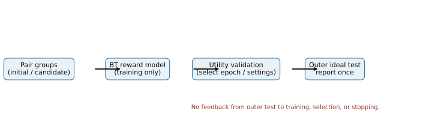

*Figure 1. Computational pipeline and evaluation firewall.*

## 2. Method

### 2.1 Preference reward model

See https://github.com/ymeng3/Quantum/tree/main/Classifier2.

Each image $x$ is passed through a ResNet-18 encoder and a reward head that returns one score per reconstruction class, $r_\theta(x,t)$, with five output dimensions corresponding to TYPE\_ORDER = [(1×1), Twinned(2×1), c(6×2), (√13×√13), HTR]. For a labelled pair $(x_i,x_j)$ of type $t$, the Bradley--Terry model assigns the probability that the first image is preferred as

$$
P_\theta(x_i \succ x_j \mid t) = \sigma\!\left(r_\theta(x_i,t)-r_\theta(x_j,t)\right),
\qquad \sigma(z)=\frac{1}{1+e^{-z}}.
$$

In plain language, the model is confident that the first image should win when its learned score is much larger than the second image's score. For a first-image win, the loss is

$$
\mathcal L_{BT} = -\frac{1}{|D|}\sum_{(i,j,t)\in D} w_{ij}\log P_\theta(x_i \succ x_j\mid t),
$$

where $w_{ij}$ is an optional annotator-confidence weight. The implementation also handles reversed wins, ties, and not-applicable labels using the corresponding loss terms in `pairwise_active_learning_pipeline.py`.

#### Downstream reconstruction prediction and accuracy

The downstream endpoint is reconstruction-type accuracy on held-out ideal images, not pairwise training accuracy. For a test or utility-validation image $x$, let $R_c$ be the set of ideal reference anchors labelled as class $c$, and let $R_{-c}=\bigcup_{d\ne c}R_d$ be the anchors from every *other* class. The class-$c$ win rate is

$$
W_c(x)=\frac{1}{|R_{-c}|}\sum_{z\in R_{-c}}\sigma\!\left(r_\theta(x,c)-r_\theta(z,c)\right).
$$

$r_\theta(x,c)$ is the $c$-th reward-head score for image $x$. Each term asks whether $x$ is more compatible with class $c$ than an anchor known to belong to another class, on the class-$c$ reward dimension. $W_c(x)$ averages that comparison over all non-$c$ reference anchors. The predicted reconstruction type is

$$
\hat c(x)=\underset{c\in\mathcal C}{\arg\max}\ W_c(x),
$$

where $\mathcal C$ is the available reconstruction-type set. Thus a class wins only when its reward dimension separates the image from reference examples of the competing classes; the model does not compare an image with same-class reference anchors at this step. For an evaluation split $E$ with absolute labels $c(x)$, downstream accuracy is

$$
A(E)=\frac{1}{|E|}\sum_{x\in E}\mathbf{1}\!\left[\hat c(x)=c(x)\right].
$$

In plain language, this is the fraction of held-out ideal images assigned the correct reconstruction type. $A(E)$ is calculated identically for `utility_validation` and `outer_test`; only the former is available while selecting epochs, learning rates, and acquisition settings. The implementation is [Experiment.evaluate](https://github.com/Purpleline-z/rl_quantum_2026summer/blob/main/code/active_learning_program/pairwise_active_learning_pipeline.py#L447-L464), which also saves correct count, total count, and per-class accuracy.

The downstream model is a ResNet-18 encoder followed by a 512-to-256-to-5 reward head (Linear(512→256) → ReLU → Dropout(0.2) → Linear(256→5)), fine-tuned end to end with AdamW (weight decay $10^{-4}$, batch size 16): all encoder and head parameters are updated, and the encoder is **not frozen** during training. Frozen (cached) encoder embeddings are used only by the acquisition rules that need distances between candidate images (core-set, cluster-based rules); they never enter training. At prediction time, the reward heads score an image against the labelled reference images (win-rate rule above). The five reward heads correspond to all five entries in TYPE\_ORDER. Twinned(2×1) is excluded from ideal image splits and evaluation; its reward head (index 1) is present in the model and receives gradient updates from any Twinned-labelled pairwise rows in the training pool. For seeds 42, 79, and 123, the pipeline at git SHA 58d59d6 did not filter Twinned pairwise rows from the training pool or candidate pool; those rows trained the Twinned head alongside the four active classes. All strategies were affected identically, so the relative comparison between strategies is valid. Seeds 202 and 303 run under commit 482f712, which adds a Twinned pairwise filter to load\_and\_split(). Evaluation metrics use only the four active class heads in all cases.

The two encoder initializations are different starting representations under this same training procedure. The shipped SimCLR checkpoint is image-only self-supervised pretraining and has not seen pairwise preference labels. ImageNet initialization uses torchvision ResNet-18 weights trained with ImageNet-1K supervision. Pairwise labels enter only during reward-model fine-tuning.

The fixed-epoch comparison (Section 5.9) pre-registers lr=$10^{-4}$, weight decay=$10^{-4}$, and epoch counts $E\in\{3,30\}$. The validation-selected protocol (Task 3b, Section 5.8) uses the utility-validation grid to select lr and epoch count per encoder and budget; the outer test is never consulted during that selection.

### 2.2 Active selection

Candidate comparisons retain their images but hide their human winner labels. Active selection decides which $b$ comparisons should be labelled next so that the retrained preference model makes more accurate reconstruction-type predictions on held-out ideal images. Let $L$ be the currently labelled pair groups, let $C$ be the label-hidden candidate groups, let $S_b\subseteq C$ be the $b$ groups selected by an acquisition strategy, and let $Y(S_b)$ be the labels revealed only after selection. The quantity that selection is trying to increase is

$$
\Delta A_{\mathrm{val}}(S_b\mid L)=
A_{\mathrm{val}}\!\left(F(L\cup Y(S_b))\right)
-A_{\mathrm{val}}\!\left(F(L)\right).
$$

Here $F(L)$ is the model produced by the fixed training procedure using labelled groups $L$, $A_{\mathrm{val}}$ is validation reconstruction accuracy, and $\Delta A_{\mathrm{val}}$ is the improvement attributable to the newly labelled batch. An acquisition rule cannot calculate this quantity directly because $Y(S_b)$ is hidden; instead, it uses the available images, embeddings, and model predictions as a proxy. Section 2.3 defines those proxies. Validation data choose a training schedule and compare design choices; the locked outer test is evaluated only after those choices are fixed.

The current study is a single-round, batch active-learning experiment: train on $L$, score all of $C$, select one batch $S_b$, reveal its labels, retrain on $L\cup Y(S_b)$, and evaluate. This makes a strategy's contribution easy to compare at a fixed annotation budget.

Implementation entry point: [Experiment.select](https://github.com/Purpleline-z/rl_quantum_2026summer/blob/main/code/active_learning_program/pairwise_active_learning_pipeline.py#L536).

~~~text
Algorithm 3: Single-round active-selection loop
Input: labelled groups L, label-hidden candidate groups C, budget b,
       acquisition rule A, validation set V, locked outer-test set T
1. Train a reward model f on L using a validation-selected schedule.
2. Compute permitted label-free quantities for every c in C.
3. Select S_b = A(C, f, L, b); do not read winner labels in this step.
4. Reveal Y(S_b), then retrain f' on L union Y(S_b).
5. Measure A_val(f') on V for protocol decisions and save the full run record.
6. Once all strategies and settings are frozen, evaluate the chosen protocol on T.
Output: selected groups S_b, validation result, and one locked-test result.
~~~

### 2.3 Acquisition strategies and their roles

All methods select complete pair groups, never individual images. The candidate view contains image paths and permitted model outputs, but not the human winner label.

| Strategy | Selection rule | Why it may help | Main tuning or failure mode |
|---|---|---|---|
| Random | Uniform sample of candidate groups | Essential unbiased baseline | High variance at small budgets |
| Uncertainty | Largest mean predictive entropy | Requests comparisons near the model decision boundary | Can repeatedly select visually similar pairs |
| Core-set | Farthest-first coverage in embedding space | Covers underrepresented image regions | Depends on encoder geometry and distance metric |
| Cluster-quota uncertainty | Spread selections over clusters, then rank by uncertainty | Avoids spending all labels in one region | Cluster count and quota can be mismatched to the data |
| Uncertainty + diversity | Largest $a(c)$ | Balances difficult and nonredundant pairs | Requires validation choice of $\lambda$ |
| Cluster-Margin | Low margin, then round-robin from small clusters | Keeps ambiguous pairs while protecting rare clusters | Historical evidence is a separate extension, not pooled with the five-strategy curve |
| MC-dropout variance / mutual information | Rank disagreement across dropout predictions | Models epistemic uncertainty | Requires dropout probability and Monte-Carlo sample-count calibration |

The common strategy dispatcher is [`Experiment.select`](https://github.com/Purpleline-z/rl_quantum_2026summer/blob/main/code/active_learning_program/pairwise_active_learning_pipeline.py#L536). Each pseudocode block gives the exact implemented score or sampling distribution, defines its symbols, and links to the implementing function. $C$ is the candidate-pair pool, $L$ is the labelled-pair pool, and $b$ is the requested number of selected pair groups throughout.

#### Algorithm 3a: Random baseline

Implementation: [`random_sampling`](https://github.com/Purpleline-z/rl_quantum_2026summer/blob/main/code/active_learning_program/pair_acquisition_methods.py#L110).

```text
Input: candidate pair groups C, budget b, random seed s
initialize a deterministic random-number generator with s
return b distinct groups sampled uniformly from C
```

$$
\Pr(S)=\binom{|C|}{b}^{-1}\quad\text{for every }S\subseteq C\text{ with }|S|=b.
$$

Thus every possible batch $S$ of $b$ groups has the same probability; $|C|$ is the number of available candidates. Random has no model-derived score and provides the reference for whether a more elaborate rule earns its complexity.

#### Algorithm 3b: Predictive uncertainty

Implementation: [`uncertainty_sampling`](https://github.com/Purpleline-z/rl_quantum_2026summer/blob/main/code/active_learning_program/pair_acquisition_methods.py#L116), which calls [`score_uncertainty`](https://github.com/Purpleline-z/rl_quantum_2026summer/blob/main/code/active_learning_program/pair_acquisition_methods.py#L75).

```text
Input: candidates C, trained reward model f, budget b
for each pair (xi, xj) in C:
    logits_h = r_h(xi) - r_h(xj)   for h = 1,...,5
    p_h = sigmoid(logits_h)
    u_h = BernoulliEntropy(p_h)
    uncertainty = mean(u_1,...,u_5)
return the b pairs with largest uncertainty
```

$$p_h(c)=\sigma\!\left(r_\theta(x_i,h)-r_\theta(x_j,h)\right),\qquad u_h(c)=-p_h(c)\log p_h(c)-(1-p_h(c))\log(1-p_h(c)),\qquad u(c)=\frac{1}{H}\sum_{h=1}^{H}u_h(c).$$

For candidate $c=(x_i,x_j)$, $p_h(c)$ is the predicted probability that $x_i$ wins under reward head $h$, $H=5$ is the number of reward heads, and $u(c)$ is the mean Bernoulli entropy over all heads. The label-free candidate view (candidate\_metadata) does not carry a reconstruction-type index; the mean-head formula is therefore used in every production run. Large entropy means the current model finds the comparison hard on average across all reward dimensions.

#### Algorithm 3c: Core-set coverage

Implementation: [`core_set_select`](https://github.com/Purpleline-z/rl_quantum_2026summer/blob/main/code/active_learning_program/pair_acquisition_shared_calculations.py#L52); pair embeddings are created through [`pair_vector`](https://github.com/Purpleline-z/rl_quantum_2026summer/blob/main/code/active_learning_program/pair_acquisition_shared_calculations.py#L20).

```text
Input: candidate pair embeddings C, labelled-pair embeddings L, budget b
selected = empty
repeat b times:
    choose c in C that has the greatest distance to L union selected
    add c to selected
return selected
```

$$
v(c)=\frac{e(x_i)+e(x_j)}{2},\qquad
c^*=\underset{c\in C\setminus S}{\arg\max}\ \min_{z\in\{v(\ell):\ell\in L\}\cup\{v(s):s\in S\}}\|v(c)-z\|_2.
$$

Here $e(x)$ is the encoder embedding of image $x$, $v(c)$ is the average embedding of the two images in pair $c$, $S$ is the batch selected so far, and $\|\cdot\|_2$ is Euclidean distance. The rule repeatedly adds the candidate furthest from already covered labelled or selected pairs. When $L$ is empty, the implementation initializes distances from the candidate-pool mean.

#### Algorithm 3d: Cluster-quota uncertainty

Implementation: [`cluster_quota_uncertainty_sampling`](https://github.com/Purpleline-z/rl_quantum_2026summer/blob/main/code/active_learning_program/pair_acquisition_methods.py#L122).

```text
Input: candidates C with cluster IDs, reward model f, budget b
compute uncertainty for every candidate
allocate a proportional integer quota, with a minimum of one before budget is exhausted
within each cluster quota, choose the most uncertain remaining candidate
fill any unused budget with globally most uncertain remaining candidates
return selected groups
```

$$
n_g=|\{c\in C:g(c)=g\}|,\qquad
q_g=\max\!\left(1,\mathrm{round}\!\left(b\frac{n_g}{|C|}\right)\right).
$$

$g(c)$ is the cluster assigned to pair $c$, $n_g$ is that cluster's candidate count, and $q_g$ is its proportional provisional quota. Within each cluster the implementation takes the $q_g$ largest uncertainty scores $u(c)$, then fills any remaining budget with the largest $u(c)$ globally. The minimum-one rule gives small clusters a chance to contribute before the budget is exhausted.

#### Algorithm 3e: Uncertainty plus diversity

Implementation: [`uncertainty_diversity_select`](https://github.com/Purpleline-z/rl_quantum_2026summer/blob/main/code/active_learning_program/pair_acquisition_shared_calculations.py#L29).

```text
Input: uncertainty-scored candidates C, labelled embeddings L, budget b, lambda
for each candidate c:
    u = normalized predictive uncertainty of c
    d = normalized distance from c to L and already selected pairs
    score(c) = u + lambda*d
repeat until b groups are selected:
    add remaining candidate with largest score and update diversity distances
return selected groups
```

$$
d(c;L,S)=\min_{z\in\{v(\ell):\ell\in L\}\cup\{v(s):s\in S\}}\|v(c)-z\|_2,
\qquad a(c)=R(u(c))+\lambda R(d(c;L,S)).
$$

Here $u(c)$ is the uncertainty from Algorithm 3b, $d(c;L,S)$ is distance from covered pair embeddings, $S$ is updated after every selection, and $\lambda$ weights diversity. $R(\cdot)$ is the implementation's robust normalization: values are clipped at their 5th and 95th percentiles and rescaled to $[0,1]$. The rule greedily chooses the remaining candidate with the largest $a(c)$ and then recomputes diversity distances.

#### Algorithm 3f: Cluster-Margin

Implementation: [`cluster_margin_pairwise_sampling`](https://github.com/Purpleline-z/rl_quantum_2026summer/blob/main/code/active_learning_program/pair_acquisition_methods.py#L145).

```text
Input: candidates C with clusters, reward model f, budget b
compute each pair's distance from probability 0.5 (its margin)
prefilter min(10*b, number of candidates) pairs with the smallest margins
round-robin across prefiltered clusters, visiting smaller prefiltered clusters first
return b selected groups
```

$$
m(c)=\frac{1}{H}\sum_{h=1}^{H}\left|p_h(c)-\tfrac{1}{2}\right|,
$$

$p_h(c)$ and $H$ have the meanings defined for predictive uncertainty; $H=5$ reward heads; the mean is over all five. $m(c)$ is small when the heads place the comparison close to a 50--50 decision. Let $P$ contain the $\min(10b,|C|)$ candidates with the smallest margins. The implementation groups $P$ by $g(c)$, orders the groups from smallest to largest, and takes their smallest-margin remaining member in round-robin order until $b$ pairs are selected.

#### Algorithm 3g: MC-dropout probability variance

Implementation: [`score_mc_dropout`](https://github.com/Purpleline-z/rl_quantum_2026summer/blob/main/code/active_learning_program/monte_carlo_dropout_uncertainty.py#L33) and [`select_mc_dropout`](https://github.com/Purpleline-z/rl_quantum_2026summer/blob/main/code/active_learning_program/monte_carlo_dropout_uncertainty.py#L77).

```text
Input: candidates C, reward model f with dropout active, b, M stochastic passes
for m = 1,...,M:
    score every candidate with a different dropout mask
for each candidate:
    compute variance of its predicted preference probability across M passes
return b candidates with largest probability variance
```

$$
\bar p_h(c)=\frac{1}{M}\sum_{m=1}^{M}p_{mh}(c),\qquad
v_{\mathrm{MC}}(c)=\frac{1}{H}\sum_{h=1}^{H}\frac{1}{M}\sum_{m=1}^{M}\left[p_{mh}(c)-\bar p_h(c)\right]^2.
$$

$p_{mh}(c)$ is the preference probability for candidate $c$ from dropout pass $m$ and reward head $h$, $M$ is the number of stochastic dropout passes, and $H$ is the number of heads. A large $v_{\mathrm{MC}}(c)$ means predictions change substantially when dropout perturbs the model, so the candidate is selected as epistemically uncertain.

#### Algorithm 3h: MC-dropout mutual information

Implementation: the same [`score_mc_dropout`](https://github.com/Purpleline-z/rl_quantum_2026summer/blob/main/code/active_learning_program/monte_carlo_dropout_uncertainty.py#L33) and [`select_mc_dropout`](https://github.com/Purpleline-z/rl_quantum_2026summer/blob/main/code/active_learning_program/monte_carlo_dropout_uncertainty.py#L77) functions, dispatched with metric `mc_dropout_mutual_information`.

```text
Input: candidates C, reward model f with dropout active, b, M stochastic passes
obtain M stochastic preference distributions per candidate
for each candidate:
    predictive_entropy = entropy(mean probability)
    expected_entropy = mean entropy(stochastic probabilities)
    mutual_information = predictive_entropy - expected_entropy
return b candidates with largest mutual_information
```

$$
I_{\mathrm{MC}}(c)=\frac{1}{H}\sum_{h=1}^{H}\left[
h\!\left(\frac{1}{M}\sum_{m=1}^{M}p_{mh}(c)\right)
-\frac{1}{M}\sum_{m=1}^{M}h\!\left(p_{mh}(c)\right)\right],
\qquad h(p)=-p\log p-(1-p)\log(1-p).
$$

The symbols $p_{mh}(c)$, $M$, and $H$ are as above. $h(p)$ is Bernoulli entropy. The first term measures uncertainty after averaging dropout predictions; the second measures their average individual uncertainty. Their difference is large when model samples disagree, which directs labels toward uncertainty caused by model parameters rather than one consistently ambiguous pair.

### 2.4 Leakage-safe training algorithms

```text
Algorithm 1: Build leakage-safe partitions
Input: ideal images, pairwise rows, seed
1. Compute SHA-256 identity for every image file.
2. Assign each unique ideal identity to exactly one of {reference, validation, outer test}.
3. Collect identities assigned to outer test.
4. Remove every pairwise/unlabelled-trajectory row and negative anchor whose image identity is in outer test.
5. Form pair-disjoint initial and candidate pair groups; image reuse across those pair groups is allowed.
6. Audit and save every path/hash overlap count; fail a run if any test-identity overlap remains.
Output: pair-disjoint training/candidate groups and identity-disjoint ideal partitions.
```

```text
Algorithm 2: Train for a fixed number of epochs
Input: labelled pairs, reference images, utility-validation set, epoch count E
for epoch = 1,...,E:
    optimize Bradley--Terry and permitted reference-anchor losses for one epoch
    record mean training loss
    metric = reconstruction_accuracy(utility-validation)
    record metric; never evaluate outer test here
return model after E epochs
```


## 3. Data Protocol and Leakage Prevention

### 3.1 Historical data and benchmark contract

The v1.8 preference source contains 669 valid rows representing 179 unordered pair groups. The legacy controlled benchmark used 50 initial pair groups and 120 candidate groups. The current identity-safe Task 3 study uses 10 initial pair groups and up to 100 candidate pair groups (from simclr\_three\_seed\_identity\_safe\_task3\_settings.json); the remaining groups are unused. There is no separate pairwise validation partition: every preference group is initial, candidate, or unused. The [Stage 1 manifest](active_learning_studies/pair_disjoint_not_image_disjoint/results/selection_benchmark/stage1_selector_curves_none/study_manifest.json) records the exact allocation.

The unit of acquisition is an unordered pair group; initial and candidate groups are pair-disjoint. The same image may occur in different non-test pair groups because image-disjoint pair partitions are unnecessarily restrictive for this application. Ideal reference, utility-validation, and outer-test images are separately partitioned. In contrast, no outer-test identity may appear in training pairs, candidate images, reference anchors, utility validation, or Bad-image anchors.

For the default identity-safe configuration, `Twinned(2 x 1)` is excluded and 144 unique identities remain from 150 ideal-image files. The resulting capacity is 28 outer-test images, 28 utility-validation images, and 88 reference anchors. Counts by reconstruction type are exported in the [identity-safe split-capacity CSV](active_learning_studies/pair_disjoint_not_image_disjoint/results/identity_safe_protocol/ideal_split_capacity.csv).

| Reconstruction type | Raw files | Unique identities | Outer test | Utility validation | Reference anchors |
|---|---:|---:|---:|---:|---:|
| `(1 x 1)` | 41 | 41 | 8 | 8 | 25 |
| `c(6 x 2)` | 42 | 41 | 8 | 8 | 25 |
| `(√13 x √13)` | 38 | 36 | 7 | 7 | 22 |
| `HTR` | 29 | 26 | 5 | 5 | 16 |
| **Total** | **150** | **144** | **28** | **28** | **88** |

### 3.2 Pairwise CSV cleaning: removal of trajectory images identical to ideal images

During the identity audit for seeds 202 and 303, the SHA-256 audit reported non-zero values for two fields that must be zero: `pairwise_image_identity_overlap_reference` (3) and `pairwise_image_identity_overlap_utility_validation` (2). These fields count the number of pairwise training rows in which at least one trajectory image is content-identical (same SHA-256 hash) to an image assigned to the reference-anchor or utility-validation partition.

The root cause was that 8 trajectory image files in `Trajectories/` had identical byte content to ideal image files in `STO_ideal_*/` folders. These 8 trajectory images appeared in 40 rows of the v1.8 pairwise CSV (`Quantum Label Data - Pairwise_Comparisonv1.8.csv`). If any of those rows entered the training or candidate pool, the model would be trained on preference comparisons containing images that are byte-for-byte identical to held-out evaluation images—a form of label-free test-set leakage.

Seeds 42, 79, and 123 did not trigger this violation because, for those random seeds, the affected ideal images were assigned to the outer-test partition, where the pipeline's `pairwise_image_identity_overlap_outer_test` filter removes overlapping pairs from the training pool automatically. Seeds 202 and 303 assigned some of those same ideal images to the reference and utility-validation partitions instead, where no analogous runtime filter was active, causing the audit to fail.

The fix was applied directly to the source CSV rather than adding a runtime workaround: the 40 affected rows were deleted from `Quantum Label Data - Pairwise_Comparisonv1.8.csv`, reducing the row count from 678 to 638. The 8 trajectory images involved span the `(1 x 1)` and `c(6 x 2)` reconstruction classes. After this removal, all seven forbidden-overlap audit fields are zero for seeds 202, 303, and all previously passing seeds. The cleaned CSV is committed at git SHA `5ca1bb4` and all subsequent runs use it.

This cleaning has no effect on seeds 42, 79, and 123 results reported in §5.8–5.10: those runs predate the cleaning but the removed pairs were already excluded from their training pools by the outer-test filter, so no training set changes for those seeds.

### 3.3 Identity-safe split contract

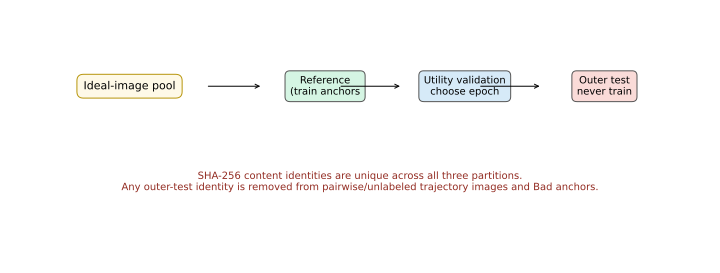

*Figure 2. Required split protocol. Identity means SHA-256 file content, not filename.*

The implementation enforces this rule in `active_learning_program/pairwise_active_learning_pipeline.py`. It retains audit counts for path and content-identity overlaps. This avoids the failure mode in which duplicated image bytes appear under different paths and silently leak from a train-time pool into the test set.

## 4. Implementation and Reproducibility

The reusable program is in `active_learning_program/`. `pairwise_active_learning_pipeline.py` loads preference CSVs, creates ideal partitions, trains the reward model, and executes selectors. `resumable_model_training.py` stores per-epoch training loss and utility-validation accuracy. The pipeline trains for a fixed number of epochs (selected per encoder and budget by the Task 3b validation grid) with no early stopping. The budget-aware runner uses `utility_validation` for training decisions and records `outer_test_not_evaluated: true` during calibration.

Each run should save: configuration; data hashes; pair manifests; split audit; per-epoch metrics; selected pair IDs; seed; data freeze manifest (generate\_data\_freeze\_manifest.py); and all aggregate CSVs used in figures. The freeze manifest records git commit hash, source-file SHA-256s, reconstruction classes included and excluded, image-identity partition assignments, pair-group assignments, partition counts by class, and all seven forbidden-overlap audit fields. It fails loudly if any overlap constraint is violated or if Twinned(2×1) appears in any partition. Every paper number must trace to one of these saved artifacts.

## 5. Results and Evidence Status

### 5.1 Historical selector curves: diagnostic only

The repository contains five-seed, fixed-schedule curves across acquisition budgets. Figure 3 is generated directly from `results/selected_summaries/budget_curve_5seed/tables/strategy_performance_by_acquisition_budget.csv`.

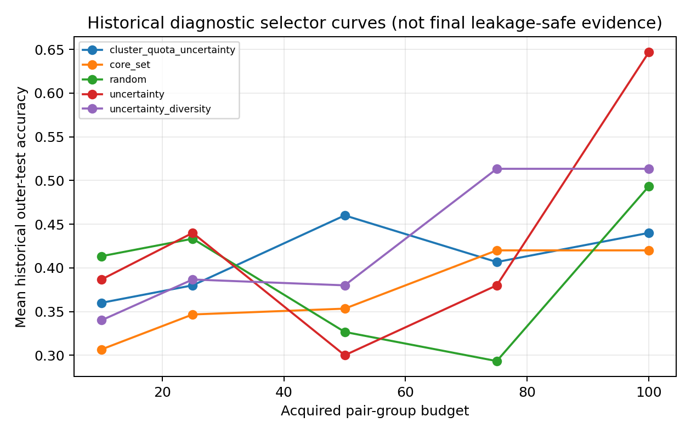

*Figure 3. Five-strategy accuracy across acquisition budgets from the fixed-schedule study; the winner changes with budget.*

**Question.** Does the same acquisition rule select useful labels at every annotation budget? This historical five-seed curve uses the unmodified-image mode and the fixed full-model schedule described in Section 2.1. Mean outer-test accuracy identifies the leading arm at each budget:

| Acquired pair groups | Leading arm | Mean outer-test accuracy | Decision carried into the identity-safe rerun |
|---:|---|---:|---|
| 10 | Random | 0.413 | Retain random as the paired baseline when labels are scarce. |
| 25 | Uncertainty | 0.440 | Compare against random under the validation-selected schedule. |
| 50 | Cluster-quota uncertainty | 0.460 | Retain this documented coverage comparator. |
| 75 | Uncertainty + diversity | 0.513 | Preserve the exact diversity weight as a validation-tuned setting. |
| 100 | Uncertainty | 0.647 | Use uncertainty as a principal reference arm. |

The full means and standard deviations are in the [strategy-by-budget table](active_learning_studies/pair_disjoint_not_image_disjoint/results/selection_benchmark/stage1_selector_curves_none/aggregate/strategy_budget_summary.csv).

The changing winners indicate that annotation budget changes the selection problem. At 10 labels, random sampling provides a stable cross-section of the pool; at 50, cluster quotas can prevent the batch from collapsing into one embedding region; at 75--100, uncertainty-based rules can sample several ambiguous regions. Test these explanations with paired seed-level gains over random after validation selects the training schedule, alongside a fixed-total-update control that removes the effect of differing optimizer updates.

### 5.2 Symmetry preprocessing is an experimental factor

The repository evaluates three input modes: `none`, `left_half_mirror`, and `symmetric_average`. The latter two encode a symmetry assumption by reconstructing an image from its left half or averaging it with its horizontal reflection. They can remove discriminative asymmetry and reduce nuisance variation.

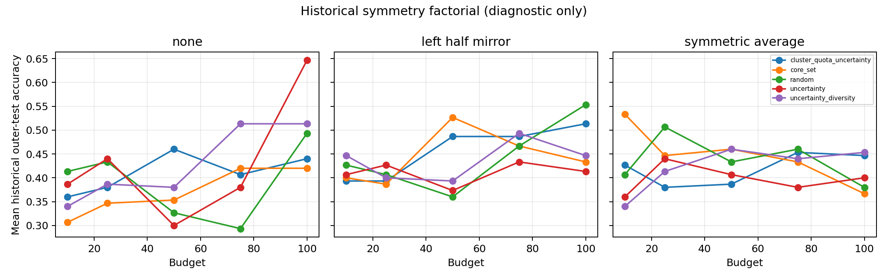

*Figure 4. Strategy--budget--symmetry interaction from the Stage 2 aggregate CSV; no one preprocessing mode wins across conditions.*

**Question.** Does enforcing horizontal symmetry make candidate comparisons easier to use? The answer depends on both budget and selector. The table below gives the strongest and weakest condition at each budget from the [Stage 2 factorial](active_learning_studies/pair_disjoint_not_image_disjoint/results/selection_benchmark/stage2_symmetry_factorial/aggregate/strategy_budget_summary.csv).

| Budget | Highest mean accuracy condition | Lowest mean accuracy condition | Operational meaning |
|---:|---|---|---|
| 10 | core-set + symmetric average: 0.533 | core-set + none: 0.307 | Averaging can make embedding coverage more stable when labels are scarce. |
| 25 | random + symmetric average: 0.507 | core-set + none: 0.347 | The transform can help even without model-based selection, consistent with removing condition-specific variation. |
| 50 | core-set + left-half mirror: 0.527 | uncertainty + none: 0.300 | Mirroring changes which regions look distinct in embedding space. |
| 75 | uncertainty-diversity + none: 0.513 | random + none: 0.293 | The unmodified image retains useful information for the best selector at this budget. |
| 100 | uncertainty + none: 0.647 | core-set + symmetric average: 0.367 | Strong symmetry processing can remove distinctions that uncertainty exploits. |

`left_half_mirror` and `symmetric_average` change the information given to the encoder. A gain after averaging indicates that suppressing asymmetry helps that selector and budget; a loss indicates that the removed asymmetric detail helps the comparison. Test this interaction with an identity-safe strategy × budget × preprocessing factorial using the same validation-selected schedule for all arms at a given budget.

### 5.3 SimCLR versus ImageNet initialization

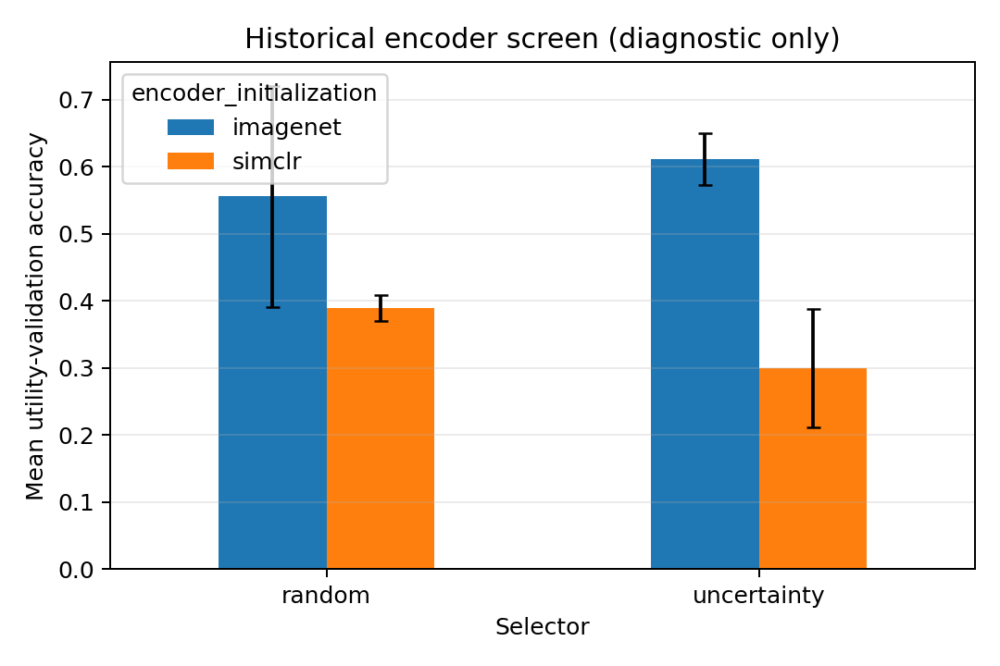

*Figure 5. Utility-validation encoder screen; error bars are standard deviations over three seeds.*

**Question.** Which frozen starting representation gives the selector a more useful coordinate system? In the three-seed validation screen, ImageNet initialization exceeds SimCLR for both random selection (0.556 vs. 0.389) and uncertainty selection (0.611 vs. 0.300), as shown in the [encoder-screen CSV](active_learning_studies/pair_disjoint_not_image_disjoint/results/protocol_diagnostics/encoder_initialization_screen/aggregate/encoder_utility_validation_summary.csv).

The encoder determines which pairs appear close, which candidate clusters exist, and which comparisons look uncertain. In this screen, ImageNet initialization produced higher utility-validation accuracy after fine-tuning. Compare encoder × strategy with identity-safe seeds, optimizer, stopping rule, and budget held fixed; report per-seed paired differences to distinguish a broad shift from a few favourable splits.

### 5.4 PCA and t-SNE representation diagnostics

**Question.** Do frozen image features put examples of the same reconstruction type in the same local neighborhood, and do the labelled ideal images cover the trajectory population? An embedding is a numerical location assigned to each image: local label consistency means an image's nearest neighbours usually have the same reconstruction label. PCA displays the two directions with the most variation; the retained-variance fraction tells the reader how much of the full representation is visible in that two-axis sketch. t-SNE emphasizes who is near whom and is useful for local neighborhoods, but its apparent gap widths are not literal distances.

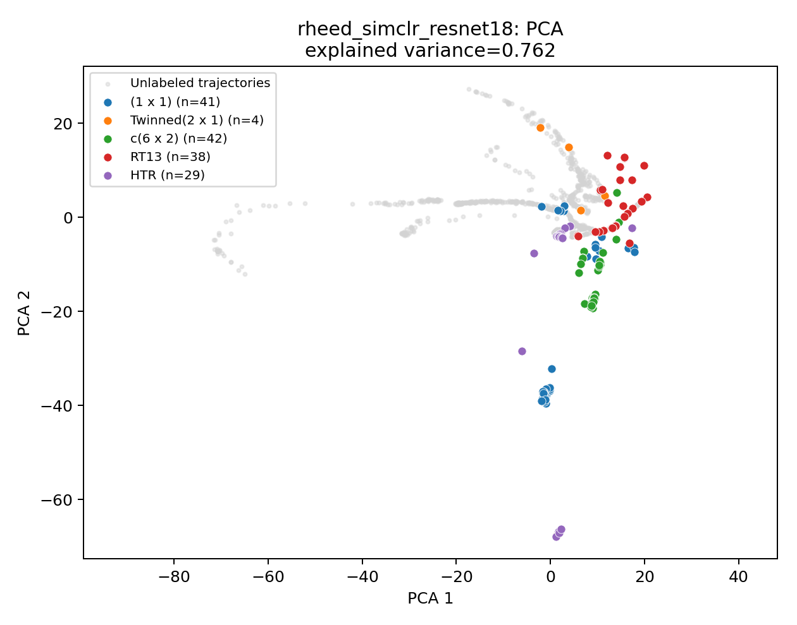

*Figure 6. PCA of frozen RHEED-SimCLR features for the exploratory image manifest.*

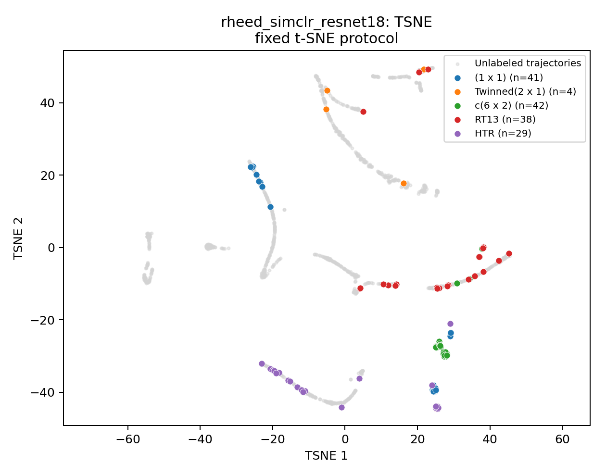

*Figure 7. t-SNE of frozen RHEED-SimCLR features for the same exploratory manifest.*

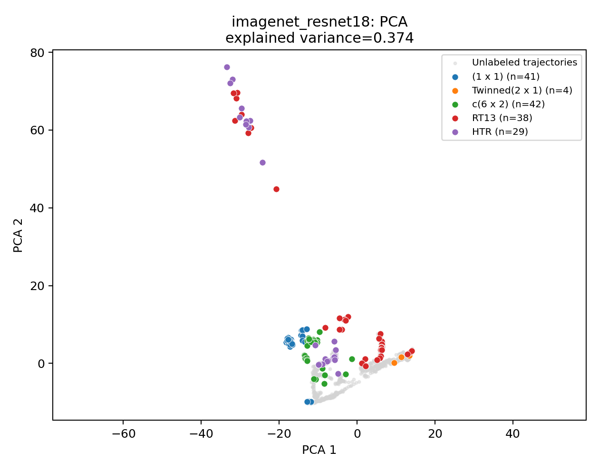

*Figure 8. PCA of frozen ImageNet ResNet-18 features for the exploratory image manifest.*

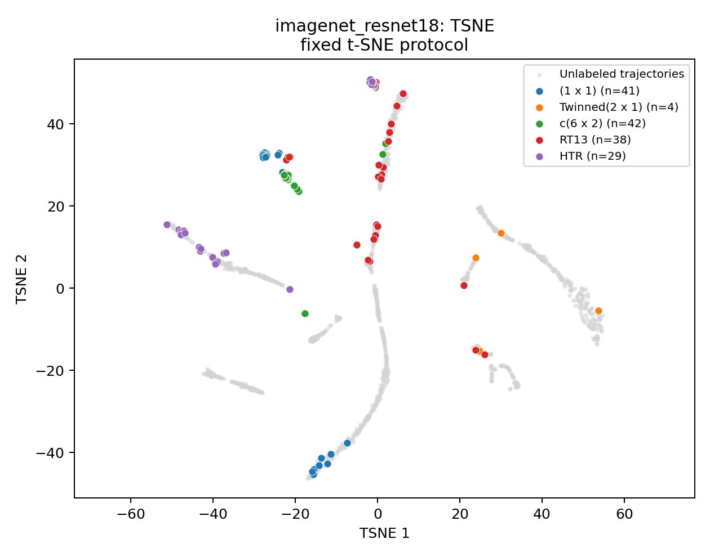

*Figure 9. t-SNE of frozen ImageNet ResNet-18 features for the same exploratory manifest.*

The full frozen-feature check gives 5-NN accuracy 0.884 for SimCLR and 0.896 for ImageNet, versus 0.832 for raw pixels. The more specific coordinate diagnostics now show what that average hides. In PCA coordinates, `(1 x 1)` has the highest 5-NN recall for both SimCLR (0.927) and ImageNet (0.976); `c(6 x 2)` is also locally consistent (0.857 and 0.881). These are the classes whose nearest feature-space neighbours usually share their label, so coverage- or similarity-based acquisition has a meaningful local geometry to work with for them.

The main ambiguous boundary is `HTR` versus `RT13`: SimCLR PCA 5-NN misclassifies 7 HTR images as RT13 and 9 RT13 images as HTR; ImageNet PCA makes the same pair of errors 5 and 7 times. Their nearest-other-class distances are also small relative to within-class spread in the [class-separation table](active_learning_studies/image_representation_analysis/results/representation_exploration/section5_diagnostics/class_separation_metrics.csv), placing many HTR and RT13 images in mixed frozen-feature neighborhoods. Use a boundary-pair acquisition slice to test whether expert preference labels resolve HTR--RT13 comparisons, alongside an image-only versus permitted-additional-feature ablation.

`Twinned(2 x 1)` has only four labelled ideal images and PCA recall of 0.000 for SimCLR and 0.250 for ImageNet. Four examples provide too few same-class neighbours for a stable five-neighbour neighborhood. Obtain or annotate additional Twinned ideal images before comparing encoder separation for this type.

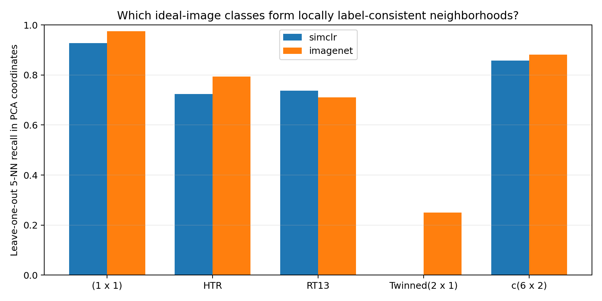

*Figure 10. Which ideal-image types have locally label-consistent PCA neighborhoods? `(1 x 1)` and `c(6 x 2)` are high-recall in both encoders; the small Twinned sample is not. Generated from [per-class 5-NN diagnostics](active_learning_studies/image_representation_analysis/results/representation_exploration/section5_diagnostics/per_class_knn_metrics.csv).*

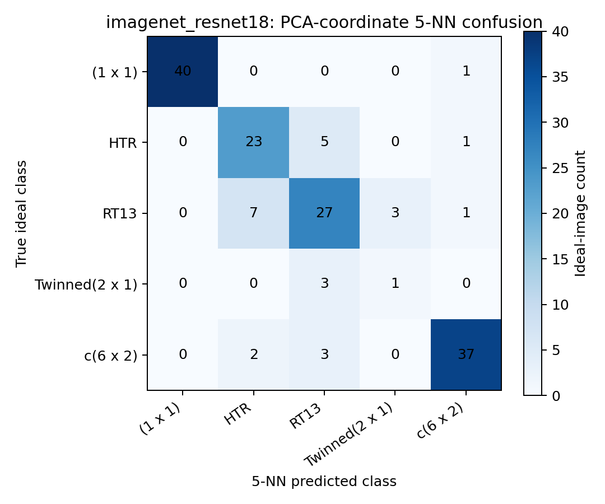

*Figure 11. Which reconstruction types share local ImageNet-feature neighborhoods? The off-diagonal HTR--RT13 counts identify the principal boundary for targeted comparisons. Generated from the [confusion matrix](active_learning_studies/image_representation_analysis/results/representation_exploration/section5_diagnostics/knn_confusion_matrix.csv).*

For trajectory coverage, the near threshold is the 95th percentile of each labelled ideal image's leave-one-out nearest-ideal distance, rather than an arbitrary radius. In the PCA views, 71.7% of trajectory frames lie inside the SimCLR labelled-ideal neighborhood and 81.9% lie inside the ImageNet neighborhood; the remaining 28.3% and 18.1% are feature-space regions sparsely represented by the ideal set. These frames are candidates for a trajectory coverage audit or expert labeling before treating an ideal-image classifier as representative of the whole trajectory stream. The full thresholds and fractions are in [trajectory-neighborhood coverage](active_learning_studies/image_representation_analysis/results/representation_exploration/section5_diagnostics/trajectory_neighborhood_coverage.csv).

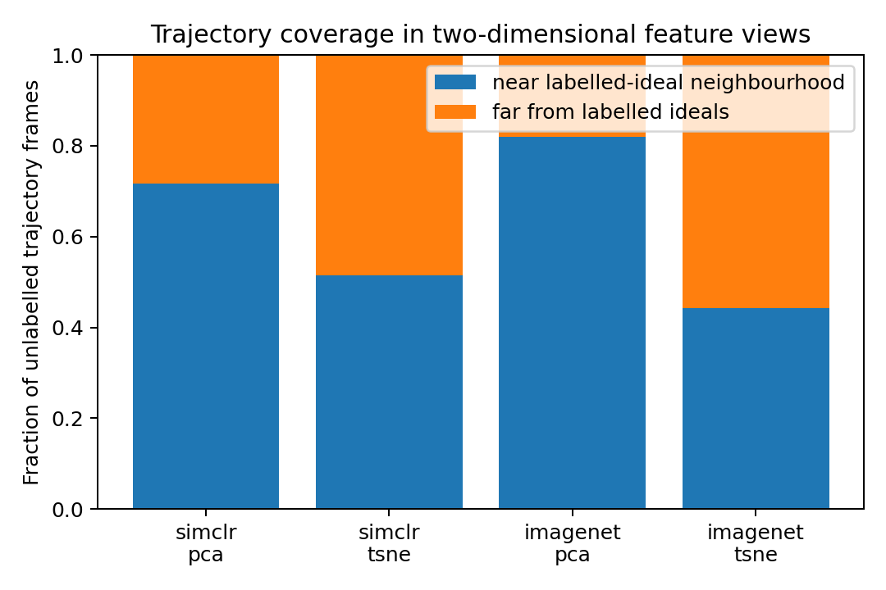

*Figure 12. Fraction of trajectory frames near the labelled ideal-image neighbourhood in each two-dimensional view. The plot identifies coverage gaps to inspect; it does not assign labels to unlabeled trajectory frames.*

PCA retains 76.2% of the SimCLR feature variation but only 37.4% of ImageNet variation, so the ImageNet PCA plot is a more compressed sketch of its full representation. Use the two-dimensional plots to locate candidate overlap and coverage questions, then test those questions with acquisition and validation experiments. All metrics, coordinate files, and thresholds are recorded in the [diagnostic manifest](active_learning_studies/image_representation_analysis/results/representation_exploration/section5_diagnostics/manifest.json).

### 5.5 Historical utility, redundancy, and batch interaction

**Question.** Why can a pair or a batch look useful in an intermediate utility analysis but not yield the highest final accuracy? The historical individual-pair utility used in the exploratory runs is

$$
U(p\mid L)=A_{\mathrm{outer}}\!\left(F(L\cup\{p\})\right)-A_{\mathrm{outer}}\!\left(F(L)\right).
$$

Here $p$ is one candidate pair, $L$ is the current labelled set, $F$ is the fixed retraining procedure, and $A_{\mathrm{outer}}$ is accuracy on the historical ideal-image outer-test set. This quantity asks what happens when one pair is added by itself. The realised utility of a selected batch $B$ is $U(B\mid L)=A_{\mathrm{outer}}(F(L\cup B))-A_{\mathrm{outer}}(F(L))$. It is not the sum of the individual utilities because pairs are retrained together; their gradients and the later selection sequence can change one another's effect. These outer-test utilities are historical diagnostics only and are not used by the current selector or budget-aware calibration.

The earlier budget-30 observation comes from one sequential trace, where each round changes $L$ before the final endpoint is measured. Its intermediate single-pair utilities and later final accuracy therefore condition on different labelled sets. The [sequential log](active_learning_studies/pair_disjoint_not_image_disjoint/results/earlier_explorations/sequential_exploration_20260728/epoch%202%20budget%2030%20batch%202%20seed%2042%20experiment_log.csv) identifies a question for the controlled study; it does not separate redundancy, interaction, or overfitting.

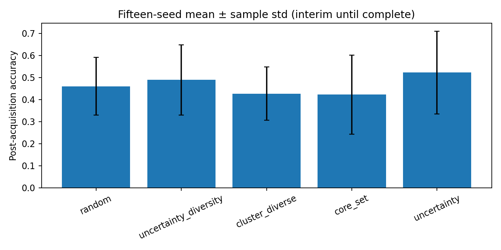

*Figure 13. Historical 15-seed budget-100 comparison. The figure asks whether the strategy that improves batch utility also improves post-acquisition accuracy; uncertainty has the largest mean on both measures.*

At budget 100, uncertainty has the largest historical mean post-acquisition accuracy (0.522) and batch utility (+0.144) over 15 seeds. Uncertainty--diversity follows at 0.489 and +0.111; random at 0.460 and +0.082; cluster-diverse at 0.427 and +0.049; and core-set at 0.422 and +0.044, as reported in the [15-seed summary](active_learning_studies/pair_disjoint_not_image_disjoint/results/strategy_followup_analysis/fifteen_seed_extension/fifteen_seed_summary.csv). Post-acquisition-accuracy standard deviations range from 0.121 to 0.188, and the per-seed outcomes therefore vary across runs.

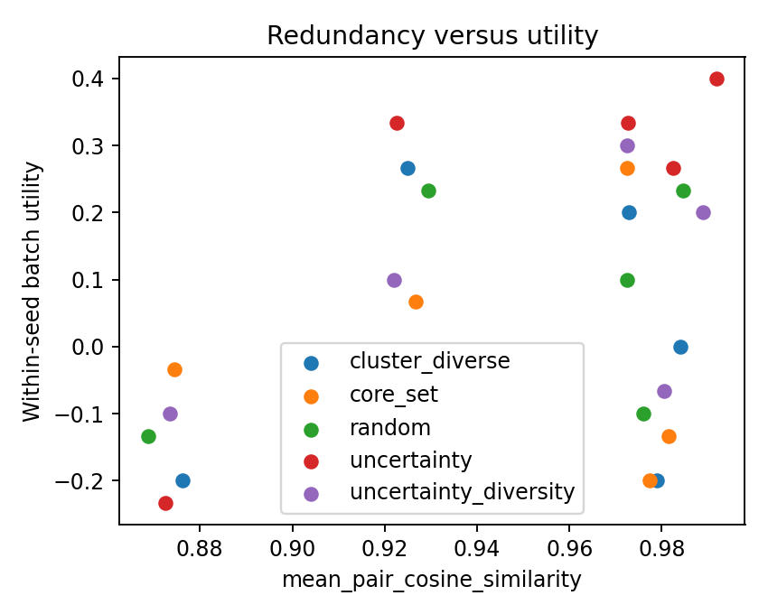

*Figure 14. Historical pair-similarity versus batch-utility diagnostic. The figure asks whether less similar selected pairs explain utility; the strategy means do not show a monotonic relationship.*

Redundancy does not explain the observed ranking by itself. Core-set has the lowest mean image-reuse rate (0.082) and uncertainty--diversity lowers it relative to random (0.091 versus 0.094), yet their mean batch utilities (+0.044 and +0.111) remain below uncertainty (+0.144). Mean pair cosine similarities are tightly grouped from 0.947 to 0.949 despite the utility spread, in the [redundancy table](active_learning_studies/pair_disjoint_not_image_disjoint/results/strategy_followup_analysis/redundancy_analysis/redundancy_utility_accuracy.csv). Thus “more diverse” is not sufficient evidence that a batch provides more reconstruction-relevant supervision.

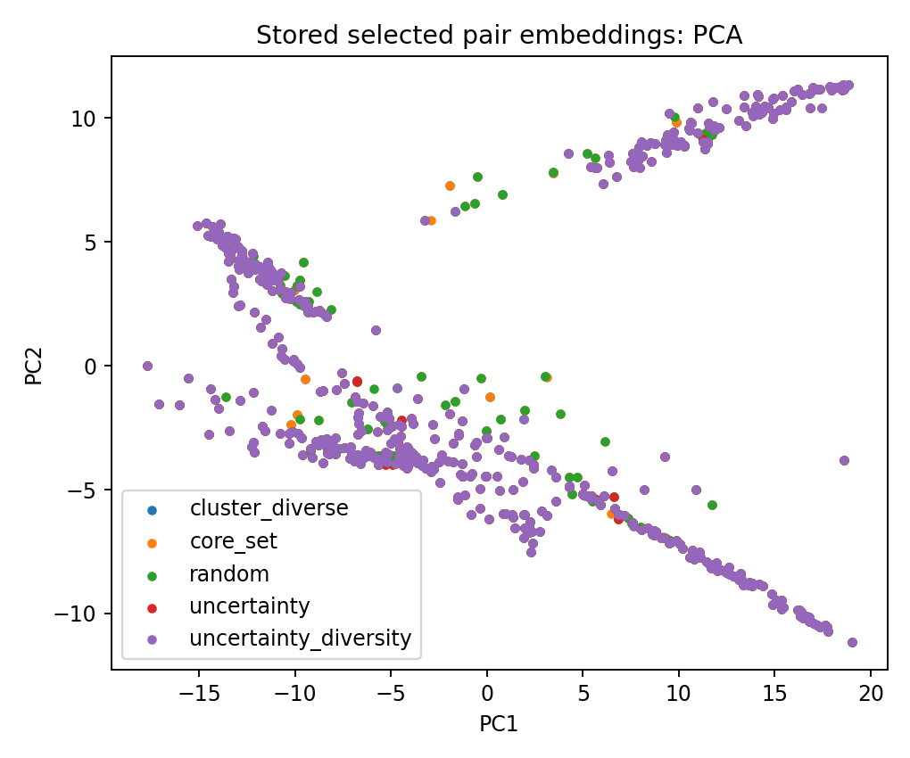

*Figure 15. Historical PCA of selected pair embeddings. Overlap between core-set and uncertainty selections in this two-dimensional view does not test the full-dimensional farthest-first distances used by core-set.*

The PCA overlap between core-set and uncertainty selections does not conflict with the core-set algorithm: core-set chooses farthest-first pairs using full pair embeddings, whereas the plot compresses those embeddings to two coordinates. The actual concern is different: distant regions in the frozen embedding may not correspond to comparisons that improve reconstruction accuracy. Resolve that question with an identity-safe experiment that, for each selected batch, records individual utilities, the realised batch utility, and

$$
I(B\mid L)=U(B\mid L)-\sum_{p\in B}U(p\mid L).
$$

$I(B\mid L)$ measures non-additive batch interaction. Evaluate whether it varies with image reuse, pair similarity, cluster coverage, and training/validation curves. A negative interaction term supports harmful combination effects; a validation decline while pairwise training accuracy rises supports overfitting; neither explanation can be assigned from the saved historical batch records because their individual utilities are unavailable.

### 5.6 Metadata fusion: a separate, currently data-limited study

**Question.** Do process-monitor variables contain prediction information absent from the image?

Synchronized process-monitor variables (substrate temperature, deposition rate, chamber pressure, and gas-flow setpoints) are collected during growth but are not yet available in structured form for the image sets used in Tasks 3b and 3c. Metadata fusion is therefore deferred: this study uses image-only reward model inputs throughout. Once structured metadata is available and linked to trajectory frames, the question can be addressed by augmenting the reward model's encoder input with a process-variable embedding and comparing image-only versus image+metadata utility-validation accuracy at each acquisition budget.

### 5.7 Physics-informed soft constraints for a complete trajectory

**Question.** Can known ordering preferences improve the interpretation of a *sequence* of classifier outputs without changing the image model? The trajectory study takes calibrated probabilities for the five active states $(1\ x\ 1)$, `Bad`, $c(6\ x\ 2)$, $(\sqrt{13}\ x\ \sqrt{13})$, and `HTR` (Twinned(2×1) excluded, consistent with the reward model's evaluation scope), then chooses the highest-scoring complete path. Its [configuration](active_learning_studies/rheed_trajectory_ordering_analysis/higher_order_trajectory_constraint_configuration.json) specifies three soft preferences: the first state is `(1 x 1)`; before a `Bad` frame occurs, a path should not move from `(1 x 1)` directly to another reconstruction; and a path should not leave `HTR` once it has entered it.

For an ordered trajectory of $T$ frames, with classifier probability $q_t(s)$ for state $s$ at frame $t$, the decoder selects

$$
\hat y_{1:T} = \underset{y_{1:T}\in S^T}{\arg\max}\ \left[\sum_{t=1}^{T}\log q_t(y_t)-\phi_{\mathrm{start}}(y_1)-\sum_{t=2}^{T}\phi_{\mathrm{transition}}(y_{t-1},y_t,h_{t-1})\right].
$$

Here $S$ is the six-state set, $y_{1:T}$ is one possible state sequence, and $h_{t-1}$ records whether `Bad` has occurred earlier in that path. $\phi_{\mathrm{start}}$ penalizes a first state other than `(1 x 1)`. $\phi_{\mathrm{transition}}$ penalizes a non-`Bad`, non-`(1 x 1)` state before `Bad`, and a transition from `HTR` to any other state. A penalty subtracts evidence but never forbids a path: sufficiently stronger image probabilities can still select an exception. The weak, moderate, and strong settings multiply every base log penalty by $0.223$, $0.693$, and $1.609$, respectively; these correspond to evidence factors of $1.25$, $2$, and $5$.

```text
Input: ordered frame probabilities q[1:T, state], penalty level
For each possible first state s:
    score[1, s, seen_bad=(s == Bad)] = log q[1, s] - start_penalty(s)
For t = 2,...,T:
    For each previous state and Bad-history flag:
        For each current state:
            candidate = previous_score + log q[t, current]
            candidate -= penalty_if_leaving_HTR(previous, current)
            candidate -= penalty_if_skipping_Bad(history, current)
            retain the best candidate and its predecessor
Backtrack the best final state to obtain the decoded path
Write raw per-frame argmax, all decoded paths, changed-frame flags, and rule counts
```

The exact decoder is [decode_rheed_trajectory_with_higher_order_constraints.py](active_learning_program/decode_rheed_trajectory_with_higher_order_constraints.py); it uses dynamic programming with a one-bit `Bad has occurred` memory. This separation is deliberate in implementation terms: decoder outputs do not alter pairwise labels, model weights, metadata features, or acquisition scores.

The completed evidence is a [filename/order audit](active_learning_studies/rheed_trajectory_ordering_analysis/results/temporal_constraint_audit/temporal_audit_report.md), which records frame-order parsing, missing indices, duplicate indices, and ambiguity. It does not establish the frequency of any physical transition. A fully quantitative decoded-trajectory evaluation requires an externally validated five-state classifier with a calibrated `Bad` probability saved for ordered frames; that evaluation is deferred until the reward model trained in Task 3c is transferred to the trajectory stream. The decoder implementation is complete and ready for that integration.

### 5.8 Task 3b: budget-aware training protocol

**Question.** Should every acquisition budget use the same learning rate and number of epochs? Task 3a answers this with a validation-only grid: 3 seeds (42, 79, 123) × 5 budgets × 4 learning rates × 3 epoch counts = 180 cells, SimCLR initialization only. Each cell starts from ten labelled pair groups, adds a deterministic random batch of pair groups up to its budget, trains, and measures utility-validation accuracy; the outer test is never opened. Task 3b then picks, for each budget, the setting with the highest mean validation accuracy. The complete grid is in the [validation-calibration summary](active_learning_studies/pair_disjoint_not_image_disjoint/results/simclr_three_seed_identity_safe_task3/frozen_task3b_protocol/three_seed_validation_calibration_summary.csv); the selection is saved as the [Task 3b schedule](active_learning_studies/pair_disjoint_not_image_disjoint/results/simclr_three_seed_identity_safe_task3/frozen_task3b_protocol/simclr_three_seed_budget_specific_schedule.json).

| Budget | Selected epochs | Selected lr |
|---:|---:|---:|
| 10 | 30 | $3\cdot10^{-4}$ |
| 25 | 10 | $3\cdot10^{-4}$ |
| 50 | 30 | $3\cdot10^{-4}$ |
| 75 | 10 | $3\cdot10^{-4}$ |
| 100 | 10 | $3\cdot10^{-4}$ |

Ties were broken by fewer epochs, then lower learning rate. The schedule was selected on seeds 42, 79, and 123 only, so seeds 202 and 303 are out-of-sample for it. In Task 3c, every strategy at a given budget uses the same selected setting, so strategies differ only in which pair groups they acquire.

### 5.9 Fixed-epoch single-shot comparison (pre-registered)

**Question.** Does training for 30 epochs instead of 3 consistently improve acquisition strategy performance across budgets?

The fixed-epoch comparison pre-registers lr=$10^{-4}$, weight decay=$10^{-4}$, and epoch counts $E\in\{3,30\}$ without consulting outer-test results. Two strategies are compared at each budget: random (the paired baseline) and uncertainty. Both use the same 10-pair initial pool, the same 100-pair candidate pool, and the same SHA-256-enforced identity-safe splits as Task 3c. The outer test (28 images, 4 classes) is evaluated after all protocol choices are frozen.

Mean outer-test accuracy over all five seeds (42, 79, 123, 202, 303; outer-test total = 28 per seed):

| Strategy | Budget | 3-epoch accuracy | 30-epoch accuracy | Δ (30 − 3) |
|---|---:|---:|---:|---:|
| Random | 10 | 0.379 ± 0.190 | 0.329 ± 0.073 | −0.050 |
| Random | 25 | 0.214 ± 0.067 | 0.564 ± 0.166 | +0.350 |
| Random | 50 | 0.236 ± 0.070 | 0.571 ± 0.197 | +0.336 |
| Random | 75 | 0.379 ± 0.096 | 0.557 ± 0.234 | +0.179 |
| Random | 100 | 0.457 ± 0.188 | 0.671 ± 0.130 | +0.214 |
| Uncertainty | 10 | 0.279 ± 0.077 | 0.364 ± 0.152 | +0.086 |
| Uncertainty | 25 | 0.336 ± 0.120 | 0.500 ± 0.025 | +0.164 |
| Uncertainty | 50 | 0.214 ± 0.107 | 0.557 ± 0.249 | +0.343 |
| Uncertainty | 75 | 0.357 ± 0.094 | 0.357 ± 0.101 | +0.000 |
| Uncertainty | 100 | 0.329 ± 0.030 | 0.621 ± 0.117 | +0.293 |

Over five seeds, 30 epochs consistently outperforms 3 epochs at budgets ≥ 25 for both strategies. At budget 10, the advantage is inconsistent (Δ = −0.050 for random, +0.086 for uncertainty), reflecting high variance with a small labelled set. The uncertainty advantage from the three-seed analysis (all Δ > 0) does not fully replicate: at budget 75, the five-seed mean is identical (0.357) for both epoch counts. The full per-seed results are in [pre\_registered\_outer\_test\_results\_at\_epochs\_3\_and\_30.csv](active\_learning\_studies/pair\_disjoint\_not\_image\_disjoint/results/simclr\_three\_seed\_identity\_safe\_task3/fixed\_epoch\_3\_and\_30\_single\_shot\_aggregate/pre\_registered\_outer\_test\_results\_at\_epochs\_3\_and\_30.csv) and the aggregate summary is in [fixed\_epoch\_outer\_test\_summary.csv](active\_learning\_studies/pair\_disjoint\_not\_image\_disjoint/results/simclr\_three\_seed\_identity\_safe\_task3/fixed\_epoch\_3\_and\_30\_single\_shot\_aggregate/fixed\_epoch\_outer\_test\_summary.csv).

### 5.10 Task 3c: eight-strategy acquisition comparison

**Question.** Starting from ten labelled pair groups, which of eight acquisition strategies gives the most accurate reconstruction-type classifier after acquiring 10, 25, 50, 75, or 100 more pair groups?

**Setup.** Each cell trains the reward model (§2.1) on the initial groups plus the groups one strategy selected, using the Task 3b schedule for that budget, and reports accuracy on the 28-image outer test (4 classes). There are 8 strategies × 5 budgets × 5 seeds (42, 79, 123, 202, 303) = 200 cells. Frozen selector parameters: cluster count 20 (10 for Cluster-Margin), diversity λ = 0.5, MC-dropout probability 0.2, 10 MC samples. All strategies share the same identity-safe splits. Seeds 202 and 303 ran under commit 482f712 (Twinned pairwise filter active); seeds 42, 79, and 123 ran at git SHA 58d59d6 (§2.1).

**How to read the results.** Three properties of this design limit what the table can show.

1. *Budget 100 does not compare strategies.* The candidate pool has 100 pair groups, so at budget 100 every strategy acquires the same 100 groups (one distinct selected set per seed). The eight budget-100 numbers per seed are repeated measurements of one data set; they differ only through training-run variation and span 0.39–0.68 (seed 42), 0.54–0.89 (seed 79), 0.46–0.75 (seed 123), 0.50–0.82 (seed 202), and 0.25–0.82 (seed 303). The budget-100 column is therefore a noise estimate, not a ranking.
2. *Training outcome depends on the order of the selected pairs.* Training is deterministic for a fixed ordered list (two runs on the same ordered list gave identical accuracy and per-epoch validation), but reordering the same pair groups changes the minibatches and therefore the model (outer-test 0.357 versus 0.429 on one 30-group example). Selected pairs are currently not sorted before training, so part of every strategy-to-strategy difference is order noise. This is a known limitation of the completed runs.
3. *The outer test is small.* With 28 images, one image is 0.036 accuracy; seed-level standard deviations in the table are 0.07–0.26.

**Results.** Mean outer-test accuracy ± standard deviation over five seeds (also saved as `task3c_outer_test_summary_by_strategy_and_budget.csv`):

| Strategy | Budget 10 | Budget 25 | Budget 50 | Budget 75 | Budget 100 |
|---|---:|---:|---:|---:|---:|
| Random | 0.507 ± 0.154 | 0.536 ± 0.175 | 0.536 ± 0.091 | 0.664 ± 0.096 | 0.679 ± 0.143 |
| Uncertainty | 0.421 ± 0.188 | 0.429 ± 0.080 | 0.579 ± 0.092 | 0.586 ± 0.117 | 0.621 ± 0.227 |
| Core-set | 0.486 ± 0.082 | 0.421 ± 0.069 | 0.564 ± 0.174 | 0.636 ± 0.102 | 0.679 ± 0.104 |
| Cluster-quota uncertainty | 0.479 ± 0.264 | 0.564 ± 0.127 | 0.636 ± 0.069 | 0.664 ± 0.109 | 0.564 ± 0.077 |
| Uncertainty + diversity | 0.536 ± 0.194 | 0.486 ± 0.128 | 0.650 ± 0.111 | 0.600 ± 0.159 | 0.721 ± 0.081 |
| Cluster-Margin | 0.421 ± 0.102 | 0.593 ± 0.155 | 0.486 ± 0.078 | 0.643 ± 0.143 | 0.671 ± 0.092 |
| MC-dropout variance | 0.386 ± 0.132 | 0.507 ± 0.191 | 0.650 ± 0.159 | 0.621 ± 0.178 | 0.514 ± 0.086 |
| MC-dropout mutual info | 0.393 ± 0.217 | 0.443 ± 0.206 | 0.693 ± 0.169 | 0.571 ± 0.156 | 0.700 ± 0.140 |

The highest mean at budgets 10, 25, 50, and 75 is Uncertainty + diversity (0.536), Cluster-Margin (0.593), MC-dropout mutual information (0.693), and a tie between Random and Cluster-quota uncertainty (0.664). At budgets 10 and 75, Random is within 0.03 of the leader, and at budget 75 it ties for first. The gaps between the leading strategies and Random are small compared with the standard deviations, and with the order noise described above, so these results do not establish that any acquisition rule outperforms random selection at this scale. Earlier three-seed (42, 79, 123) rankings, in which Cluster-quota uncertainty led at budget 10 and Core-set and MC-dropout variance at budget 75, did not hold once seeds 202 and 303 were added.

**Reference baseline.** A frozen SimCLR encoder with no training and no pairwise labels, classifying each outer-test image by its nearest reference image, reaches 0.871 ± 0.041 over the same five seeds' outer-test images ([results](active_learning_studies/pair_disjoint_not_image_disjoint/results/simclr_three_seed_identity_safe_task3/frozen_encoder_nearest_neighbour_baseline.csv), produced by `compute_frozen_encoder_nearest_neighbour_baseline.py`). This baseline uses absolute class labels of the reference ideal images, whereas the acquisition strategies choose pairwise preference labels, so they are not interchangeable. It does show that, in this protocol, the fine-tuned reward model (0.4–0.7) is well below what the frozen features alone support, and that the absolute accuracies in the table are limited by the training procedure, not by the encoder.

**Per-class accuracy at budget 100** (mean over five seeds; same data for all strategies, so differences are training noise):

| Strategy | (1×1) | c(6×2) | (√13×√13) | HTR |
|---|---:|---:|---:|---:|
| Random | 0.800 | 0.675 | 0.543 | 0.680 |
| Uncertainty | 0.700 | 0.750 | 0.343 | 0.680 |
| Core-set | 0.750 | 0.700 | 0.543 | 0.720 |
| Cluster-quota uncertainty | 0.500 | 0.700 | 0.400 | 0.680 |
| Uncertainty + diversity | 0.650 | 0.925 | 0.514 | 0.800 |
| Cluster-Margin | 0.750 | 0.700 | 0.514 | 0.720 |
| MC-dropout variance | 0.675 | 0.475 | 0.286 | 0.640 |
| MC-dropout mutual info | 0.900 | 0.750 | 0.343 | 0.800 |

(√13×√13) is the weakest class for every strategy (at most 0.543), consistent with the PCA diagnostic in §5.4, which shows it sharing a crowded neighbourhood with HTR in the frozen SimCLR feature space.

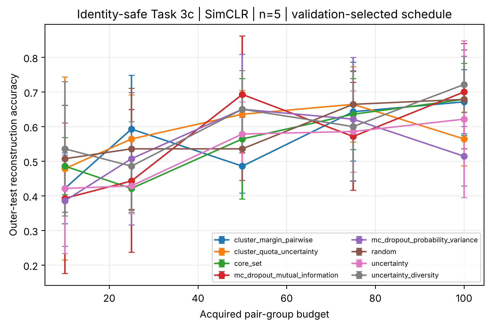

*Figure 16. Mean outer-test accuracy vs. annotation budget for all eight strategies (five seeds; bars are ± one standard deviation). At budget 100 all strategies use identical data, so the spread there is training noise.*

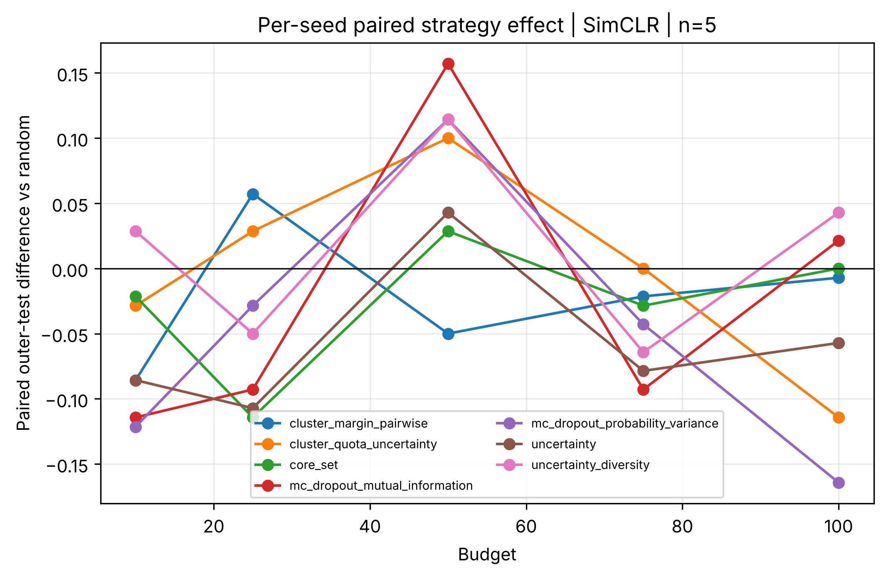

*Figure 17. Paired seed-level accuracy difference relative to random for each strategy and budget. Positive values indicate the strategy outperforms random on the same seed; the distribution width reflects seed variance rather than strategy inconsistency.*

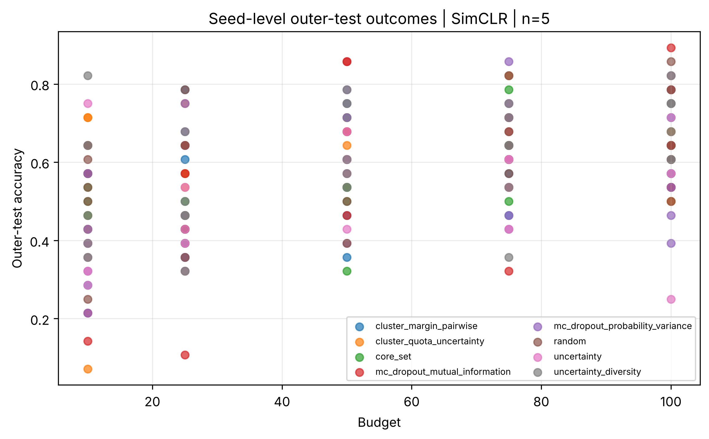

*Figure 18. Outer-test accuracy for every individual seed × strategy × budget cell. The spread confirms that no single strategy dominates at every seed.*

All 200 cells are stored in `results/simclr_three_seed_identity_safe_task3/task3c_final_strategy_cells/`; Figures 16–18 are generated from them by `generate_simclr_identity_safe_task3_figures.py`. In the 80 cells of seeds 202 and 303, all seven forbidden-overlap audit fields are zero. The 120 cells of seeds 42, 79, and 123 record the other five fields as zero but do not record `pairwise_image_identity_overlap_reference` and `pairwise_image_identity_overlap_utility_validation`; §3.2 explains why those overlaps were already excluded for those seeds.

### 5.11 Why the encoder is frozen, and what it shows about type accuracy

**Question.** The fine-tuned reward model of §5.10 gave outer-test accuracies of 0.4–0.7 with noise as large as the differences between strategies. Is that noise a property of strategies, or of how the model is trained, and does a model trained differently change the answers?

**Why freeze.** Three observations from §5.10 motivate removing end-to-end fine-tuning from the strategy comparison. First, the same data can give different models: at budget 100 every strategy trains on the identical 100 pair groups, yet accuracy within a seed spans 0.25–0.89. Second, the result depends on the order of the selected pairs: 30 identical pair groups in two orders gave outer-test accuracies of 0.357 and 0.429 (training on a fixed ordered list is exactly repeatable; reordering the list changes the minibatches). Third, 34–342 labelled rows are very few for 11 million encoder parameters. Freezing the encoder and training only the reward head, with a loss that is a *sum* over rows, makes the trained head a function of the set of labelled pair groups rather than of their order.

**Method.** The SimCLR ResNet-18 encoder is applied once to every image and never updated; its 512-d features are cached (444 images across all seeds). The reward head is the same Linear(512→256)–ReLU–Dropout(0.2)–Linear(256→5) as before, but is trained by full-batch AdamW (weight decay $10^{-4}$) on the sum of per-row losses divided by the number of rows, with no dropout during training (dropout remains in the head so that MC-dropout acquisition can still sample it at selection time). The losses are those of §2.1: Bradley–Terry for decisive winners, an absolute-difference term for ties, a push-down term for `not_apply`, reference-anchor ranking (weight 0.25), and bad-image anchors (weight 0.10). A sum over rows is invariant to row order, which is verified by `test_frozen_encoder_order_invariance.py`. Acquisition code is unchanged: strategies read the cached features and the head. The candidate pool is enlarged from 100 to 158 groups (all groups not in the initial 10), so every budget up to 100 is smaller than the pool and strategies can genuinely differ. Learning rate $\in\{10^{-3},3\cdot10^{-3},10^{-2}\}$ and number of full-batch steps $\in\{100,300,1000\}$ were selected per budget on utility-validation accuracy with a deterministic random batch, on seeds 42, 79, and 123 only (outer test unopened), as in Task 3b:

| Budget | Selected lr | Selected steps | Mean validation accuracy |
|---:|---:|---:|---:|
| 10 | 0.01 | 300 | 0.857 |
| 25 | 0.003 | 300 | 0.881 |
| 50 | 0.01 | 100 | 0.905 |
| 75 | 0.003 | 100 | 0.893 |
| 100 | 0.001 | 300 | 0.869 |

**Residual noise.** With the data fixed, only the head's random initialisation varies. Across 8 initialisations the within-seed standard deviation of outer-test accuracy is 0.013–0.051 (mean 0.039), against 0.09–0.18 between strategies at budget 100 for the fine-tuned model; the between-seed standard deviation of the mean is 0.065 and is dominated by which 28 images fall in the outer test. The frozen model therefore removes most of the training noise but not the test-set sampling noise.

**Results: outer-test type accuracy.** Mean ± standard deviation over five seeds (same outer test, same identity-safe splits as §5.10; 200 cells; results in `results/frozen_encoder_task3/`):

| Strategy | Budget 10 | Budget 25 | Budget 50 | Budget 75 | Budget 100 |
|---|---:|---:|---:|---:|---:|
| Random | 0.836 ± 0.020 | 0.829 ± 0.016 | 0.779 ± 0.077 | 0.807 ± 0.065 | 0.821 ± 0.044 |
| Uncertainty | 0.821 ± 0.076 | 0.814 ± 0.047 | 0.843 ± 0.054 | 0.771 ± 0.054 | 0.807 ± 0.041 |
| Core-set | 0.829 ± 0.069 | 0.843 ± 0.065 | 0.779 ± 0.047 | 0.786 ± 0.067 | 0.821 ± 0.051 |
| Cluster-quota uncertainty | 0.807 ± 0.096 | 0.814 ± 0.105 | 0.757 ± 0.081 | 0.800 ± 0.070 | 0.807 ± 0.041 |
| Uncertainty + diversity | 0.864 ± 0.053 | 0.821 ± 0.044 | 0.764 ± 0.082 | 0.771 ± 0.090 | 0.829 ± 0.039 |
| Cluster-Margin | 0.843 ± 0.060 | 0.836 ± 0.054 | 0.786 ± 0.056 | 0.786 ± 0.098 | 0.793 ± 0.077 |
| MC-dropout variance | 0.829 ± 0.077 | 0.807 ± 0.070 | 0.829 ± 0.059 | 0.793 ± 0.059 | 0.836 ± 0.070 |
| MC-dropout mutual info | 0.807 ± 0.054 | 0.857 ± 0.044 | 0.729 ± 0.032 | 0.821 ± 0.036 | 0.829 ± 0.081 |

No strategy differs reliably from random. The paired differences (strategy minus random, same seed and budget) lie between -0.050 and +0.064; the largest in magnitude is uncertainty at budget 50 (+0.064, paired t = 2.45, n = 5), which is not significant once 35 comparisons are considered. Training on the initial 10 pair groups alone, with no acquisition, gives 0.871 ± 0.065, as high as any cell. Frozen-head accuracy (0.73–0.86) is also far above the fine-tuned model (0.4–0.7) and matches the frozen-encoder nearest-neighbour baseline of §5.10 (0.871 ± 0.041).

**Where the accuracy comes from.** The pattern above (more pair labels do not help, and the initial 10 groups already reach the plateau) suggests that type accuracy is determined by something other than the acquired pairs. Training the same frozen head with only some of its loss terms isolates the source (mean over five seeds, four head initialisations each):

| Training signal | Utility-validation accuracy | Outer-test accuracy |
|---|---:|---:|
| anchors only (0 pair groups) | 0.848 | 0.848 ± 0.038 |
| anchors + 10 groups | 0.864 | 0.852 ± 0.053 |
| anchors + 110 groups | 0.832 | 0.805 ± 0.076 |
| pairs only, 10 groups | 0.337 | 0.368 ± 0.114 |
| pairs only, 110 groups | 0.543 | 0.554 ± 0.110 |
| pairs only, all 168 groups | 0.389 | 0.409 ± 0.038 |

With **no pair groups at all**, the reference-anchor term alone reaches 0.848. Pairwise preferences alone reach only 0.37–0.55, and adding 110 groups to the anchors slightly lowers accuracy (0.805 versus 0.848). The anchors use the absolute class labels of about 88 reference ideal images per seed; the pairwise labels say which of two trajectory images better shows a reconstruction, which is information about quality, not about class identity. Type accuracy on ideal images is therefore a poor endpoint for judging which pairs to label: it is nearly saturated by the anchors, and the strategy comparisons of §5.10 and of this section cannot rank acquisition rules on it. §5.12 evaluates the quantity pair labels do teach.

### 5.12 Held-out preference prediction: comparing acquisition strategies on what pair labels teach

**Question.** Pair labels say which of two images better shows a reconstruction type. Which acquisition rules choose the pair groups that best predict *held-out human preferences*, once type accuracy on ideal images (saturated by the reference anchors, §5.11) is replaced by an endpoint the labels can move?

**Endpoint and split.** For every seed the 168 usable pair groups are divided into the 10 initial groups, 20 validation groups, 40 test groups, and a candidate pool of the remaining groups that share no image with the validation or test groups (64–77 groups, depending on the seed: 168 usable groups − 10 initial − 20 validation − 40 test = 98, from which 21–34 groups are removed because they share an image with a validation or test group; the largest budget, 60 groups, is therefore 78–94% of the pool). Validation and test groups are image-disjoint from the training and candidate groups and from each other, so no evaluation image is ever seen in training. The test endpoint is the reward model's prediction of the decisive judgments (winner 1 or 2; 49% of judgments are ties or not-applicable) in the test groups: for each decisive row, whether the head of that row's reconstruction type scores the winner higher. We report four numbers: (i) accuracy, (ii) Bradley–Terry log-loss, (iii) AUC of the signed score gap, which does not depend on the scale of the scores, and (iv) log-loss after fitting a single temperature on the validation groups, which separates ranking quality from score scale. Rows are weighted by their confidence weight.

**Training and calibration.** The reward model is the frozen-encoder head of §5.11. Learning rate and number of full-batch steps were chosen on validation log-loss with a random batch of the budget size, on seeds 42, 79, and 123 only, averaged over all four budgets; the test groups were not used. The selected setting is learning rate 0.01 and 100 steps.

**Strategies.** The eight strategies of §5.10 are used unchanged: Random, Uncertainty, Core-set, Cluster-quota uncertainty, Uncertainty + diversity, Cluster-Margin, MC-dropout probability variance, and MC-dropout mutual information. These original rules score a candidate with the head of the type of the group's first judgment row, which plays the role of the queried type (the annotator is asked to judge one reconstruction type per query). A group usually carries judgments for several types and all of them are acquired together with the group, so the budget counts groups, not judgments (about 3.1 judgments per group). Nineteen further strategies, in `new_pair_strategies.py`, aggregate over the four active heads, that is, they do not assume which type will be queried; a test confirms that they ignore the type. Seventeen are described below; the other two are deep-ensemble BALD (the mutual information between a preference and the head's random initialisation, from 8 heads trained on the same labels) and the same score weighted by the predicted probability of a decisive answer. They draw on the literature in `notes/literature_and_new_strategy_ideas.md`: relation-aware core-set (pair vector [(a+b)/2, |a−b|, a⊙b]), TypiClust, BADGE for a Bradley–Terry head, Fisher D-optimal design (Active Reward Modeling), Laplace-approximation BALD with batch updates, largest predicted gap and gap + posterior standard deviation (ActiveUltraFeedback-style), BALD weighted by a predicted probability that the judgment is decisive, DPP, ProbCover, MaxHerding, DropQuery, an image-coverage rule, an uncertainty-weighted facility-location rule on a kNN graph of pairs, FASS and graph cut. Six *all-head* versions of the original rules (suffix `_lf`: Uncertainty, Cluster-quota uncertainty, Uncertainty + diversity, Cluster-Margin, and the two MC-dropout rules) run the original code with the candidate's type removed and the unused Twinned head silenced (its last-layer row is zeroed so it adds the same constant to every candidate), which puts them on the same footing as the added strategies (neither assumes a queried type); 33 strategy variants in total are compared with Random, which is the mean of five independent draws per seed and budget so that its noise does not dominate the comparison.

**Two acquisition conditions.** *Single-shot*: one batch of the budget size is chosen using the model trained on the 10 initial groups, as in §5.10. *Sequential*: rounds of 10 groups, retraining the head on everything labelled so far before each round; the same trajectory is read out after 10, 20, 40, and 60 acquired groups. Sequential acquisition is how model-based rules are normally used and is cheap here because the encoder is frozen.

**Statistics.** The unit of replication is the seed (random split of ideal images, initial groups, validation and test groups). For each strategy and metric, the gain over Random is averaged over budgets within a seed, giving one number per seed; significance is a two-sided Wilcoxon signed-rank test on these numbers, with Holm correction across strategies. Five seeds (42, 79, 123, 202, 303) are the primary study seeds; 30 further seeds (400–429), outside the calibration, extend the comparison. Seeds 42, 79, and 123 were also used to choose the learning rate and step count.

**Results: single-shot, 35 seeds.** Random reaches held-out log-loss 0.600, 0.494, 0.406, 0.356 and AUC 0.883, 0.902, 0.921, 0.934 at 10, 20, 40, and 60 acquired groups (mean over 35 seeds); the 10 initial groups alone give log-loss 0.715 and AUC 0.872, so the labels teach the held-out preferences and the endpoint responds to the budget. The strategies differ overall (Friedman test across the 33 strategy variants with data on all 35 seeds: log-loss p = 0.0001, calibrated log-loss p < 0.0001, AUC p = 0.0001, accuracy p = 0.001). The table gives each strategy's gain over Random, averaged over budgets within a seed (positive = better, in log-loss units for the first two columns and AUC units for the third), with the Wilcoxon signed-rank p-value Holm-corrected across the strategies, and the fraction of seeds in which the strategy beat Random on log-loss. Full per-budget tables and the unadjusted p-values are in `results/pair_endpoint_study/single_all_*`.

| Strategy | log-loss gain | Holm p | cal. log-loss gain | Holm p | AUC gain | Holm p | seeds better (log-loss) |
|---|---:|---:|---:|---:|---:|---:|---:|
| Fisher D-optimal (Active Reward Modeling) | +0.041 | 0.155 | +0.009 | 0.717 | +0.008 | 0.909 | 66% (35) |
| BALD x P(decisive) | +0.038 | 0.026 | +0.008 | 0.877 | +0.010 | 0.027 | 77% (35) |
| Cluster-quota uncertainty | +0.038 | 0.033 | +0.003 | 1.000 | +0.005 | 1.000 | 74% (35) |
| Laplace BALD | +0.038 | 0.022 | +0.024 | 0.289 | +0.010 | 0.031 | 80% (35) |
| Core-set, relation-aware pairs | +0.036 | 0.176 | +0.038 | 0.067 | +0.006 | 1.000 | 74% (35) |
| Cluster-Margin | +0.033 | 0.285 | +0.026 | 0.481 | +0.002 | 1.000 | 69% (35) |
| MaxHerding (pairs) | +0.031 | 0.122 | +0.014 | 0.335 | +0.007 | 0.601 | 69% (35) |
| Cluster-quota uncertainty, original code, all heads | +0.029 | 0.176 | +0.002 | 1.000 | +0.001 | 1.000 | 74% (35) |
| DPP (quality x diversity) | +0.028 | 0.047 | +0.012 | 0.877 | +0.005 | 1.000 | 77% (35) |
| FASS (pairs) | +0.025 | 1.000 | +0.012 | 1.000 | +0.003 | 1.000 | 60% (35) |
| Core-set | +0.023 | 1.000 | +0.008 | 1.000 | -0.002 | 1.000 | 60% (35) |
| Graph facility location (uncertainty-weighted) | +0.020 | 1.000 | +0.003 | 1.000 | +0.004 | 1.000 | 51% (35) |
| MC-dropout variance | +0.019 | 1.000 | +0.003 | 1.000 | +0.003 | 1.000 | 57% (35) |
| Cluster-Margin, original code, all heads | +0.018 | 1.000 | +0.009 | 1.000 | -0.003 | 1.000 | 60% (35) |
| TypiClust (pairs) | +0.018 | 1.000 | +0.036 | 0.294 | +0.006 | 1.000 | 57% (35) |
| Largest predicted gap | +0.017 | 1.000 | +0.035 | 0.105 | +0.005 | 1.000 | 60% (35) |
| BADGE (pairs) | +0.016 | 1.000 | +0.009 | 1.000 | +0.002 | 1.000 | 60% (35) |
| ProbCover (pairs) | +0.016 | 1.000 | +0.023 | 0.330 | +0.005 | 1.000 | 66% (35) |
| Uncertainty + diversity | +0.015 | 1.000 | +0.013 | 1.000 | +0.001 | 1.000 | 63% (35) |
| Deep-ensemble BALD (8 heads) | +0.013 | 1.000 | +0.005 | 1.000 | +0.005 | 1.000 | 54% (35) |
| MC-dropout mutual info | +0.012 | 1.000 | +0.008 | 1.000 | +0.004 | 1.000 | 54% (35) |
| Image-coverage uncertainty | +0.010 | 1.000 | -0.014 | 1.000 | -0.000 | 1.000 | 63% (35) |
| Uncertainty | +0.007 | 1.000 | +0.000 | 1.000 | +0.001 | 1.000 | 51% (35) |
| Deep-ensemble BALD x P(decisive) | +0.004 | 1.000 | -0.002 | 1.000 | +0.005 | 1.000 | 51% (35) |
| Uncertainty, original code, all heads | +0.003 | 1.000 | -0.028 | 0.474 | -0.004 | 1.000 | 60% (35) |
| Uncertainty, all heads | +0.003 | 1.000 | -0.028 | 0.474 | -0.004 | 1.000 | 60% (35) |
| Uncertainty + diversity, original code, all heads | +0.002 | 1.000 | -0.014 | 1.000 | -0.006 | 1.000 | 57% (35) |
| Gap + posterior std (DeltaUCB-style) | -0.001 | 1.000 | +0.029 | 0.579 | +0.001 | 1.000 | 57% (35) |
| MC-dropout mutual info, original code, all heads | -0.015 | 1.000 | -0.020 | 1.000 | -0.007 | 1.000 | 54% (35) |
| DropQuery (pairs) | -0.016 | 1.000 | -0.019 | 0.483 | -0.004 | 1.000 | 37% (35) |
| MC-dropout variance, original code, all heads | -0.019 | 1.000 | -0.024 | 1.000 | -0.007 | 1.000 | 49% (35) |
| Graph cut (pairs) | -0.058 | 0.047 | -0.010 | 1.000 | -0.000 | 1.000 | 31% (35) |

Only **Laplace BALD** and **BALD × P(decisive)** beat Random on both log-loss and AUC after correction (Holm p = 0.022 and 0.026 on log-loss, 0.031 and 0.027 on AUC). Two further strategies are significant on log-loss alone, the original Cluster-quota uncertainty (Holm p = 0.033) and the DPP selector (0.047); graph cut is significantly *worse* than Random (−0.058, p = 0.047). On calibrated log-loss no strategy survives correction (the best, relation-aware core-set, has Holm p = 0.067), so part of the raw log-loss gain comes from the scale of the scores rather than from a better ordering of the pairs. The effects are small: Laplace BALD lowers log-loss from 0.600 to 0.542 at 10 groups and from 0.356 to 0.324 at 60, and raises AUC by about 0.01, and the gains are largest at the smallest budgets. Pure uncertainty rules do not help: Uncertainty (+0.007), MC-dropout mutual information (+0.012), and the all-head entropy rule (+0.003) are indistinguishable from Random, and DropQuery (−0.016) is no better. Deep-ensemble BALD, an alternative estimate of the same epistemic quantity, gains only +0.013 (Holm p = 1.0) and weighting it by P(decisive) +0.004; a plausible reason, which we did not test, is that heads trained to convergence on the same labels from different initialisations end up close to one another, leaving little disagreement to exploit, whereas the Laplace posterior reflects how little data constrains each direction of the last layer. The all-head versions of the original rules (rows marked `original code, all heads`) are all weaker than the originals: Cluster-quota uncertainty falls from +0.038 to +0.029 and is no longer significant (Holm p = 0.16), Cluster-Margin from +0.033 to +0.018, and the two MC-dropout rules from +0.019 and +0.012 to −0.019 and −0.015. The original Cluster-quota rule's advantage therefore depends on scoring only the head of the first judgment row rather than all heads. If the system chooses which type to ask for, as in the intended labeling protocol, the original scoring is legitimate and the all-head versions are a conservative alternative; both are reported. The five-seed ranking that first suggested a large advantage for Cluster-Margin (+0.110) and core-set (+0.076) did not replicate: over 35 seeds they are +0.033 and +0.023 and neither is significant after correction, an instance of the noise that a five-seed, 28-image comparison cannot exclude.

**Results: sequential, 35 seeds.** With rounds of 10 groups and retraining between rounds, Random reaches log-loss 0.578, 0.474, 0.398, 0.354 and AUC 0.891, 0.907, 0.922, 0.933 at 10, 20, 40, and 60 acquired groups. The strategies again differ overall (Friedman across the 33 variants: log-loss p = 0.001, calibrated log-loss p < 0.0001, AUC p = 0.004, accuracy p = 0.021), but **no strategy is significantly better than Random on any of the four metrics after Holm correction**, and the gains are smaller than in the single-shot condition:

| Strategy | log-loss gain | Holm p | cal. log-loss gain | Holm p | AUC gain | Holm p | seeds better (log-loss) |
|---|---:|---:|---:|---:|---:|---:|---:|
| Core-set, relation-aware pairs | +0.023 | 1.000 | +0.027 | 0.522 | +0.002 | 1.000 | 66% (35) |
| MaxHerding (pairs) | +0.021 | 1.000 | +0.008 | 1.000 | +0.004 | 1.000 | 66% (35) |
| BALD x P(decisive) | +0.017 | 1.000 | +0.004 | 1.000 | +0.004 | 1.000 | 60% (35) |
| Laplace BALD | +0.016 | 1.000 | +0.013 | 1.000 | +0.004 | 1.000 | 57% (35) |
| Cluster-quota uncertainty | +0.015 | 1.000 | +0.001 | 1.000 | -0.002 | 1.000 | 60% (35) |
| FASS (pairs) | +0.013 | 1.000 | +0.003 | 1.000 | -0.001 | 1.000 | 66% (35) |
| Fisher D-optimal (Active Reward Modeling) | +0.013 | 1.000 | -0.015 | 1.000 | +0.002 | 1.000 | 54% (35) |
| Cluster-Margin | +0.012 | 1.000 | +0.001 | 1.000 | -0.005 | 1.000 | 60% (35) |
| Core-set | +0.010 | 1.000 | -0.004 | 1.000 | -0.005 | 1.000 | 54% (35) |
| Cluster-Margin, original code, all heads | +0.010 | 1.000 | -0.011 | 1.000 | -0.004 | 1.000 | 54% (35) |
| Uncertainty + diversity, original code, all heads | +0.001 | 1.000 | -0.020 | 1.000 | -0.005 | 1.000 | 49% (35) |
| Largest predicted gap | +0.001 | 1.000 | +0.019 | 1.000 | +0.001 | 1.000 | 49% (35) |
| MC-dropout variance | -0.000 | 1.000 | -0.008 | 1.000 | -0.001 | 1.000 | 63% (35) |
| Uncertainty + diversity | -0.000 | 1.000 | -0.003 | 1.000 | -0.002 | 1.000 | 51% (35) |
| Graph facility location (uncertainty-weighted) | -0.000 | 1.000 | -0.007 | 1.000 | -0.001 | 1.000 | 51% (35) |
| DPP (quality x diversity) | -0.002 | 1.000 | +0.009 | 1.000 | -0.002 | 1.000 | 46% (35) |
| ProbCover (pairs) | -0.004 | 1.000 | +0.008 | 1.000 | +0.002 | 1.000 | 57% (35) |
| Cluster-quota uncertainty, original code, all heads | -0.005 | 1.000 | -0.016 | 1.000 | -0.007 | 0.452 | 51% (35) |
| TypiClust (pairs) | -0.007 | 1.000 | +0.019 | 1.000 | +0.001 | 1.000 | 46% (35) |
| Image-coverage uncertainty | -0.007 | 1.000 | -0.011 | 1.000 | -0.004 | 1.000 | 54% (35) |
| BADGE (pairs) | -0.009 | 1.000 | +0.002 | 1.000 | -0.001 | 1.000 | 49% (35) |
| Deep-ensemble BALD (8 heads) | -0.009 | 1.000 | -0.000 | 1.000 | -0.001 | 1.000 | 51% (35) |
| MC-dropout mutual info | -0.009 | 1.000 | -0.021 | 1.000 | -0.003 | 1.000 | 54% (35) |
| Uncertainty | -0.011 | 1.000 | -0.010 | 1.000 | -0.005 | 1.000 | 43% (35) |
| Gap + posterior std (DeltaUCB-style) | -0.020 | 1.000 | +0.001 | 1.000 | -0.005 | 1.000 | 37% (35) |
| Deep-ensemble BALD x P(decisive) | -0.021 | 1.000 | -0.001 | 1.000 | -0.000 | 1.000 | 40% (35) |
| Uncertainty, original code, all heads | -0.023 | 1.000 | -0.034 | 0.145 | -0.009 | 0.145 | 49% (35) |
| Uncertainty, all heads | -0.023 | 1.000 | -0.034 | 0.145 | -0.009 | 0.145 | 49% (35) |
| MC-dropout variance, original code, all heads | -0.025 | 1.000 | -0.040 | 1.000 | -0.009 | 1.000 | 54% (35) |
| MC-dropout mutual info, original code, all heads | -0.032 | 1.000 | -0.019 | 1.000 | -0.010 | 1.000 | 46% (35) |
| DropQuery (pairs) | -0.039 | 0.491 | -0.023 | 1.000 | -0.008 | 1.000 | 37% (35) |
| Graph cut (pairs) | -0.049 | 0.015 | -0.025 | 1.000 | -0.001 | 1.000 | 23% (35) |

Laplace BALD's log-loss gain falls from +0.038 (single-shot) to +0.016, BALD × P(decisive) from +0.038 to +0.017, and Cluster-quota uncertainty from +0.038 to +0.015, none of them significant. The relation-aware core-set (+0.023) and MaxHerding (+0.021) lead, also not significant (Holm p = 1.0). Graph cut is again significantly worse than Random (−0.049, Holm p = 0.015), and the uncertainty-driven rules (Uncertainty −0.011, all-head entropy −0.023, DropQuery −0.039, DeltaUCB-style −0.020) are at or below Random; the all-head MC-dropout variants (−0.025, −0.032) and all-head Uncertainty (−0.023) are lower still. Retraining between rounds therefore did not help the model-based rules; the one effect that appears in both conditions is that graph cut is harmful.

**Which strategy at which budget.** The tables above average each seed's gain over the four budgets, which gives the test its power but hides differences between budgets. The question of which rule is best at which budget is answered separately here: for each condition, metric, and budget, the per-seed gain over Random is tested with a Wilcoxon signed-rank test over the 35 seeds, Holm-corrected across the 32 strategy variants within that cell (`analyze_by_budget.py`; `results/pair_endpoint_study/by_budget_gain_vs_random.csv`). Gains are in log-loss units (positive = lower loss than Random) or AUC units (positive = higher AUC).

*Single-shot* (one batch of the budget size chosen from the 10-group model):

| Budget | Metric | Three largest gains over Random (Holm p) | Significant after Holm correction within this cell |
|---:|---|---|---|
| 10 | log-loss | Cluster-quota uncertainty +0.082 (0.06); Cluster-quota uncertainty, original code, all heads +0.077 (0.04); BALD x P(decisive) +0.071 (0.10) | Cluster-quota uncertainty, original code, all heads +0.077; DPP (quality x diversity) +0.067 |
| 10 | AUC | MaxHerding (pairs) +0.018 (0.27); BALD x P(decisive) +0.017 (0.14); DPP (quality x diversity) +0.016 (0.24) | none |
| 20 | log-loss | Core-set, relation-aware pairs +0.061 (0.20); Core-set +0.053 (0.62); Cluster-Margin +0.046 (0.20) | none |
| 20 | AUC | BALD x P(decisive) +0.011 (0.74); MaxHerding (pairs) +0.010 (0.90); Largest predicted gap +0.009 (1.00) | none |
| 40 | log-loss | Fisher D-optimal (Active Reward Modeling) +0.052 (0.00); BALD x P(decisive) +0.039 (0.00); BADGE (pairs) +0.037 (0.22) | Fisher D-optimal (Active Reward Modeling) +0.052; BALD x P(decisive) +0.039; Graph facility location (uncertainty-weighted) +0.029 |
| 40 | AUC | BALD x P(decisive) +0.011 (0.08); Fisher D-optimal (Active Reward Modeling) +0.010 (0.10); BADGE (pairs) +0.009 (1.00) | none |
| 60 | log-loss | Laplace BALD +0.032 (0.01); FASS (pairs) +0.017 (1.00); DPP (quality x diversity) +0.016 (0.93) | Laplace BALD +0.032 |
| 60 | AUC | Laplace BALD +0.012 (0.00); DPP (quality x diversity) +0.005 (1.00); Gap + posterior std (DeltaUCB-style) +0.003 (1.00) | Laplace BALD +0.012 |

*Sequential* (rounds of 10 groups):

| Budget | Metric | Three largest gains over Random (Holm p) | Significant after Holm correction within this cell |
|---:|---|---|---|
| 10 | log-loss | Cluster-quota uncertainty +0.060 (1.00); Cluster-quota uncertainty, original code, all heads +0.055 (0.61); BALD x P(decisive) +0.049 (1.00) | Graph cut (pairs) -0.120 |
| 10 | AUC | MaxHerding (pairs) +0.010 (1.00); BALD x P(decisive) +0.008 (1.00); DPP (quality x diversity) +0.007 (1.00) | none |
| 20 | log-loss | Core-set, relation-aware pairs +0.041 (1.00); Core-set +0.033 (1.00); MaxHerding (pairs) +0.016 (1.00) | none |
| 20 | AUC | Core-set, relation-aware pairs +0.004 (1.00); MaxHerding (pairs) +0.003 (1.00); Laplace BALD +0.003 (1.00) | none |
| 40 | log-loss | FASS (pairs) +0.034 (0.05); Fisher D-optimal (Active Reward Modeling) +0.025 (1.00); Graph facility location (uncertainty-weighted) +0.025 (1.00) | FASS (pairs) +0.034 |
| 40 | AUC | FASS (pairs) +0.008 (0.34); Graph facility location (uncertainty-weighted) +0.006 (1.00); Core-set, relation-aware pairs +0.005 (1.00) | none |
| 60 | log-loss | Largest predicted gap +0.024 (0.03); Image-coverage uncertainty +0.023 (0.10); MC-dropout mutual info, original code, all heads +0.023 (0.03) | Largest predicted gap +0.024; MC-dropout mutual info, original code, all heads +0.023 |
| 60 | AUC | Largest predicted gap +0.008 (0.05); MC-dropout mutual info, original code, all heads +0.006 (0.38); BALD x P(decisive) +0.005 (1.00) | Largest predicted gap +0.008 |

In the single-shot condition the leaders move with the budget: at 10 groups the leading rules are Cluster-quota uncertainty (original +0.082, all-head +0.077, the latter significant) and DPP (+0.067), at 20 the relation-aware and plain core-set, at 40 the Fisher D-optimal and BALD × P(decisive) rules, and at 60 Laplace BALD (log-loss +0.032, AUC +0.012). This looks like coverage- or diversity-oriented rules doing better when few groups can be labelled and rules built on the model's posterior doing better as the budget grows, which is the direction of the low-budget-versus-high-budget argument of Hacohen et al. (2022; notes, third round). It is a plausible pattern, not a conclusion, for three reasons. (i) Each cell reports the best of 32 variants, which overstates the best one. (ii) Holm correction is applied within each cell only, not across budgets, metrics, and conditions, so the number of significant cells is larger than a family-wise correction over all 32 × 4 × 2 × 2 comparisons would leave. (iii) The sequential condition does not reproduce the pattern: its leaders are Cluster-quota uncertainty (not significant) at 10, relation-aware core-set (not significant) at 20, FASS (+0.034, significant on log-loss only) at 40, and the largest-predicted-gap rule (+0.024 log-loss, +0.008 AUC) and all-head MC-dropout mutual information at 60. In addition, a budget of 60 groups is 78–94% of the candidate pool (64–77 groups), so at that budget every strategy selects most of the pool and the strategies differ only in the 4–17 groups they leave out; the budget-60 results should not be read as evidence about large budgets. Establishing the pattern would need a larger candidate pool and a correction over all cells.

**Sensitivity to the training schedule.** To check that the single-shot results do not hinge on the calibrated learning rate and step count, we repeated the single-shot comparison for 13 strategies and Random on the same 35 seeds with learning rate 0.003 and 300 steps instead of 0.01 and 100 (`results/pair_endpoint_study/single_all_cells_alt_lr003_300steps_*`). The strategies still differ overall on log-loss (Friedman p < 0.0001) and calibrated log-loss (p = 0.019) but not on AUC (p = 0.14) or accuracy (p = 0.59). After Holm correction across these 14 variants, the significant log-loss gains are now the relation-aware core-set (+0.063, p = 0.003) and the original Cluster-quota uncertainty (+0.051, p = 0.004), graph cut is again significantly worse (−0.066, p = 0.005), and Laplace BALD (+0.044, p = 0.091) and BALD × P(decisive) (+0.018, p = 0.53) are no longer significant. On AUC only Laplace BALD is significant (+0.007, p = 0.022; +0.010 under the calibrated schedule). So the log-loss ranking of the information-based and coverage-based rules moves with the training schedule, which is consistent with log-loss depending on the scale of the scores, whereas three statements hold under both schedules: Laplace BALD has a small positive AUC gain, graph cut is worse than Random, and no uncertainty-driven rule beats Random.

**Cold start.** Replacing the study's default initial set (a random draw with greedy reconstruction-type coverage) by label-free choices (farthest-first, k-means, TypiClust in the relation-aware pair space, or a random draw) changes the initial model's AUC by at most 0.012 (35 seeds; paired Wilcoxon p ≥ 0.25 against the default). The raw log-loss of the initial model is lower for farthest-first and k-means (0.567 and 0.599 versus 0.715), but calibrated log-loss is the same for all sets, so this difference reflects score scale rather than ranking quality. After 30 further random groups all initial sets are within noise (`notes/literature_and_new_strategy_ideas.md`). A first analysis on five seeds had suggested that the type-covering default is better; that did not replicate and is not claimed.

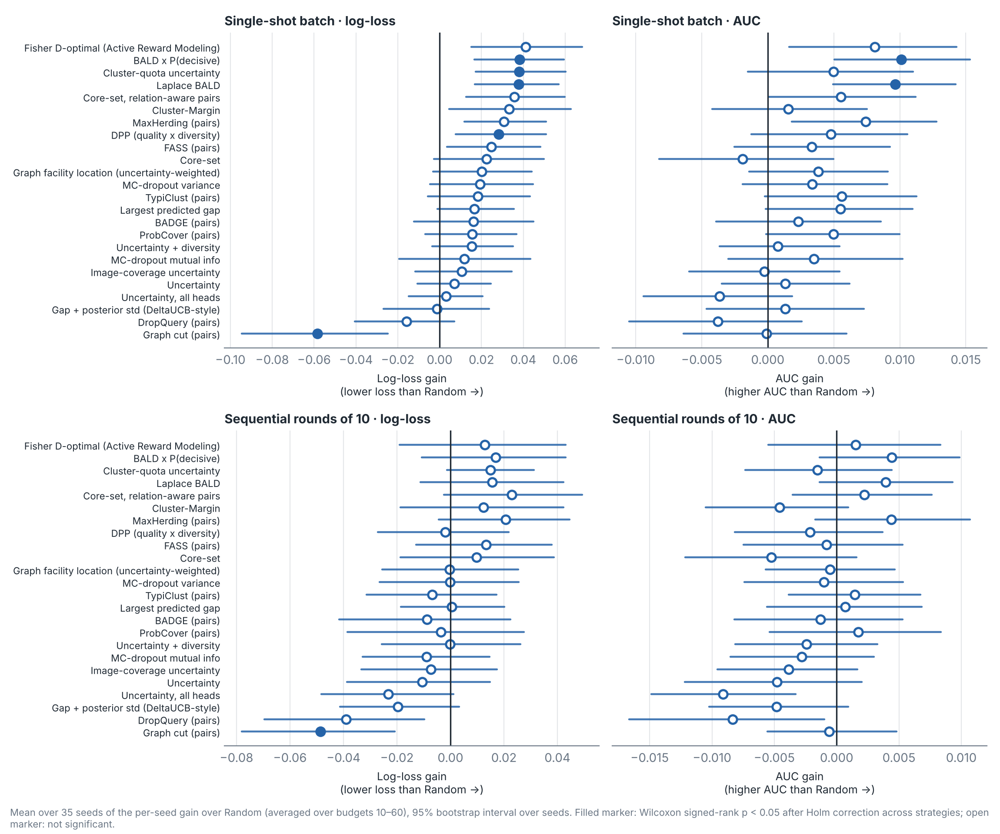

*Figure 19. Gain of each of 33 acquisition strategy variants over Random on held-out preference prediction, 35 seeds, single-shot (top) and sequential (bottom) acquisition; left: log-loss gain, right: AUC gain (positive = better than Random). Points are means of the per-seed gain averaged over budgets of 10–60 groups; bars are 95% bootstrap intervals over seeds; filled points are significant by a Wilcoxon signed-rank test with Holm correction across strategies. Strategies are ordered by their single-shot log-loss gain.*

**Reading the two conditions together.** On a preference endpoint that the labels can move, the choice among 33 acquisition-rule variants matters little at this scale. The strongest evidence is for a small benefit of information-based rules built on the last-layer Fisher/Laplace posterior (Laplace BALD, BALD × P(decisive)) when one batch is chosen from the 10-group model, of which only Laplace BALD keeps a significant AUC gain under a second training schedule: log-loss is lower by about 0.04 and AUC higher by about 0.01 at budgets of 10–60 groups, significant after correction within that condition but not reproduced with sequential retraining, so it should be treated as suggestive. The finding that is consistent across conditions is negative: uncertainty-driven selection (including MC-dropout, BADGE-style gradient embeddings, and DropQuery) is no better than random choice, and graph cut is worse. Differences between all other rules are below what 35 seeds can resolve.

**Limitations.** (i) The endpoint is prediction of held-out *human* judgments in this data set, with 51–79 decisive test rows per seed (mean 63); it is not the downstream type classification of §5.11, which the anchors saturate. (ii) The eight original strategies score only the head of the type of each group's first judgment row, treated as the queried type, yet acquire every judgment of the selected group; the all-head versions score all four heads instead. A design in which the query unit is a (pair, type) judgment, with the budget counted in judgments, would remove this mismatch and has not been run. The all-head versions apply the original code to a model whose Twinned head is silenced rather than re-deriving each rule for four heads. (iii) Hyper-parameters were tuned on random batches (learning rate 0.01, 100 steps), not for each strategy, and a second schedule (learning rate 0.003, 300 steps) changes which strategies are significant on log-loss (see above), so log-loss rankings depend on the schedule. (iv) The per-seed gain is averaged over four budgets, so a strategy that helps only at one budget is diluted. (v) Seeds 42, 79, and 123 informed the hyper-parameter choice, and Holm correction is applied within each condition, not across the two. (vi) The strategies include implementations of published methods adapted to a Bradley–Terry head (e.g. TypiClust, BADGE, FASS, ProbCover); we did not tune their own hyper-parameters, and a different adaptation could change their ranking.


### 5.13 A second split following classifier2: 20% of pair groups held out

**Why a second split.** The split of §5.12 holds out 40 test and 20 validation groups, so the evaluation sets are as large as the largest training set (10 initial + 60 acquired groups) and the candidate pool is only 64–77 groups. The results of §5.12 are therefore results for a very small labelled budget evaluated on a comparatively large held-out set. To test them under the data-splitting practice of the earlier classifier2 work (`classifier2/classifier_training_code/train_unified.py`, `load_data`: shuffle the unique image pairs and hold out 20%, all judgments of a pair on the same side, no separate validation set), the comparison is repeated with that split.

**Split.** For each of the same 35 seeds, 20% of the 168 usable pair groups (34) are held out as the test set, every group that shares an image with a test group is removed from training, and the 10 initial groups are drawn from the remainder by the study's rule (random with greedy coverage of the reconstruction types). The remaining 99–113 groups form the candidate pool, so the largest budget (60 groups) is 53–61% of the pool. The test set holds 35–67 decisive judgments per seed (mean 53.5). There is no validation set, so the learning rate and step count of §5.12 (0.01, 100 steps, chosen on different groups) are reused without recalibration, and the temperature-calibrated log-loss is not reported. Strategies, budgets (10, 20, 40, 60), the single-shot and sequential conditions, and the statistics are those of §5.12 (`PAIR_STUDY_SPLIT=classifier2`).

**Results: single-shot, 35 seeds.** Random reaches log-loss 0.574, 0.484, 0.392, 0.359 and AUC 0.886, 0.905, 0.924, 0.930 at 10, 20, 40, and 60 acquired groups; the 10 initial groups give log-loss 0.667 and AUC 0.865. The strategies differ overall (Friedman test across 33 variants, p < 0.0001 for log-loss, AUC, and accuracy), but after Holm correction **only plain core-set** is significantly better than Random, on log-loss (+0.052, p = 0.012, better in 77% of seeds); no strategy is significant on AUC or accuracy.

| Strategy | log-loss gain | Holm p | AUC gain | Holm p | seeds better (log-loss) |
|---|---:|---:|---:|---:|---:|
| Core-set | +0.052 | 0.012 | +0.003 | 1.000 | 77% (35) |
| Core-set, relation-aware pairs | +0.042 | 0.391 | +0.004 | 1.000 | 60% (35) |
| BALD x P(decisive) | +0.037 | 0.314 | +0.008 | 0.654 | 71% (35) |
| Gap + posterior std (DeltaUCB-style) | +0.027 | 1.000 | +0.001 | 1.000 | 63% (35) |
| Laplace BALD | +0.027 | 1.000 | +0.003 | 1.000 | 66% (35) |
| ProbCover (pairs) | +0.025 | 1.000 | +0.005 | 1.000 | 60% (35) |
| TypiClust (pairs) | +0.024 | 1.000 | +0.006 | 1.000 | 57% (35) |
| Deep-ensemble BALD (8 heads) | +0.021 | 1.000 | +0.007 | 0.654 | 71% (35) |
| Graph facility location (uncertainty-weighted) | +0.020 | 1.000 | +0.004 | 1.000 | 74% (35) |
| Fisher D-optimal (Active Reward Modeling) | +0.020 | 1.000 | +0.002 | 1.000 | 69% (35) |
| FASS (pairs) | +0.016 | 1.000 | +0.000 | 1.000 | 60% (35) |
| Largest predicted gap | +0.015 | 1.000 | -0.001 | 1.000 | 60% (35) |
| Cluster-Margin | +0.014 | 1.000 | -0.003 | 1.000 | 57% (35) |
| MaxHerding (pairs) | +0.014 | 1.000 | +0.004 | 1.000 | 66% (35) |
| BADGE (pairs) | +0.012 | 1.000 | +0.005 | 1.000 | 63% (35) |
| Deep-ensemble BALD x P(decisive) | +0.012 | 1.000 | +0.003 | 1.000 | 60% (35) |
| Cluster-Margin, all heads | +0.012 | 1.000 | -0.008 | 1.000 | 49% (35) |
| Uncertainty + diversity, all heads | -0.001 | 1.000 | -0.007 | 0.654 | 46% (35) |
| DropQuery (pairs) | -0.001 | 1.000 | -0.006 | 1.000 | 46% (35) |
| Uncertainty + diversity | -0.002 | 1.000 | -0.001 | 1.000 | 54% (35) |
| MC-dropout mutual info, all heads | -0.006 | 1.000 | -0.005 | 1.000 | 51% (35) |
| Image-coverage uncertainty | -0.008 | 1.000 | -0.010 | 0.091 | 40% (35) |
| Cluster-quota uncertainty, all heads | -0.010 | 1.000 | -0.011 | 0.219 | 49% (35) |
| Uncertainty, all heads | -0.012 | 1.000 | -0.013 | 0.175 | 46% (35) |
| Uncertainty, all heads | -0.012 | 1.000 | -0.013 | 0.175 | 46% (35) |
| Uncertainty | -0.012 | 1.000 | -0.007 | 0.493 | 34% (35) |
| Cluster-quota uncertainty | -0.015 | 1.000 | -0.008 | 1.000 | 43% (35) |
| DPP (quality x diversity) | -0.016 | 1.000 | -0.007 | 1.000 | 49% (35) |
| MC-dropout mutual info | -0.018 | 1.000 | -0.006 | 0.819 | 43% (35) |
| MC-dropout variance, all heads | -0.020 | 1.000 | -0.007 | 1.000 | 46% (35) |
| MC-dropout variance | -0.029 | 1.000 | -0.009 | 0.183 | 29% (35) |
| Graph cut (pairs) | -0.048 | 0.909 | -0.002 | 1.000 | 46% (35) |

The information-based rules that were significant in §5.12 are not here: Laplace BALD +0.027 (Holm p = 1.0), BALD × P(decisive) +0.037 (p = 0.31), Fisher D-optimal +0.020 (p = 1.0). The uncertainty-driven rules are again no better than Random and mostly worse (Uncertainty −0.012, Cluster-quota uncertainty −0.015, MC-dropout mutual information −0.018, MC-dropout variance −0.029; none significant), and graph cut keeps its negative sign (−0.048) but is no longer significant (p = 0.91).

**By budget.** The same per-budget analysis as in §5.12 (single-shot, Holm correction within each cell):

| Budget | Metric | Three largest gains over Random (Holm p) | Significant after Holm correction within this cell |
|---:|---|---|---|
| 10 | log-loss | Graph facility location (uncertainty-weighted) +0.072 (0.01); Gap + posterior std (DeltaUCB-style) +0.071 (0.85); Core-set, relation-aware pairs +0.069 (0.70) | Graph facility location (uncertainty-weighted) +0.072 |
| 10 | AUC | Deep-ensemble BALD (8 heads) +0.018 (0.00); TypiClust (pairs) +0.016 (0.46); BALD x P(decisive) +0.013 (0.12) | Deep-ensemble BALD (8 heads) +0.018 |
| 20 | log-loss | Core-set +0.080 (0.01); BALD x P(decisive) +0.050 (1.00); Deep-ensemble BALD (8 heads) +0.044 (1.00) | Core-set +0.080 |
| 20 | AUC | BALD x P(decisive) +0.012 (1.00); Deep-ensemble BALD (8 heads) +0.009 (1.00); Core-set +0.008 (1.00) | none |
| 40 | log-loss | Core-set +0.047 (0.11); Core-set, relation-aware pairs +0.037 (0.93); Laplace BALD +0.034 (0.80) | none |
| 40 | AUC | Laplace BALD +0.006 (1.00); Core-set +0.004 (1.00); Core-set, relation-aware pairs +0.004 (1.00) | none |
| 60 | log-loss | Core-set, relation-aware pairs +0.031 (0.57); Laplace BALD +0.027 (0.42); FASS (pairs) +0.023 (0.11) | none |
| 60 | AUC | Core-set, relation-aware pairs +0.008 (1.00); FASS (pairs) +0.007 (0.38); Laplace BALD +0.005 (1.00) | none |

Coverage-oriented rules lead at the smallest budgets: graph facility location (+0.072 log-loss) at 10 groups and core-set (+0.080) at 20, both significant, and deep-ensemble BALD has a significant AUC gain at 10 (+0.018). At 40 and 60 groups nothing is significant (core-set +0.047 at 40, p = 0.11; relation-aware core-set +0.031 at 60). The lowest budgets favouring coverage is in line with §5.12 (where Cluster-quota uncertainty and DPP led at 10), but the leading rule differs between the two splits, and each cell is again the best of 32 variants with correction only within the cell.

**Results: sequential, 35 seeds.** With rounds of 10 groups on this split, Random reaches log-loss 0.560, 0.481, 0.407, 0.366 and AUC 0.886, 0.902, 0.918, 0.928 at 10, 20, 40, and 60 acquired groups. The strategies differ overall (Friedman: p < 0.0001 for log-loss, AUC, and accuracy), and again **only core-set** is significantly better than Random after correction, on log-loss (+0.053, Holm p = 0.009); no strategy is significant on AUC or accuracy. Core-set is therefore the one rule whose advantage appears under both acquisition conditions on this split (+0.052 single-shot, +0.053 sequential).

| Strategy | log-loss gain | Holm p | AUC gain | Holm p | seeds better (log-loss) |
|---|---:|---:|---:|---:|---:|
| Core-set | +0.053 | 0.009 | +0.006 | 1.000 | 71% (35) |
| Core-set, relation-aware pairs | +0.044 | 0.424 | +0.006 | 1.000 | 69% (35) |
| BALD x P(decisive) | +0.043 | 0.877 | +0.011 | 0.114 | 69% (35) |
| Gap + posterior std (DeltaUCB-style) | +0.041 | 0.922 | +0.005 | 1.000 | 60% (35) |
| Largest predicted gap | +0.038 | 1.000 | +0.007 | 1.000 | 63% (35) |
| Cluster-Margin, original code, all heads | +0.037 | 0.498 | +0.001 | 1.000 | 74% (35) |
| Laplace BALD | +0.037 | 1.000 | +0.006 | 1.000 | 66% (35) |
| ProbCover (pairs) | +0.032 | 1.000 | +0.008 | 0.380 | 66% (35) |
| Graph facility location (uncertainty-weighted) | +0.032 | 0.969 | +0.006 | 1.000 | 66% (35) |
| Deep-ensemble BALD (8 heads) | +0.031 | 1.000 | +0.009 | 0.147 | 63% (35) |
| Deep-ensemble BALD x P(decisive) | +0.025 | 1.000 | +0.007 | 0.565 | 69% (35) |
| Cluster-Margin | +0.022 | 1.000 | +0.000 | 1.000 | 66% (35) |
| Fisher D-optimal (Active Reward Modeling) | +0.019 | 1.000 | +0.006 | 1.000 | 69% (35) |
| BADGE (pairs) | +0.019 | 0.870 | +0.007 | 0.274 | 71% (35) |
| TypiClust (pairs) | +0.015 | 1.000 | +0.009 | 0.689 | 46% (35) |
| MaxHerding (pairs) | +0.015 | 1.000 | +0.006 | 1.000 | 54% (35) |
| Uncertainty + diversity, original code, all heads | +0.010 | 1.000 | -0.001 | 1.000 | 66% (35) |
| Cluster-quota uncertainty, original code, all heads | +0.001 | 1.000 | -0.006 | 1.000 | 57% (35) |
| Cluster-quota uncertainty | -0.003 | 1.000 | -0.000 | 1.000 | 57% (35) |
| MC-dropout mutual info, original code, all heads | -0.006 | 1.000 | -0.004 | 1.000 | 43% (35) |
| FASS (pairs) | -0.007 | 1.000 | -0.005 | 1.000 | 51% (35) |
| Image-coverage uncertainty | -0.011 | 1.000 | -0.007 | 0.277 | 43% (35) |
| Uncertainty + diversity | -0.012 | 1.000 | -0.002 | 1.000 | 49% (35) |
| MC-dropout variance | -0.014 | 1.000 | -0.002 | 1.000 | 49% (35) |
| MC-dropout mutual info | -0.018 | 1.000 | -0.004 | 1.000 | 40% (35) |
| DropQuery (pairs) | -0.018 | 1.000 | -0.008 | 0.359 | 43% (35) |
| Uncertainty | -0.021 | 1.000 | -0.006 | 1.000 | 60% (35) |
| DPP (quality x diversity) | -0.024 | 1.000 | -0.005 | 1.000 | 46% (35) |
| Uncertainty, original code, all heads | -0.026 | 0.922 | -0.011 | 0.102 | 34% (35) |
| Uncertainty, all heads | -0.026 | 0.922 | -0.011 | 0.102 | 34% (35) |
| Graph cut (pairs) | -0.027 | 1.000 | +0.004 | 1.000 | 54% (35) |
| MC-dropout variance, original code, all heads | -0.029 | 1.000 | -0.009 | 0.179 | 34% (35) |

Laplace BALD (+0.037, Holm p = 1.0), BALD × P(decisive) (+0.043, p = 0.88), and deep-ensemble BALD (+0.031, p = 1.0) are positive but not significant on log-loss, and the uncertainty-driven rules are again at or below Random (Uncertainty −0.021, MC-dropout mutual information −0.018). Per budget (sequential, correction within each cell):

| Budget | Metric | Three largest gains over Random (Holm p) | Significant after Holm correction within this cell |
|---:|---|---|---|
| 10 | log-loss | Graph facility location (uncertainty-weighted) +0.058 (0.36); Gap + posterior std (DeltaUCB-style) +0.057 (0.97); Core-set, relation-aware pairs +0.055 (1.00) | none |
| 10 | AUC | Deep-ensemble BALD (8 heads) +0.017 (0.05); TypiClust (pairs) +0.014 (1.00); BALD x P(decisive) +0.012 (1.00) | Deep-ensemble BALD (8 heads) +0.017 |
| 20 | log-loss | Core-set +0.076 (0.02); Cluster-Margin, original code, all heads +0.065 (0.16); Laplace BALD +0.063 (0.88) | Core-set +0.076 |
| 20 | AUC | TypiClust (pairs) +0.011 (0.83); ProbCover (pairs) +0.011 (1.00); Deep-ensemble BALD (8 heads) +0.011 (1.00) | none |
| 40 | log-loss | Core-set +0.062 (0.00); Core-set, relation-aware pairs +0.053 (0.11); Cluster-Margin, original code, all heads +0.051 (0.15) | Core-set +0.062 |
| 40 | AUC | BALD x P(decisive) +0.015 (0.01); Cluster-Margin, original code, all heads +0.013 (0.21); Core-set +0.012 (0.34) | BALD x P(decisive) +0.015 |
| 60 | log-loss | Largest predicted gap +0.040 (0.02); Core-set, relation-aware pairs +0.039 (0.10); BALD x P(decisive) +0.032 (0.21) | Largest predicted gap +0.040 |
| 60 | AUC | Largest predicted gap +0.011 (0.01); Core-set, relation-aware pairs +0.009 (0.05); BALD x P(decisive) +0.008 (0.97) | Largest predicted gap +0.011; Core-set, relation-aware pairs +0.009 |

Core-set is significant at 20 and 40 groups (+0.076, +0.062 log-loss); the largest-predicted-gap rule is significant at 60 (+0.040 log-loss, +0.011 AUC), BALD × P(decisive) has a significant AUC gain at 40 (+0.015), and deep-ensemble BALD at 10 (+0.017 AUC, p = 0.05). Each of these is the best of 32 variants in its cell.

**What the two splits say together.** Two statements hold under both splits: no uncertainty-driven rule (Uncertainty, MC-dropout, BADGE-style, DropQuery) is significantly better than Random, and gains over Random are small (log-loss about 0.03–0.05, AUC at most 0.01). The statements that differ are the ones about which rules help: Laplace BALD and BALD × P(decisive) are significant under the small-pool split of §5.12 (single-shot only) and not under this one, while core-set is significant here under both acquisition conditions (+0.052, +0.053) and not in §5.12 (+0.023 single-shot, +0.010 sequential); no rule is significant under both splits. The ranking of coverage-type and information-type rules therefore depends on the split, plausibly on the size of the candidate pool and of the test set, and the data do not support recommending one rule. A larger candidate pool and a second encoder are needed to settle it.

## 6. Conclusion

The implemented protocol separates pair-disjoint acquisition groups, SHA-256 content-identity exclusion of outer-test images, validation-only training decisions, and artifact-level auditing, and its results change what can be claimed about acquisition strategies.

*Fine-tuned reward model (§5.8–5.10).* Task 3b (validation-selected schedules) and Task 3c (eight strategies, five budgets, five seeds) are complete. Leaders differ by budget, but the gaps are small relative to seed variance and to training noise that depends on the order of the selected pairs; at budget 100 all strategies train on identical data. The pre-registered fixed-epoch comparison (§5.9) shows 30 epochs exceeding 3 epochs at budgets of 25 and above, except for budget-75 Uncertainty (0.357 for both). No acquisition strategy can be recommended from these runs.

*Frozen encoder (§5.11).* Caching the SimCLR features and training only the reward head, with an order-invariant loss, removes most training noise (residual head-initialisation sd about 0.04) and lifts type accuracy to 0.73–0.86, in line with a frozen-encoder nearest-neighbour baseline (0.871 ± 0.041). But the reference-anchor term alone reaches 0.848 with zero pair groups, pair labels alone reach 0.37–0.55, and the 10 initial groups already reach the plateau: type accuracy on ideal images is not an endpoint on which acquisition rules can be compared.

*Held-out preference endpoint (§5.12).* Across 33 strategy variants and 35 seeds, the evidence for any acquisition rule beating random selection is limited. With one batch chosen from the 10-group model, Laplace BALD and BALD × P(decisive) are significantly better than Random on log-loss and AUC after correction (gains of about 0.04 and 0.01), and the original Cluster-quota uncertainty rule and a DPP selector on log-loss only (the Cluster-quota advantage does not survive scoring all heads instead of the first row's type); with sequential retraining none is significant, and a second training schedule changes which strategies are significant on log-loss and leaves only Laplace BALD's AUC gain. Uncertainty-driven rules (Uncertainty, MC-dropout, BADGE-style, DropQuery) are no better than Random in either condition, graph-cut selection is worse in both, and the choice of initial set does not matter detectably. With the 20% pair-level hold-out of the classifier2 work (§5.13), the significant rule is instead plain core-set (+0.052 log-loss single-shot and +0.053 sequential, log-loss only) and neither Laplace BALD nor BALD × P(decisive) is significant, so no rule is significant under both splits; coverage-oriented rules lead at the smallest budgets in both. A ranking that looked decisive on five seeds (Cluster-Margin, core-set) shrank to nothing over 35, a caution for any comparison that rests on a few seeds and a few dozen test images.

*Next steps.* The held-out preference endpoint, not ideal-image type accuracy, should be the primary measure for deciding which pairs to label; coverage rules (core-set) and the Fisher/Laplace-posterior rules are the natural candidates to confirm with a larger candidate pool or a second encoder (ImageNet, or a larger self-supervised model), and whether to score the queried type only or all types should follow the actual labeling protocol, and the budget should count judgments (pair, type) rather than pair groups. Data freeze manifests are generated by `generate_data_freeze_manifest.py` and fail loudly on any overlap violation or unexpected partition size. Metadata fusion (§5.6) and trajectory integration (§5.7) remain deferred pending structured process-variable data and a validated five-state classifier, respectively.

## References

1. R. A. Bradley and M. E. Terry. *Rank Analysis of Incomplete Block Designs: I. The Method of Paired Comparisons*. Biometrika, 1952.
2. B. Settles. *Active Learning Literature Survey*. University of Wisconsin--Madison, 2009.
3. K. He, X. Zhang, S. Ren, and J. Sun. *Deep Residual Learning for Image Recognition*. CVPR, 2016.
4. T. Chen et al. *A Simple Framework for Contrastive Learning of Visual Representations*. ICML, 2020.
5. G. Citovsky, G. DeSalvo, C. Gentile, L. Karydas, A. Rajagopalan, A. Rostamizadeh, and S. Kumar. *Batch Active Learning at Scale*. NeurIPS, 2021.
6. Y. Gal and Z. Ghahramani. *Dropout as a Bayesian Approximation: Representing Model Uncertainty in Deep Learning*. ICML, 2016.
7. D. Lischuk and S. Dasgupta. *Adaptive Sampling for Estimation of a Probability Distribution*. ICML, 2017. *(See also Yang and Loog, 2016, for uncertainty-diversity acquisition.)*

## Appendix A. Figure Provenance

- Figure 1: generated by `active_learning_studies/pair_disjoint_not_image_disjoint/generate_academic_report_assets.py`.
- Figure 2: generated by the same script from the implemented split contract.
- Figure 3: generated by the script from the cited historical CSV; it introduces no new numerical results.
- Figure 4: generated by the script from the Stage 2 symmetry-factorial aggregate CSV.
- Figure 5: generated by the script from the encoder-screen validation CSV.
- Figures 6--9: existing PCA/t-SNE artifacts from `active_learning_studies/image_representation_analysis/results/representation_exploration/`; they use the exploratory manifest and are not active-learning outcome figures.
- Figures 10--12: generated by `generate_section5_representation_diagnostics.py` from saved exploratory coordinate CSVs.
- Figure 13: generated from `strategy_followup_analysis/fifteen_seed_extension/fifteen_seed_summary.csv`.
- Figure 14: generated from `strategy_followup_analysis/redundancy_analysis/redundancy_utility_accuracy.csv`.
- Figure 15: generated from stored selected pair embeddings in the historical follow-up analysis.
- Figure 19: generated by `active_learning_studies/pair_disjoint_not_image_disjoint/plot_endpoint_forest.py` from `results/pair_endpoint_study/{single,sequential}_all_*_vs_random.csv` and the per-seed cells in `results/pair_endpoint_study/{cells,sequential_cells}/`.
- Table 1: generated by `generate_ideal_split_capacity_summary.py` from the default identity-safe split contract and current ideal-image files.
